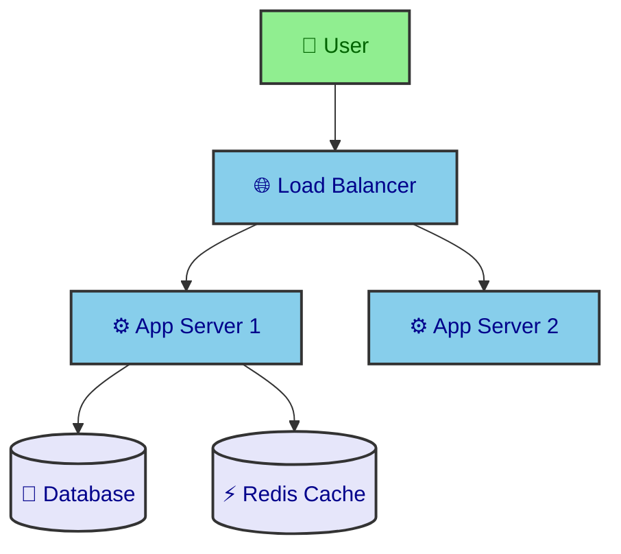

# Mermaid Diagram Generator

> **Version**: 1.0
> **Last updated**: 2026-03-22
> **Covers**: Mermaid 11+ — 23 diagram types

## Workflow

1. **Analyze intent** — determine which diagram type best fits the request
2. **Read syntax reference** — load the corresponding `references/<type>.md` file
3. **Generate code** — produce valid Mermaid wrapped in ` ```mermaid ` code blocks
4. **Apply styling** — use high-contrast `classDef` with explicit `color:` property
5. **Add Unicode symbols** — enhance clarity with semantic icons
6. **Validate** — check for reserved-word issues and common syntax pitfalls

## Diagram Type Reference

Select the appropriate type and **read the reference file before generating**:

### Flow & Process

| Type          | Reference                                     | Use When                                      |
| ------------- | --------------------------------------------- | --------------------------------------------- |
| Flowchart     | [flowchart.md](references/flowchart.md)       | Processes, decisions, steps, algorithms       |
| State Diagram | [stateDiagram.md](references/stateDiagram.md) | State machines, state transitions, lifecycles |
| User Journey  | [userJourney.md](references/userJourney.md)   | User experience flows, satisfaction scoring   |

### Structural

| Type          | Reference                                                               | Use When                                                       |
| ------------- | ----------------------------------------------------------------------- | -------------------------------------------------------------- |
| Class Diagram | [classDiagram.md](references/classDiagram.md)                           | OOP class structure, inheritance, associations                 |
| ER Diagram    | [entityRelationshipDiagram.md](references/entityRelationshipDiagram.md) | Database schema, entity relationships                          |
| C4 Diagram    | [c4.md](references/c4.md)                                               | System architecture (C4 model — context, container, component) |
| Architecture  | [architecture.md](references/architecture.md)                           | System architecture (icon-based)                               |
| Block Diagram | [block.md](references/block.md)                                         | System components, modules, blocks                             |

### Temporal

| Type             | Reference                                           | Use When                                        |
| ---------------- | --------------------------------------------------- | ----------------------------------------------- |
| Sequence Diagram | [sequenceDiagram.md](references/sequenceDiagram.md) | Interactions, messaging, API calls, protocols   |
| Gantt Chart      | [gantt.md](references/gantt.md)                     | Project planning, timelines, milestones         |
| Timeline         | [timeline.md](references/timeline.md)               | Historical events, milestones, roadmaps         |
| Git Graph        | [gitgraph.md](references/gitgraph.md)               | Branch strategies, merge flows, version history |

### Data Visualization

| Type           | Reference                                       | Use When                                         |
| -------------- | ----------------------------------------------- | ------------------------------------------------ |
| Pie Chart      | [pie.md](references/pie.md)                     | Proportions, distributions, percentages          |
| XY Chart       | [xyChart.md](references/xyChart.md)             | Line charts, bar charts, trends                  |
| Sankey Diagram | [sankey.md](references/sankey.md)               | Flow volumes, conversions, resource movement     |
| Quadrant Chart | [quadrantChart.md](references/quadrantChart.md) | Four-quadrant analysis, prioritization matrices  |
| Radar Chart    | [radar.md](references/radar.md)                 | Multi-dimensional comparison, skill profiles     |
| Treemap        | [treemap.md](references/treemap.md)             | Hierarchical data visualization, size comparison |

### Organization

| Type                | Reference                                                 | Use When                                               |
| ------------------- | --------------------------------------------------------- | ------------------------------------------------------ |
| Mindmap             | [mindmap.md](references/mindmap.md)                       | Brainstorming, hierarchical structures, knowledge maps |
| Kanban              | [kanban.md](references/kanban.md)                         | Task management, workflow boards                       |
| Requirement Diagram | [requirementDiagram.md](references/requirementDiagram.md) | Requirements traceability                              |

### Technical

| Type           | Reference                         | Use When                                         |
| -------------- | --------------------------------- | ------------------------------------------------ |
| Packet Diagram | [packet.md](references/packet.md) | Network protocols, data structures, byte layouts |
| ZenUML         | [zenuml.md](references/zenuml.md) | Sequence diagrams in code-style syntax           |

## Configuration & Themes

- [Theming](references/config-theming.md) — custom colors and styles
- [Directives](references/config-directives.md) — diagram-level configuration
- [Layouts](references/config-layouts.md) — layout direction and spacing
- [Configuration](references/config-configuration.md) — global settings
- [Math](references/config-math.md) — LaTeX math support

## High-Contrast Styling (Required)

**Every diagram MUST use high-contrast colors with explicit `color:` property:**

```mermaid
graph TB
    classDef primary fill:#90EE90,stroke:#333,stroke-width:2px,color:darkgreen
    classDef secondary fill:#87CEEB,stroke:#333,stroke-width:2px,color:darkblue
    classDef accent fill:#FFD700,stroke:#333,stroke-width:2px,color:black
    classDef database fill:#E6E6FA,stroke:#333,stroke-width:2px,color:darkblue
    classDef error fill:#FFB6C1,stroke:#DC143C,stroke-width:2px,color:black
    classDef decision fill:#FFD700,stroke:#333,stroke-width:2px,color:black
```

**Rules:**

- Light background -> dark text `color:`
- Dark background -> light text `color:`
- Always specify `color:` in every `classDef` — never omit it
- Use `stroke-width:2px` for visibility

## Unicode Semantic Symbols

Always use Unicode symbols to enhance diagram readability:

| Category       | Symbols                                                             |
| -------------- | ------------------------------------------------------------------- |
| Infrastructure | `cloud` ☁️ `globe` 🌐 `plug` 🔌 `antenna` 📡 `server` 🗄️            |
| Compute        | `gear` ⚙️ `lightning` ⚡ `cycle` 🔄 `rocket` 🚀 `dash` 💨           |
| Data           | `disk` 💾 `package` 📦 `chart` 📊 `graph` 📈 `cabinet` 🗃️ `cube` 🧊 |
| Messaging      | `envelope` 📨 `mailbox` 📬 `outbox` 📤 `inbox` 📥 `megaphone` 📢    |
| Security       | `lock` 🔐 `key` 🔑 `shield` 🛡️ `door` 🚪 `person` 👤 `ticket` 🎫    |
| Status         | `memo` 📝 `alert` 🚨 `warning` ⚠️ `check` ✅ `cross` ❌ `fire` 🔥   |
| Actions        | `start` 🚀 `stop` 🛑 `save` 💾 `search` 🔍 `edit` ✏️ `delete` 🗑️    |

**Example — infrastructure diagram with symbols:**



## Common Syntax Pitfalls

### Reserved words — wrap in double quotes

```
flowchart TD
    start --> "end"
    "call" --> "style"
    "default" --> next
```

Reserved: `default`, `style`, `class`, `end`, `subgraph`, `click`, `call`, `graph`, `interpolate`, `classDef`, `linkStyle`

### Arrow syntax

- Solid arrow: `-->`
- Dotted arrow: `-.->`
- Thick arrow: `==>`
- **NOT** `->` (this is not valid in flowcharts)

### Subgraph closing

Every `subgraph` must have a matching `end`:

```
subgraph "Group Name"
    A --> B
end
```

### Special characters in labels

Wrap labels containing special characters in double quotes:

```
A["Label with (parens) and {braces}"]
```

### Sequence diagram colons

Messages MUST have a colon before the text:

```
Alice->>Bob: Hello    %% correct
Alice->>Bob Hello     %% WRONG - missing colon
```

## Output Specification

Generated Mermaid code should:

1. Be wrapped in ` ```mermaid ` code blocks
2. Have correct syntax that renders without errors
3. Use clear structure with proper indentation
4. Use semantic node IDs (not `A`, `B`, `C` — use `UserRequest`, `AuthService`, etc.)
5. Include `classDef` styling with high-contrast colors
6. Include Unicode symbols where they add clarity
7. Have a title or comment explaining the diagram purpose

## Validation Checklist

Before finalizing any diagram, verify:

- [ ] Correct diagram type keyword on first line
- [ ] No reserved words used as bare identifiers
- [ ] All `subgraph` blocks have matching `end`
- [ ] All `classDef` include `color:` property
- [ ] Arrow syntax is correct for the diagram type
- [ ] Labels with special characters are quoted
- [ ] Sequence diagram messages have colons
- [ ] Node IDs are semantic and descriptive
