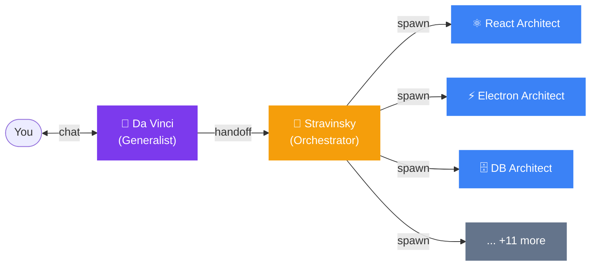
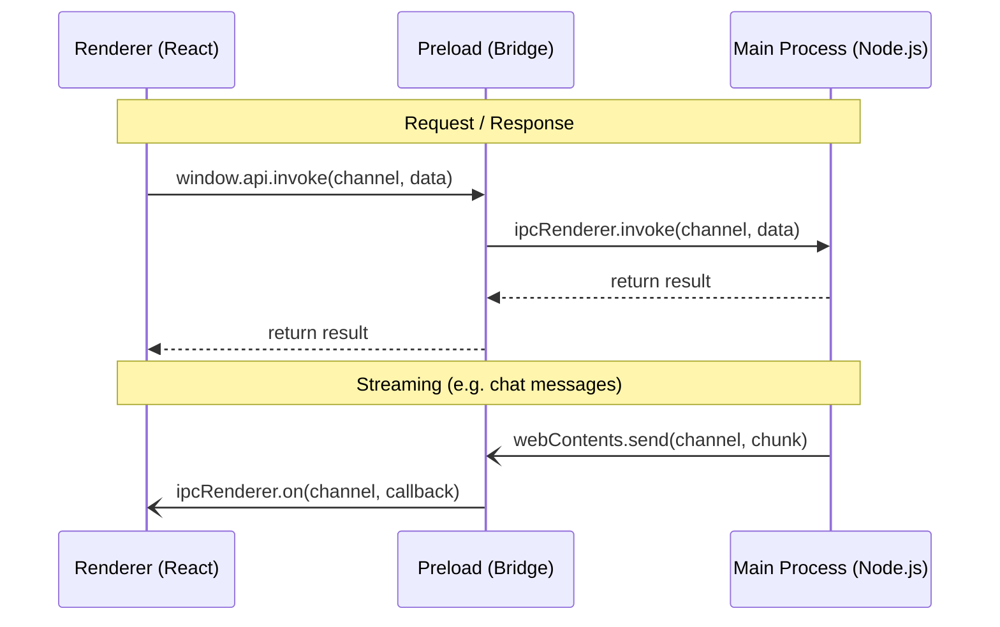
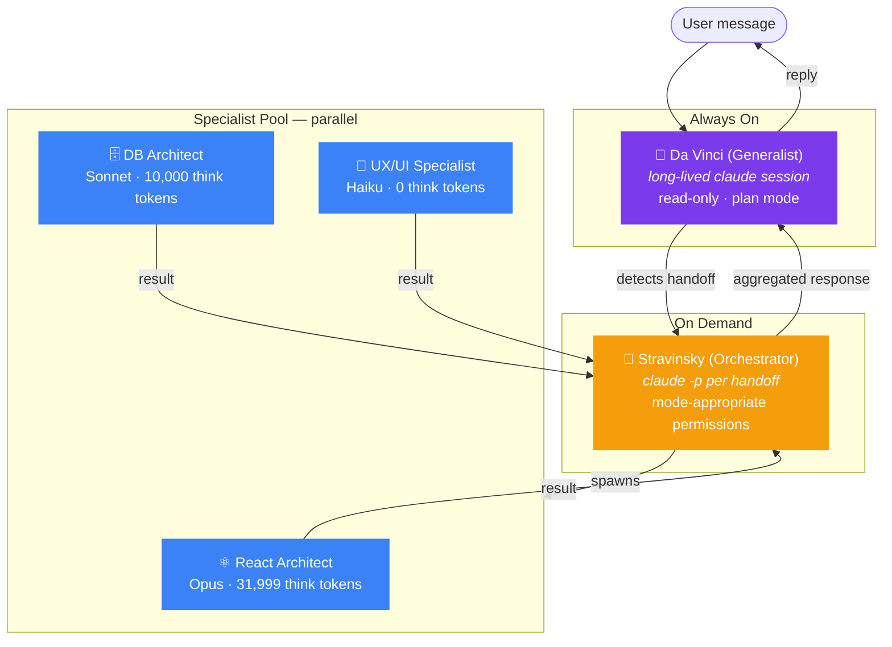
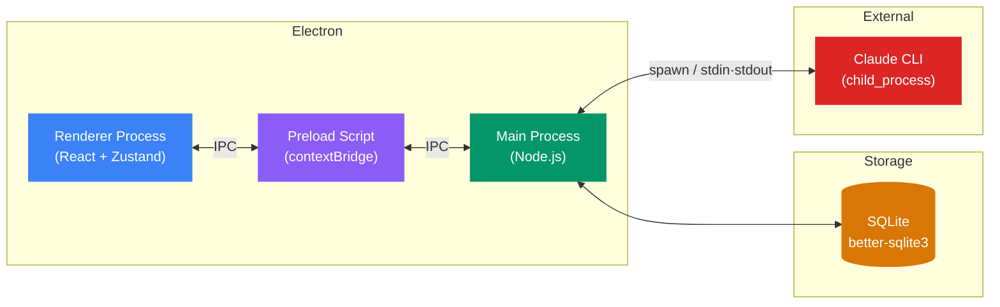

# Agent Studio

> AI-Powered Development Team — running locally on your machine.

Agent Studio is a desktop application that transforms software development by providing a coordinated team of specialist AI agents, orchestrated intelligently, all running locally through your Claude Max subscription via Claude CLI. No API keys. No proxy servers. Just your machine.

## How It Works



1. **Chat with the Generalist** — a long-lived Claude CLI session that understands your entire codebase
2. **Automatic handoffs** — when a task requires specialized skills, the Generalist delegates to the Orchestrator
3. **Parallel specialists** — the Orchestrator spawns the right specialist agents to work simultaneously

## Agent Team

| Icon | Agent                   | Alias          | Role                                                                    |
| ---- | ----------------------- | -------------- | ----------------------------------------------------------------------- |
| 🎨   | **Generalist**          | **Da Vinci**   | Always-on assistant, read-only codebase analysis, detects handoffs      |
| 🎼   | **Orchestrator**        | **Stravinsky** | Spawned on-demand, coordinates specialists with appropriate permissions |
| ⚛️   | React Architect         |                | Frontend architecture, components, state management                     |
| ⚡   | Electron Architect      |                | Desktop app patterns, IPC, native integration                           |
| 🤖   | Agentic Architect       |                | AI agent design, Claude CLI integration                                 |
| 🟣   | .NET Architect          |                | Backend services, API design                                            |
| 🗄️   | DB Architect            |                | SQLite patterns, schema design, migrations                              |
| 🎨   | UX/UI Specialist        |                | Design system, accessibility, user experience                           |
| 🔀   | Git/GitHub Specialist   |                | Branching, PRs, workflow automation                                     |
| 🚀   | CI/CD DevOps            |                | Build pipelines, packaging, distribution                                |
| ☁️   | Cloud Infrastructure    |                | Deployment, hosting, infrastructure                                     |
| 📝   | Code Planner            |                | Task decomposition, implementation strategy                             |
| 📅   | Execution Planner       |                | Sequencing, dependency resolution                                       |
| 📋   | Requirements Specialist |                | Specification, acceptance criteria                                      |
| 📐   | Docs & Diagrams         |                | Documentation, Mermaid diagrams, design docs                            |
| 🛠️   | Generalist Developer    |                | Full-stack implementation, broad coverage                               |

## Tech Stack

- **Runtime**: Electron 40 (Chromium 144 + Node 24)
- **Frontend**: React 19 + TypeScript 5.9
- **Bundler**: electron-vite 5 (Vite 7)
- **Styling**: Tailwind CSS 4
- **State**: Zustand 5
- **Database**: better-sqlite3 (local SQLite)
- **Packaging**: electron-builder 26
- **Linting**: ESLint 9 + Prettier

## Prerequisites

- [Node.js](https://nodejs.org/) 24+
- [Claude CLI](https://docs.anthropic.com/en/docs/claude-cli) installed and authenticated
- [Claude Max subscription](https://www.anthropic.com/pricing) (provides the underlying AI)

## Getting Started

### Install dependencies

```bash
npm install
```

### Run in development mode

```bash
npm run dev
```

This starts the app with hot module replacement. To kill existing processes and restart cleanly:

```bash
npm run dev:restart
```

### Build for production

```bash
# macOS
npm run build:mac

# Windows
npm run build:win

# Linux
npm run build:linux
```

### Other commands

```bash
npm run typecheck    # TypeScript type checking
npm run lint         # ESLint
npm run format       # Prettier formatting
```

## Project Structure

```
src/
├── main/              # Main process (Node.js)
│   ├── index.ts       # App lifecycle, window creation
│   ├── ipc/           # IPC handler modules (20+ domains)
│   ├── services/      # Business logic (orchestrator, specialist pool, brain)
│   └── db/            # SQLite database (schema, repositories)
├── preload/           # Secure bridge (contextBridge only)
├── renderer/src/      # React frontend (no Node.js access)
│   ├── components/    # Feature-based: agents/, chat/, welcome/, settings/, workspace/
│   ├── store/         # Zustand stores (agent, chat, workspace, etc.)
│   └── hooks/         # Custom hooks (useAutoScroll, useVoiceInput)
└── shared/            # Cross-process types + IPC channel constants

.claude/
├── agents/            # 16 agent YAML definitions
└── skills/            # 17 skill modules (SKILL.md + references/)
```

## Architecture

### IPC Communication

All communication between the renderer (UI) and main (Node.js) process goes through a typed IPC layer:



- Channels defined in `src/shared/constants.ts` — no magic strings
- Preload is the **only** bridge — `contextIsolation` is always enabled
- Request-response via `invoke`/`handle`; streaming via event listeners

### Agent Execution Model



- **Generalist**: Long-lived `claude` CLI session in `--permission-mode plan` (read-only)
- **Orchestrator**: Spawned per handoff via `claude -p` with mode-appropriate permissions
- **Specialists**: One-shot `claude -p` commands, run in parallel
- **Thinking budgets**: Opus = 31,999 tokens, Sonnet = 10,000, Haiku = 0

### Electron Process Model



### Database

Local SQLite via better-sqlite3 with a repository pattern. Schema defined in `src/main/db/schema.sql`, inline migrations in `src/main/db/index.ts`.

## IDE Setup

- [VS Code](https://code.visualstudio.com/) with [ESLint](https://marketplace.visualstudio.com/items?itemName=dbaeumer.vscode-eslint) + [Prettier](https://marketplace.visualstudio.com/items?itemName=esbenp.prettier-vscode)
- TypeScript strict mode is enforced project-wide
- Import alias `@renderer/` maps to `src/renderer/src/`

## License

Proprietary. All rights reserved.
