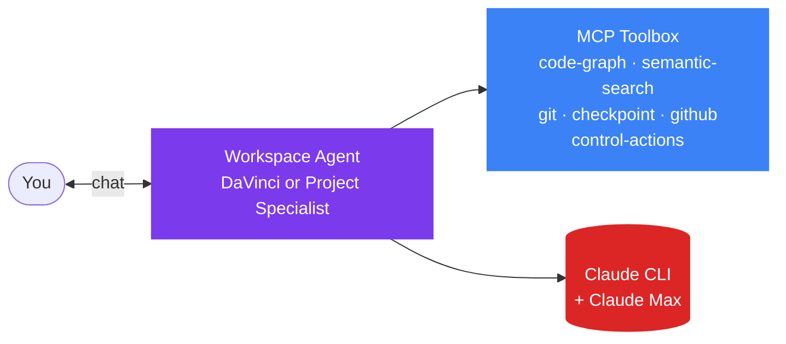
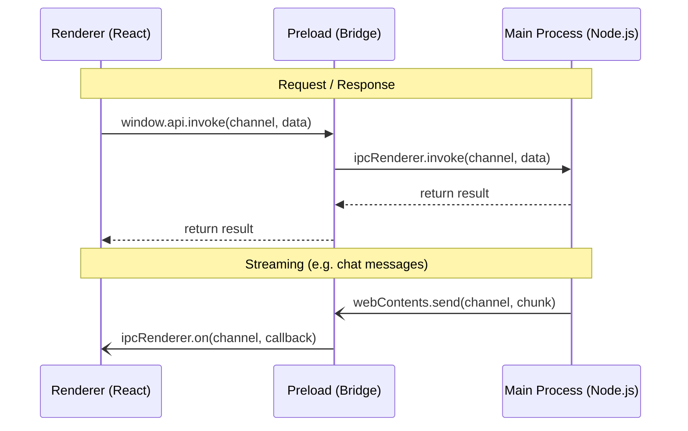
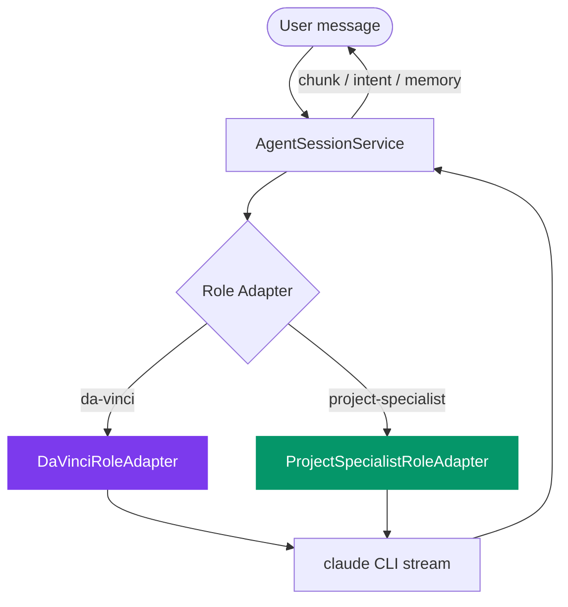
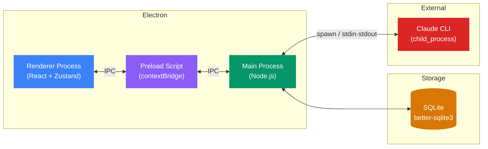

# Code Atelier

> AI-Powered Development Team — running locally on your machine.

Code Atelier is a desktop application that puts a single, opinionated AI engineer in each workspace — running locally through your Claude Max subscription via Claude CLI. No API keys. No proxy servers. Just your machine.

## How It Works



1. **One agent per workspace.** Every workspace runs exactly one role — DaVinci (default) or a Project Specialist (LLM-tailored for the workspace's stack).
2. **Same pipeline, different identity.** Both roles share mode rules, MCP servers, intent detection, and memory persistence. Only the system-prompt identity differs.
3. **Local-first.** Everything runs on your machine via Claude CLI.

## The two roles

**DaVinci** — the default assistant, available per workspace with no setup. Can optionally take on a persona by borrowing a Project Specialist's identity.

**Project Specialist** — an opinionated, LLM-tailored expert built from your workspace's detected stack + CLAUDE.md. Built on demand, rebuilt when the stack drifts.

Both adapters share the same execution model, MCP toolbox, and plan/build mode rules. The specialist is the persona; the adapter is the execution.

## Tech Stack

- **Runtime**: Electron 42 (Chromium 148 + Node 24)
- **Frontend**: React 19 + TypeScript 6
- **Bundler**: electron-vite 5 (Vite 7)
- **Styling**: Tailwind CSS 4
- **State**: Zustand 5
- **Database**: better-sqlite3 (local SQLite)
- **Packaging**: electron-builder 26
- **Linting**: ESLint 9 + Prettier

## Prerequisites

- [Node.js](https://nodejs.org/) 24+
- [Claude CLI](https://docs.anthropic.com/en/docs/claude-cli) installed and authenticated
- [Claude Max subscription](https://www.anthropic.com/pricing) (provides the underlying AI)

## Getting Started

### Install dependencies

```bash
npm install
```

### Run in development mode

```bash
npm run dev
```

This starts the app with hot module replacement. To kill existing processes and restart cleanly:

```bash
npm run dev:restart
```

### Build for production

```bash
# macOS
npm run build:mac

# Windows
npm run build:win

# Linux
npm run build:linux
```

### Other commands

```bash
npm run typecheck    # TypeScript type checking
npm run lint         # ESLint
npm run format       # Prettier formatting
```

## Project Structure

```
src/
├── main/              # Main process (Node.js)
│   ├── index.ts       # App lifecycle, window creation
│   ├── ipc/           # IPC handler modules (20+ domains)
│   ├── services/      # Business logic (role adapters, prompt assembly, MCP config, specialist builder)
│   └── db/            # SQLite database (schema, repositories, migrations)
├── preload/           # Secure bridge (contextBridge only)
├── renderer/src/      # React frontend (no Node.js access)
│   ├── components/    # Feature-based: agents/, chat/, welcome/, settings/, workspace/
│   ├── store/         # Zustand stores (agent, chat, workspace, etc.)
│   └── hooks/         # Custom hooks (useAutoScroll, useVoiceInput)
└── shared/            # Cross-process types + IPC channel constants

e2e/                   # Playwright end-to-end tests (190+ specs)

.claude/
└── skills/            # SKILL.md modules (each may include references/)
```

## Architecture

### IPC Communication

All communication between the renderer (UI) and main (Node.js) process goes through a typed IPC layer:



- Channels defined in `src/shared/constants.ts` — no magic strings
- Preload is the **only** bridge — `contextIsolation` is always enabled
- Request-response via `invoke`/`handle`; streaming via event listeners

### Agent Execution Model



- `AgentSessionService` owns lifecycle (start, send, switchMode, stop).
- Role adapters provide `buildPrompts`, `buildMcpConfig`, `buildControlCallbacks`, `emitDetectedIntents`.
- Mode permissions come from `buildModePermissions`; MCP toolbox from `buildWorkspaceMcpConfig`. Both shared across roles.

### Electron Process Model



### Database

Local SQLite via better-sqlite3 with a repository pattern. Schema defined in `src/main/db/schema.sql`, 107 versioned migrations in `src/main/db/index.ts`.

## IDE Setup

- [VS Code](https://code.visualstudio.com/) with [ESLint](https://marketplace.visualstudio.com/items?itemName=dbaeumer.vscode-eslint) + [Prettier](https://marketplace.visualstudio.com/items?itemName=esbenp.prettier-vscode)
- TypeScript strict mode is enforced project-wide
- Import alias `@renderer/` maps to `src/renderer/src/`

## License

Proprietary. All rights reserved.
