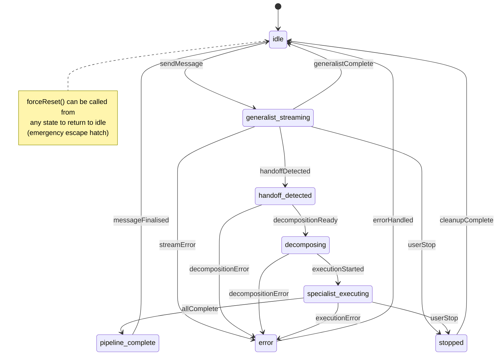

# Conversation State Machine

This document describes the runtime state machine that governs the lifecycle of a
user ↔ generalist ↔ specialist conversation turn.

> **Source:** `src/main/services/conversation-state-machine.ts`
> **Tests:** `src/main/services/__tests__/conversation-state-machine.test.ts`

---

## Why a state machine?

A single conversation turn passes through multiple asynchronous phases — the
generalist streams, may or may not emit a handoff, the pipeline may decompose
and dispatch specialists, and any phase can be interrupted by a user stop or
an error. Scattering this logic across services produced a class of bugs where
phases could overlap, events fired in impossible orders, and stale IDs leaked
between turns.

The `ConversationStateMachine` centralises those rules. Every transition is
explicit, invalid transitions are rejected and logged, and a `stateChange`
event is mirrored to the renderer so the UI never disagrees with the backend
about what phase the conversation is in.

---

## State diagram

---

## States

| State | Description | Typical services active |
|---|---|---|
| `idle` | Ready for user input | — |
| `generalist-streaming` | Generalist is processing and streaming its response | `generalist-stream.service` |
| `handoff-detected` | Generalist identified specialist work is needed | `intent-detector`, `decomposition.service` |
| `decomposing` | Breaking the handoff into executable specialist tasks | `decomposition.service` |
| `specialist-executing` | Specialist agents running in parallel | `specialist-pool.service`, `task-pipeline.service` |
| `pipeline-complete` | All specialists done, finalising the response | `task-pipeline.service` (complete phase) |
| `error` | Error occurred, awaiting recovery | `generalist-recovery-nudge`, `generalist-circuit-breaker` |
| `stopped` | User-initiated stop, awaiting cleanup | `conversation-lifecycle` |

---

## Transitions

The full transition table, machine-readable from `VALID_TRANSITIONS`:

| From | Event | To | Trigger |
|---|---|---|---|
| `idle` | `sendMessage` | `generalist-streaming` | User submits a new message |
| `generalist-streaming` | `generalistComplete` | `idle` | Generalist replied without needing specialists |
| `generalist-streaming` | `handoffDetected` | `handoff-detected` | Generalist produced a handoff brief |
| `generalist-streaming` | `streamError` | `error` | SDK stream, network, or tool-use failure |
| `generalist-streaming` | `userStop` | `stopped` | User pressed Stop during streaming |
| `handoff-detected` | `decompositionReady` | `decomposing` | Decomposition service accepted the brief |
| `handoff-detected` | `decompositionError` | `error` | Decomposer failed to produce a task plan |
| `decomposing` | `executionStarted` | `specialist-executing` | First specialist dispatched to the pool |
| `decomposing` | `decompositionError` | `error` | Decomposer failed mid-process |
| `specialist-executing` | `allComplete` | `pipeline-complete` | Every dispatched specialist finished |
| `specialist-executing` | `executionError` | `error` | A specialist failed unrecoverably |
| `specialist-executing` | `userStop` | `stopped` | User pressed Stop during execution |
| `pipeline-complete` | `messageFinalised` | `idle` | Final assistant message persisted to DB |
| `error` | `errorHandled` | `idle` | Error surfaced to UI and recovery nudge sent |
| `stopped` | `cleanupComplete` | `idle` | Lifecycle disposers ran |

---

## Idempotent transitions

To survive race conditions where multiple services finalise concurrently, the
following events are treated as **no-ops when already `idle`** — they return
`true` and do not emit `stateChange`:

- `messageFinalised`
- `errorHandled`
- `cleanupComplete`
- `generalistComplete`

Any other event on `idle` is an invalid transition and returns `false`.

---

## `forceReset()` — the escape hatch

`forceReset()` unconditionally returns the machine to `idle`, clears the
`conversationId`, and emits a synthetic `stateChange` event with
`event: 'forceReset'`. It is called by:

- `ConversationLifecycle.abort()` — user stop, stream error, execution error,
  or supersede-by-new-message
- Startup paths that need to recover from a crash-interrupted run

Because it bypasses the transition table, `forceReset()` is the last-resort
cleanup. Prefer explicit transitions whenever the flow supports them.

---

## Conversation ID lifecycle

The state machine tracks the active `conversationId` alongside the state.

| Event | Effect on `conversationId` |
|---|---|
| `sendMessage` | Set to the provided ID (becomes the "active" conversation) |
| Any transition to `idle` | Cleared to `null` |
| `forceReset()` | Cleared to `null` |
| Any other transition | Preserved unchanged |

Consumers check `activeConversationId` to route streaming chunks to the correct
chat. An invalid transition never changes the stored ID.

---

## Invariants enforced by the machine

1. Only one conversation can be active at a time — `sendMessage` fails if the
   machine is not `idle`. Call `forceReset()` or drive the machine through the
   pipeline first.
2. Every `error` and `stopped` state must be drained back to `idle` via
   `errorHandled` / `cleanupComplete` before the next message is accepted.
3. Every transition emits `stateChange` on the internal `EventEmitter` **and**
   mirrors to the renderer via `IPC_CHANNELS.CHAT_STATE_CHANGE` — the frontend
   state store is a pure projection of the backend machine.
4. Invalid transitions are logged (`log.warn`) and rejected with `false` — they
   never throw or partially apply.

---

## Testing

The test file at `src/main/services/__tests__/conversation-state-machine.test.ts`
covers:

- Every valid transition in the table (happy path)
- Every invalid transition that the pipeline would plausibly attempt
- `forceReset()` from each non-idle state
- Idempotent no-op transitions when already idle
- `conversationId` lifecycle across transitions and force-resets
- IPC mirroring to the renderer (including the destroyed-window guard)
- `stateChange` event payload shape (`{ from, to, event, conversationId }`)

Run the suite with `npm run test:unit`.

---

## Related modules

- `ConversationLifecycle` (`conversation-lifecycle.ts`) — owns the
  per-request `AbortController` and the disposer queue; drives the state machine
  on abort via `forceReset()`.
- `TaskPipelineService` (`task-pipeline.service.ts`) — dispatches specialists
  and drives `executionStarted` / `allComplete` / `executionError`.
- `IntentRouter` / `IntentDetector` — drive `handoffDetected` based on
  generalist output.
