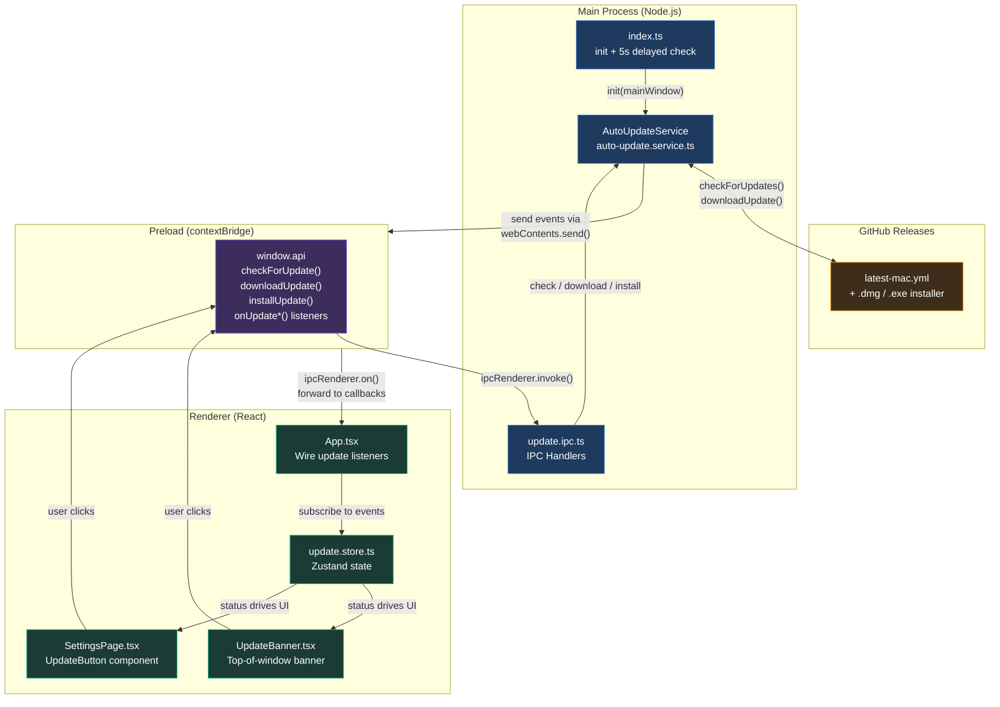

# Auto-Update Flow

> **Feature**: Automatic application updates via GitHub Releases + electron-updater
> **Date**: 2026-03-22

---

## 1. Sequence Diagram — Full Update Lifecycle

Shows every interaction from app launch through update installation, including the user-driven and automatic paths.

```mermaid
sequenceDiagram
    actor User
    participant Renderer as Renderer<br/>(React + Zustand)
    participant Preload as Preload Bridge<br/>(contextBridge)
    participant Main as Main Process<br/>(auto-update.service)
    participant GitHub as GitHub Releases

    Note over Main,GitHub: App Launch (production only)
    Main->>Main: autoUpdateService.init(mainWindow)
    Main->>Main: setTimeout(checkForUpdates, 5000)

    rect rgb(40, 40, 70)
        Note over Main,GitHub: Automatic Check on Startup
        Main->>GitHub: GET latest-mac.yml / latest.yml
        alt Update Available
            GitHub-->>Main: version info (v1.1.0)
            Main-)Renderer: IPC update:available {version, releaseNotes}
            Renderer->>Renderer: setAvailable(version)
            Note over Renderer: UpdateBanner shows<br/>"v1.1.0 available!" + Download btn
        else No Update
            GitHub-->>Main: current version matches
            Main-)Renderer: IPC update:notAvailable
            Renderer->>Renderer: setNotAvailable()
        else Network Error
            GitHub-->>Main: error / timeout
            Main-)Renderer: IPC update:error "message"
            Renderer->>Renderer: setError(message)
            Note over Renderer: Red error banner appears
        end
    end

    rect rgb(40, 60, 40)
        Note over User,Renderer: User Clicks "Download"
        User->>Renderer: Click Download button
        Renderer->>Preload: window.api.downloadUpdate()
        Preload->>Main: ipcRenderer.invoke(update:download)
        Main->>GitHub: Download .dmg / .exe / .AppImage

        loop Download Progress
            GitHub-->>Main: bytes received
            Main-)Renderer: IPC update:progress {percent, bytesPerSecond}
            Renderer->>Renderer: setProgress(percent)
            Note over Renderer: Progress bar updates
        end

        GitHub-->>Main: Download complete
        Main-)Renderer: IPC update:downloaded {version}
        Renderer->>Renderer: setDownloaded(version)
        Note over Renderer: Green banner<br/>"Ready! Restart & Install"
    end

    rect rgb(60, 40, 40)
        Note over User,Main: User Clicks "Restart & Install"
        User->>Renderer: Click "Restart & Install"
        Renderer->>Preload: window.api.installUpdate()
        Preload->>Main: ipcRenderer.invoke(update:install)
        Main->>Main: autoUpdater.quitAndInstall()
        Note over Main: App quits, installer runs,<br/>app relaunches on new version
    end

    rect rgb(50, 50, 40)
        Note over User,Renderer: Alternative: Manual Check from Settings
        User->>Renderer: Open Settings, click "Check for Updates"
        Renderer->>Preload: window.api.checkForUpdate()
        Preload->>Main: ipcRenderer.invoke(update:check)
        Main->>GitHub: GET latest-mac.yml
        GitHub-->>Main: version info
        Main-)Renderer: IPC update:available / update:notAvailable
    end
```

---

## 2. State Diagram — Update Status Lifecycle

Shows the Zustand store state transitions that drive the UI.

```mermaid
stateDiagram-v2
    [*] --> idle

    idle --> checking : checkForUpdates()

    checking --> available : update:available
    checking --> idle : update:notAvailable
    checking --> error : update:error

    available --> downloading : downloadUpdate()
    available --> idle : dismiss()

    downloading --> ready : update:downloaded
    downloading --> error : update:error

    ready --> idle : dismiss()
    ready --> [*] : installUpdate()<br/>app restarts

    error --> idle : dismiss()
    error --> checking : checkForUpdates()

    note right of idle
        No update banner shown.
        Settings shows "Check for Updates" btn.
    end note

    note right of available
        Blue banner: "v1.1.0 available!"
        Download + Dismiss buttons.
    end note

    note right of downloading
        Progress bar with percentage.
        Cannot dismiss during download.
    end note

    note right of ready
        Green banner: "Ready to install!"
        Settings shows "Install Update" btn.
    end note

    note right of error
        Red banner with error message.
        Dismiss button available.
    end note
```

---

## 3. Flowchart — Architecture Overview

Shows how the auto-update feature fits into the Electron process architecture.

---

## 4. Publishing Workflow

How you release a new version for your buddy to receive:

```mermaid
flowchart LR
    A["Bump version<br/>in package.json"] --> B["Build app<br/>npm run build:mac"]
    B --> C["Publish to GitHub<br/>--publish always"]
    C --> D["GitHub Release created<br/>v1.1.0"]
    D --> E["Buddy's app checks<br/>latest-mac.yml"]
    E --> F["Banner appears:<br/>Update available!"]
    F --> G["Download + Install"]

    classDef step fill:#1e3a5f,stroke:#4a90d9,color:#ffffff
    classDef github fill:#3d2d1a,stroke:#f59e0b,color:#ffffff
    classDef user fill:#1a3c34,stroke:#10b981,color:#ffffff

    class A,B,C step
    class D,E github
    class F,G user
```

---

## File Map

| Layer    | File                                                    | Role                                                                            |
| -------- | ------------------------------------------------------- | ------------------------------------------------------------------------------- |
| Shared   | `src/shared/constants.ts`                               | 8 `UPDATE_*` IPC channel constants                                              |
| Main     | `src/main/services/auto-update.service.ts`              | Wraps `electron-updater`, forwards events to renderer                           |
| Main     | `src/main/ipc/update.ipc.ts`                            | IPC handlers: check, download, install                                          |
| Main     | `src/main/index.ts`                                     | Initializes service, triggers 5s startup check                                  |
| Preload  | `src/preload/index.ts`                                  | Exposes `checkForUpdate`, `downloadUpdate`, `installUpdate` + 5 event listeners |
| Renderer | `src/renderer/src/store/update.store.ts`                | Zustand store: status, version, progress, actions                               |
| Renderer | `src/renderer/src/components/common/UpdateBanner.tsx`   | Top-of-window banner (4 visual states)                                          |
| Renderer | `src/renderer/src/components/settings/SettingsPage.tsx` | "Check for Updates" / "Install Update" button                                   |
| Renderer | `src/renderer/src/App.tsx`                              | Wires IPC events to Zustand store                                               |
| Config   | `electron-builder.yml`                                  | GitHub publish provider config                                                  |
