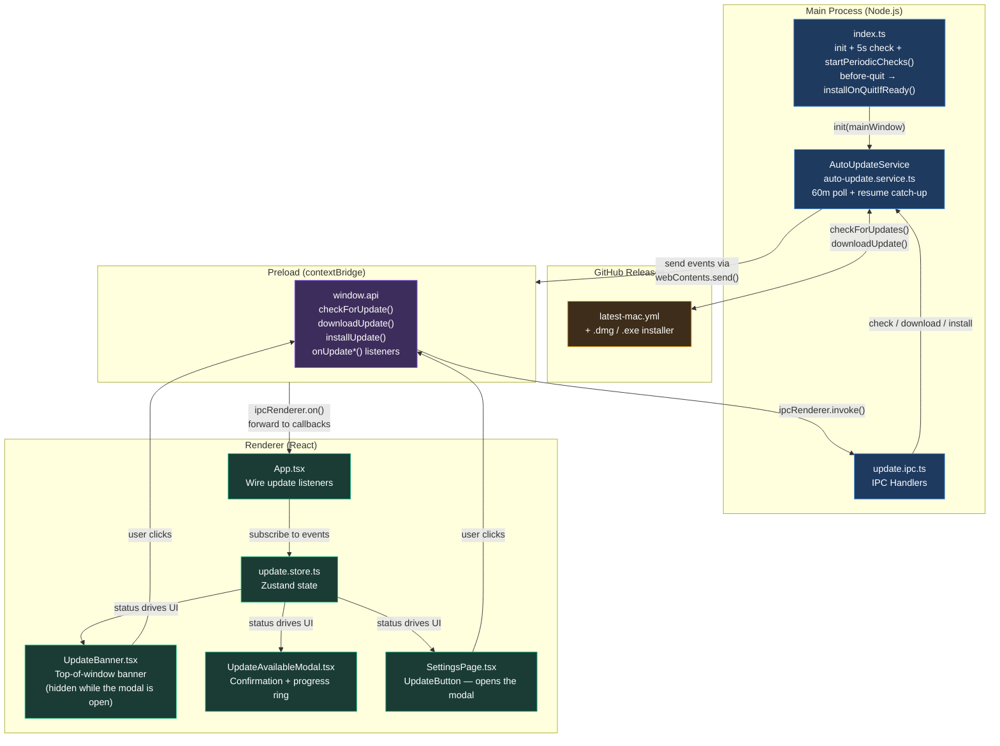

# Auto-Update Flow

> **Feature**: Automatic application updates via GitHub Releases + electron-updater
> **Date**: 2026-03-22

---

## 1. Sequence Diagram — Full Update Lifecycle

Shows every interaction from app launch through update installation, including the user-driven and automatic paths.

```mermaid
sequenceDiagram
    actor User
    participant Renderer as Renderer<br/>(React + Zustand)
    participant Preload as Preload Bridge<br/>(contextBridge)
    participant Main as Main Process<br/>(auto-update.service)
    participant GitHub as GitHub Releases

    Note over Main,GitHub: App Launch (production only)
    Main->>Main: autoUpdateService.init(mainWindow)
    Main->>Main: setTimeout(checkForUpdates, 5000)
    Main->>Main: startPeriodicChecks() — setInterval 60m + powerMonitor 'resume'

    rect rgb(40, 40, 70)
        Note over Main,GitHub: Automatic Check on Startup
        Main->>GitHub: GET latest-mac.yml / latest.yml
        alt Update Available
            GitHub-->>Main: version info (v1.1.0)
            Main-)Renderer: IPC update:available {version, releaseNotes}
            Renderer->>Renderer: setAvailable(version)
            Note over Renderer: UpdateBanner shows<br/>"v1.1.0 available!" + Download btn
        else No Update
            GitHub-->>Main: current version matches
            Main-)Renderer: IPC update:notAvailable
            Renderer->>Renderer: setNotAvailable()
        else Network Error
            GitHub-->>Main: error / timeout
            Main-)Renderer: IPC update:error "message"
            Renderer->>Renderer: setError(message)
            Note over Renderer: Red error banner appears
        end
    end

    rect rgb(45, 45, 60)
        Note over Main,GitHub: Background Polling (every 60 min, + on wake from sleep)
        loop While the app is open
            Main->>Main: maybeCheck() — skip if downloading,<br/>already downloaded, or checked < 15 min ago
            Main->>GitHub: GET latest-mac.yml / latest.yml
            GitHub-->>Main: version info
            Main-)Renderer: IPC update:available
            Note over Renderer: Modal opens — unless the user<br/>pressed "Later" on this version (4h snooze)
        end
    end

    rect rgb(40, 60, 40)
        Note over User,Renderer: User Clicks "Download"
        User->>Renderer: Click Download button
        Renderer->>Preload: window.api.downloadUpdate()
        Preload->>Main: ipcRenderer.invoke(update:download)
        Main->>GitHub: Download .dmg / .exe / .AppImage

        loop Download Progress
            GitHub-->>Main: bytes received
            Main-)Renderer: IPC update:progress {percent, bytesPerSecond}
            Renderer->>Renderer: setProgress(percent)
            Note over Renderer: Progress bar updates
        end

        GitHub-->>Main: Download complete
        alt Windows / Linux
            Main-)Renderer: IPC update:downloaded {version}
            Renderer->>Renderer: setDownloaded(version)
            Note over Renderer: autoInstall is set — 3s countdown starts
        else macOS — staging gate
            Main-)Renderer: IPC update:staging {version}
            Renderer->>Renderer: setStaging(version)
            Note over Renderer: "Preparing update…" — no restart button.<br/>MacUpdater emits update-downloaded when its<br/>proxy binds; Squirrel has staged nothing yet<br/>and quitAndInstall() is a no-op for ~17-28s.
            Main->>Main: electron.autoUpdater 'update-downloaded'<br/>(native Squirrel finished staging)
            Main-)Renderer: IPC update:downloaded {version}
            Renderer->>Renderer: setDownloaded(version) — 3s countdown starts
        end
    end

    rect rgb(60, 40, 40)
        Note over User,Main: Auto-Install (or "Restart now")
        Renderer->>Preload: window.api.installUpdate()
        Preload->>Main: ipcRenderer.invoke(update:install)
        Main->>Main: autoUpdater.quitAndInstall(true, true)
        Note over Main: Silent install (no NSIS UI). Windows/Linux:<br/>BaseUpdater spawns the installer and quits itself.<br/>Duplicate requests are ignored: two quitAndInstall()<br/>calls raced into competing ShipIt processes.
        alt macOS
            Main->>Main: app.quit() → before-quit → app.exit(0)
            Note over Main: MacUpdater.quitAndInstall() closes its proxy,<br/>delegates to the native updater and RETURNS —<br/>the app kept running. ShipIt swaps the bundle<br/>only once this PID dies, so we end it ourselves.
        end
        Main->>Main: 10s install watchdog
        Note over Main: If we are still alive, the install never started:<br/>the installRequested latch is cleared and<br/>update:installFailed keeps the Restart button<br/>usable instead of flipping the modal to 'error'.
    end

    rect rgb(40, 50, 60)
        Note over User,Main: Alternative: user cancels the countdown
        User->>Renderer: Click "Not now — install on quit"
        Note over Renderer: Modal closes, update stays on disk
        User->>Main: Quit the app later
        alt Windows / Linux
            Main->>Main: before-quit → installOnQuitIfReady()<br/>quitAndInstall(true, false)
            Note over Main: autoInstallOnAppQuit cannot be relied on here:<br/>it hangs off the 'quit' event and before-quit<br/>ends in app.exit(0), which never emits it.
        else macOS
            Main->>Main: before-quit → installOnQuitIfReady() returns early
            Note over Main: autoInstallOnAppQuit already staged the update<br/>with Squirrel; ShipIt applies it when the process<br/>dies, which app.exit(0) does not bypass.<br/>Calling quitAndInstall() would RELAUNCH the app.
        end
    end

    rect rgb(50, 50, 40)
        Note over User,Renderer: Alternative: Manual Check from Settings
        User->>Renderer: Open Settings, click "Check for Updates"
        Renderer->>Preload: window.api.checkForUpdate()
        Preload->>Main: ipcRenderer.invoke(update:check)
        Main->>GitHub: GET latest-mac.yml
        GitHub-->>Main: version info
        Main-)Renderer: IPC update:available / update:notAvailable
    end
```

---

## 2. State Diagram — Update Status Lifecycle

Shows the Zustand store state transitions that drive the UI.

```mermaid
stateDiagram-v2
    [*] --> idle

    idle --> checking : checkForUpdates()

    checking --> available : update:available
    checking --> idle : update:notAvailable
    checking --> error : update:error

    available --> downloading : downloadUpdate()<br/>(sets autoInstall + showModal)
    available --> available : closeModal()<br/>snooze this version for 4h
    available --> idle : dismiss()<br/>also snoozes for 4h

    downloading --> ready : update:downloaded<br/>(Windows / Linux)
    downloading --> staging : update:staging<br/>(macOS — Squirrel not done yet)
    downloading --> error : update:error

    staging --> ready : update:downloaded<br/>(Squirrel staged, or watchdog/error fallback)

    ready --> installing : autoInstall<br/>3s countdown
    installing --> [*] : installUpdate()<br/>silent install + relaunch
    installing --> ready : cancelAutoInstall()

    ready --> ready : dismiss()<br/>snoozes the banner; still installs on quit
    ready --> [*] : installUpdate()<br/>app restarts

    error --> idle : dismiss()
    error --> checking : checkForUpdates()

    note right of idle
        No update banner shown.
        Settings shows "Check for Updates" btn.
    end note

    note right of available
        Blue banner: "v1.1.0 available!"
        Download + Dismiss buttons.
        The banner honours the snooze;
        Settings never does.
    end note

    note right of downloading
        Circular progress ring: percentage,
        MB transferred, MB/s.
    end note

    note right of staging
        "Preparing update…" with a spinner.
        Only "Later" — deliberately no restart
        button, because quitAndInstall() cannot
        act until Squirrel has staged the zip.
        120s watchdog falls through to ready.
    end note

    note right of ready
        "Restarting in 3…" countdown.
        Cancelling defers to install-on-quit
        (explicit on Windows/Linux, Squirrel on macOS).
    end note

    note right of error
        Red banner with error message.
        Dismiss button available.
    end note
```



---

## 3. Flowchart — Architecture Overview

Shows how the auto-update feature fits into the Electron process architecture.



---

## 4. Publishing Workflow

Releases are distributed through a shared OneDrive folder, not GitHub.
`scripts/publish-to-onedrive.sh` runs automatically at the end of each platform
build: it copies artifacts into `<version>/<platform>/` and rewrites that
platform's channel manifest to point at them.

```mermaid
flowchart LR
    A["npm run build:release<br/>scripts/release.sh"] --> Z["bump once<br/>1.0.74 → 1.0.75"]
    Z --> B["build:mac<br/>packages zip + dmg"]
    B --> C["publish → 1.0.75/mac/<br/>rewrites latest-mac.yml"]
    C --> D["build:win<br/>packages setup.exe"]
    D --> E["publish → 1.0.75/win/<br/>rewrites latest.yml"]
    E --> V["verify BOTH channels = 1.0.75<br/>fatal if not"]
    V --> T["commit + tag v1.0.75"]
    T --> F["Client reads its own channel<br/>via the loopback feed server"]
    F --> G["Banner: Update available"]

    classDef step fill:#1e3a5f,stroke:#4a90d9,color:#ffffff
    classDef feed fill:#2d1e4f,stroke:#8b5cf6,color:#ffffff
    classDef user fill:#1a3c34,stroke:#10b981,color:#ffffff
    classDef gate fill:#4c1d3d,stroke:#c084fc,color:#ffffff

    class A,B,D,Z step
    class C,E,F feed
    class V,T gate
    class G user
```



### One bump per release, owned by `release.sh`

The patch bump used to live in `build-mac.sh`, which made the version a side
effect of building one platform. That produced two recurring failures:

- `build:mac` alone advanced the version and published only the mac channel, so
  Windows clients were offered the previous version indefinitely.
- Rebuilding to debug bumped again, minting versions that shipped but were never
  committed — **1.0.72 and 1.0.79 are in `dist/` and in nobody's git history.**

Now `scripts/release.sh` owns the single bump, and the platform scripts build
whatever `package.json` already says. `release.sh` also:

- refuses to run on a dirty tree, so the tag it writes actually describes what
  shipped (`ALLOW_DIRTY=1` builds without committing or tagging);
- **reverts the bump if the release fails**, so a dead build no longer burns a
  version number;
- treats a channel that is not on the new version as **fatal**, not advisory.

### Each channel is a single-version pointer

`latest-mac.yml` and `latest.yml` are independent, and each holds **one version,
not a history**. A client on 1.0.73 therefore jumps straight to whatever its own
channel names — intermediate versions are skipped entirely, and no differential
download is attempted (`disableDifferentialDownload` is set for the drive
source).

The corollary is the trap: a channel only advances when that platform's
artifacts are actually built. Release 1.0.75 with `build:mac` alone and
`latest.yml` still describes 1.0.74, so **every Windows client keeps being
offered 1.0.74** — indefinitely. `publish-to-onedrive.sh` will not republish a
manifest whose `version:` disagrees with the build (that would mint URLs into a
`1.0.75/win/` folder holding no installer), and it ends every run with a
per-channel summary so a half-finished release cannot pass unnoticed:

```
  ▸ Feed channel status (what each platform will be offered)
    ✓ macOS: v1.0.75 (current)
    ⚠ Windows: v1.0.74 — stale, this build is v1.0.75

  ⚠ Not every channel is on v1.0.75.
    → Windows clients stay on v1.0.74 — run npm run build:win
    Release both platforms in one command: npm run build:release
```

Use `npm run build:release` to advance both channels in one command. Inside a
release this warning is upgraded to a hard failure (Step 4 above) — a release is
not a release until every platform can actually be offered it.

Running `npm run build:mac` or `npm run build:win` on their own stays legitimate
and stays advisory: that is the catch-up path when one channel has fallen
behind, and neither script bumps, so building Windows alone lands it on exactly
the version macOS already published.

---

## File Map

| Layer    | File                                                          | Role                                                                                |
| -------- | ------------------------------------------------------------- | ----------------------------------------------------------------------------------- |
| Shared   | `src/shared/constants.ts`                                     | 11 `UPDATE_*` IPC channel constants                                                 |
| Main     | `src/main/services/auto-update.service.ts`                    | Wraps `electron-updater`, 60m poll, macOS staging gate, install-on-quit (Win/Linux) |
| Main     | `src/main/ipc/update.ipc.ts`                                  | IPC handlers: check, download, install                                              |
| Main     | `src/main/index.ts`                                           | Init + 5s startup check + `startPeriodicChecks()` + `installOnQuitIfReady()`        |
| Preload  | `src/preload/index.ts`                                        | Exposes `checkForUpdate`, `downloadUpdate`, `installUpdate` + 6 event listeners     |
| Renderer | `src/renderer/src/store/update.store.ts`                      | Zustand store: status (incl. `staging`), progress, snooze, auto-install countdown   |
| Renderer | `src/renderer/src/store/update-store-utils.ts`                | Pure snooze rule (`nextSnooze` / `isSnoozed` / `isBannerMuted`) + mute scopes       |
| Renderer | `src/renderer/src/components/common/UpdateAvailableModal.tsx` | Confirmation modal: aurora hero, progress ring, countdown                           |
| Renderer | `src/renderer/src/components/common/UpdateBanner.tsx`         | Top-of-window banner (suppressed while the modal is open or the version is snoozed) |
| Renderer | `src/renderer/src/components/settings/UpdateButton.tsx`       | "Check for Updates" / "Download vX" / "Install Update" — all open the modal         |
| Renderer | `src/renderer/src/hooks/useAppIpcListeners.ts`                | Wires IPC events to the Zustand store                                               |
| Renderer | `src/renderer/src/assets/main.css`                            | `update-*` keyframes: aurora, icon pulse, ring expand, check draw                   |
| Config   | `electron-builder.yml`                                        | GitHub publish provider config                                                      |
