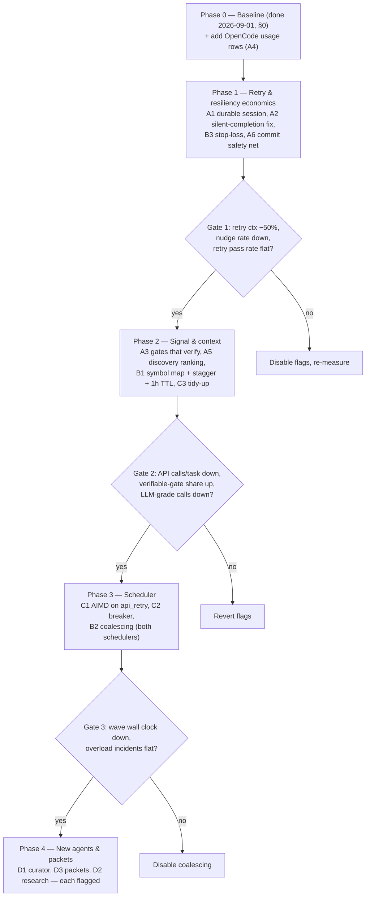

# Blueprint Execution Improvements — Research & Implementation Guide (v2, corrected 2026-09-01)

**Audience:** an LLM (or a future session) that will implement these changes without having participated in this research. Every claim below was re-verified against HEAD `2d79fc28` (v1.0.97) on 2026-09-01. Line numbers drift fast — treat them as "near here" and re-grep before editing.

**Mandate:** improve the blueprint pipeline (spec → clarify → plan → tasks → review → build → verify) on four axes — token usage, execution speed, performance, resiliency — for **both** the Claude CLI path and the OpenCode SDK path. Core constraint: **reuse existing infrastructure wherever possible**. This codebase already ships most of the primitives these improvements need; the work is wiring, not building.

**v2 changes vs v1:** v1 analysed the wrong Claude runner (see §1.3), assumed no session-resume infrastructure existed (it does, for six of seven phases), proposed `repomap-mcp` as a library dependency (unused in `src/`, zero-adoption package), and ordered phases by token economics when the measured pain is retries and lost sessions. The audit that produced these corrections is `docs/blueprint-execution-improvements-audit.md`. Section 0 below is new: measured baseline from the local usage database.

---

## 0. Measured baseline (2026-09-01, local SQLite: dev DB 17 blueprints / 384 tasks; packaged-app DB 7 blueprints / 83 tasks)

Where the tokens go (dev DB, all time; `ctx` = input + cache_read + cache_creation):

| feature | ctx tokens | share | output tokens | cache hit |
|---|---|---|---|---|
| blueprint-build | 3.03 B | **77 %** | 14.2 M | 97.1 % |
| chat | 0.68 B | 17 % | 2.6 M | 95.1 % |
| blueprint-verify | 0.16 B | 4 % | 1.3 M | 93.8 % |
| specify + clarify + plan + tasks + review | 0.045 B | **1.2 %** | 1.1 M | 72–87 % |
| recovery_nudge | 0.023 B | 0.6 % | 0.07 M | **18.6 %** |

Packaged-app DB has the same shape: build 82 %, verify 11 %, creation phases < 5 %.

Build-task economics (dev DB, 491 attempts, Claude path):

| metric | value |
|---|---|
| cumulative ctx per attempt (avg / max) | 5.3 M / 26.7 M tokens |
| peak context window per attempt (avg / max) | 166 K / 370 K tokens |
| implied API calls per attempt (cumulative ÷ peak) | ≈ 30 |
| output per attempt (avg) | 29 K tokens |
| task wall clock (avg / max) | 6.7 / 23.5 min |
| attempts needing a recovery nudge (silent completion) | **125 / 491 = 25 %** |
| attempts per completed task, dev DB | 1.28 |

Retry economics (packaged-app DB, `blueprint_tasks.attempts`, 83 tasks):

| metric | value |
|---|---|
| tasks completed first try | 50 / 83 |
| tasks needing ≥ 1 retry | **33 / 83 = 40 %** |
| tasks needing ≥ 3 attempts | 11 / 83 = 13 % (max seen: 7) |
| wall clock, 0 retries vs 2–3 retries | 8.0 min vs 16.3 min |
| two blueprints (33 tasks) that ran on OpenCode | **100 % of tasks retried, 78 retries; zero rows in `usage_log`** |

Quality-gate signal (packaged-app DB, 33 tasks with `gates_json`):

| gate | pass | fail | unverifiable |
|---|---|---|---|
| task-tests | 0 | 0 | 27 ("no test command resolved for this task") |
| test-integrity | 1 | 0 | 26 (declared test files did not exist) |
| write-set | 22 | 6 (all "outside write-set: node_modules") | 5 |
| stub-scan | 27 | 0 | 0 |

Artifacts carried between phases (dev DB, avg chars): verify 63 K, plan 46 K, build 37 K, tasks 26 K, specify 22 K, review 7 K, clarify 3 K.

**What the numbers say:**
1. The build phase is the only place token work pays. Creation-phase context economics (v1's B3) is a ~1 % lever.
2. Cache hit rate is already 97 %; prompt-ordering work (v1's A1) is not where the tokens go. The lever is **API calls per task (~30) and peak context (166 K)** — fewer exploration turns, smaller per-turn context, and not restarting cold.
3. Retries are common (40 % of tasks) and double wall clock; on OpenCode they are universal. Cold retries and lost sessions are the biggest measurable waste.
4. A quarter of Claude attempts end in a silent completion that needs a cold nudge.
5. Gates are producing almost no signal: `task-tests` was unverifiable in every recorded task. LLM grading is carrying verification alone.
6. The OpenCode path is unobservable: no usage rows. Any OpenCode improvement is unmeasurable until that is fixed.

Reproduce: copy `~/Library/Application Support/Code Atelier/code-atelier.db` (+ `-wal`, `-shm`) to a scratch dir and query `usage_log` (`feature`, `conversation_id = blueprint-build-<bp>-<task>-<ts>`), `blueprint_tasks` (`attempts`, `gates_json`, `outcome_kind`), `blueprint_phases` (`started_at/completed_at`, `artifacts_json`).

---

## 1. Verified current state (read this first)

### 1.1 Pipeline & state

- `src/main/services/blueprint.service.ts` (2339 lines) — orchestrator. `PHASE_ARTIFACT_RELEVANCE` (:72), `ARTIFACT_MD_CAPS_BY_TIER` (:178), `capArtifactForContext` (:194), `isRetryableError` (:612), `scheduleAutoRetry` (:628), `assemblePhaseContext` (:1458) / `assemblePhaseContextInner` (:1506), `buildSystemPrompt` (:1759 — phase-scoped, **task-invariant**), `saveRetryContext` fingerprint/recurrence detection (:1801–1858; incident note: "attempt counter reached 10 with the identical gate failure").
- `src/main/services/blueprint-state-machine.ts` (291 lines) — `VALID_TRANSITIONS` (:38), `ABSORBED_LATE_TERMINAL` (:117).
- 29 `blueprint-*.ts` services.

### 1.2 The DAG executor — `src/main/services/blueprint-build.service.ts` (3686 lines)

- `executeDag` (:930): cap from `parallelBuildAgents` pref (:945; clamped 1–6 by the pref layer), **halved once on overload** (:1226–1233), never raised again; `recordParallelism` (:1066) is a histogram only. File-overlap exclusivity via `allInFlightFiles` (:1047) + `filesOverlap` (:297); empty-file tasks are exclusive (:1168–1173). `runDrainPointGates` (:1114). Resume pre-pass (:966–1004). `isCascadeSkipped` (:1032); reachability cascade (:1343+).
- **A second scheduler is still live:** `executeWave` (:1423) runs as `mode: 'wave-fallback'` when the `dagScheduling` pref is off or the DAG has a cycle (:651–705). It has its own `allInFlightFiles` (:1544) and overload logic. Scheduler changes must cover both or explicitly exclude the fallback.
- Constants: `TASK_TIMEOUT_MS = 30 min` (:124), `MAX_BUILDER_ATTEMPTS = 3` (:132), `OVERLOAD_MAX_RETRIES = 2` (:135), `OVERLOAD_BACKOFF_BASE_MS = 60 s` (:136); `STALL_TIMEOUT_MS = 5 min` from `blueprint-phase-watchdog.ts:28`.
- Code graph is bootstrapped **before wave 1** against the execution worktree via a shadow workspace (:607–637).
- `buildTaskContext` (:3522) renders, in order: task id / wave / description → user story → `**Files**` flat list → depends-on → discoveries `.slice(-20)` (:3554) → prior-attempt output capped `MAX_PRIOR_CHARS = 4000` (:3564) → prior failure reason (:3578) → work packet `renderWorkPacket` (:3594; deliberately after retry context) → `gateFixInstructions` last (:3602).
- `handleTaskCompletion` (:2676): discoveries merged `.slice(-20)` (:2720) and persisted as artifact type `'discoveries'` (:2724–2729); failures via `blueprintRepository.setOutcome` (:2744). **No deterministic git commit anywhere in the build path**; the prompt asks the agent to commit per task (`src/main/blueprints/prompts/build-phase.md:78–84`, adapter `getPhaseMessage :70–79`).
- Three retry rungs, **all cold**: gate retry in `executeTaskWithGates` (:2046, loops to `MAX_BUILDER_ATTEMPTS`, then `escalateToLead` :2374); overload retry in `executeDag` (:1214–1277); user phase retry `retryPhase` (`blueprint.service.ts:1172`). `executeTask` (:2952) rebuilds context (:2996), creates a **new** `BlueprintBuildAdapter` + **new** `AgentSessionService` (:3006–3017) and a **fresh** `syntheticConvId = blueprint-build-${bp}-${task}-${Date.now()}` (:3104). "Prior attempt output" comes from a `build-partial` artifact regex lookup (:2986–2993).
- Escalation ladder: `gradeTask`, `escalateToLead`, `runPeerReviewIfEnabled`, `runWaveGates` (grep; anchors moved).

### 1.3 Claude path — the real one

**v1 error:** `agentic-claude-runner.ts` (`claude -p … --output-format text`) is used only by Deep Scan / memory extraction / specialist builder (`memory-reflection.service.ts`, `specialist-builder.service.ts`, `memory-extraction.service.ts`, `memory-bootstrap/executors.ts`). No blueprint file calls it.

Build tasks run:
```
executeTask → new BlueprintBuildAdapter → new AgentSessionService(adapter, instanceId)
  → session.send(adapter.getPhaseMessage(), syntheticConvId)                     // :3143
  → agent-session.service.ts:1728   sessionId = this.sessionMap.get(conversationId)   // empty for a fresh id ⇒ no --resume
  → cli-executor.ts buildCLIArgs (:1628–1703)
      claude --output-format stream-json --input-format stream-json --verbose --include-partial-messages
             --model … --permission-mode … --system-prompt-file <tmp> --max-turns … --mcp-config … --allowedTools … --disallowedTools …
             [--resume <id>]   // :1686–1699; guarded by markSessionPoisoned (:450) + UUID check (:1694)
      session_id captured from system/init at :816 → getSessionId() :439
```
- Build parses `parsePhaseCompletionBlock(session.getStreamedContent())` (:3172), not `parseSentinelBlock`.
- Build MCP/tool surface (`role-adapters/blueprint/blueprint-build.adapter.ts:90–119`): native Read/Write/Edit/Glob/Grep/Bash/WebSearch/WebFetch/ListDir + MCP **code-graph, semantic-search, git-context, code-analysis, memory** (lean mode drops two); disallowed Agent/ToolSearch/AskUserQuestion/TodoWrite.
- Prompt is already cache-ordered: `buildPhaseSystemPrompt` (:53–67, "Phase 1.2") = `basePrompt + TOOL_PRIORITY_DIRECTIVE_BUILDER + taskSection`; only the task tail differs across tasks. Because `--system-prompt-file` replaces the CLI's default system prompt, the git-status snapshot that normally sits in the prefix is absent — the cross-task prefix is `tools + phase prompt`.
- **Session resume already exists for six phases:** spec (`blueprint-spec.service.ts:425`), plan (:145), tasks (:255), review (:147), verify (:292), code-review (:292) all do `if (priorConvId && conversationRepository.getSessionId(priorConvId))` on retry. BUILD is the exception because of the per-attempt conversation id.
- Installed CLI 2.1.257 also offers `--session-id <uuid>`, `--fork-session`, `--json-schema` (structured output), `--no-session-persistence`, `system/api_retry` stream events (`error: rate_limit | overloaded`, `retry_delay_ms`), and `CLAUDE_CODE_PROMPT_CACHE_TTL=1h`.

### 1.4 OpenCode path — `src/main/services/opencode-executor.ts` (2865 lines)

- `ServerRefTracker` (:346), `MAX_TRANSIENT_RETRIES = 3` (:178), `processEventStream` (:945), `CIRCUIT_BREAKER_THRESHOLD = 5` consecutive errors (:404 / :1441 / `resetCircuitBreaker` :2620 — a counter, not a provider breaker), `killStaleServer` (:2632).
- Session primitives: `getSessionId` (:1949), `primeSession` (:1972), `revertSession`/`unrevertSession` (:2084/:2096 — OpenCode file-snapshot revert, not git), `summarizeSession` (:2105), `compactSession` (:2137), `autoCompactIfNeeded` (:2155), `getOrCreateSession` (:2500, private, **keyed by conversationId**).
- Callers outside the executor are `agent-session.service.ts` and `chat-agent.service.ts` only. Build reaches OpenCode through `AgentSessionService`; the fresh conversation id per attempt means a new session and a new `primeSession` every retry.
- **No usage rows are written for OpenCode build tasks** (packaged DB: two OpenCode blueprints, 33 tasks, 78 retries, 0 `usage_log` rows).
- Supporting: `opencode-event-normalizer.ts`, `agent-recovery-manager.ts`, `agent-recovery-nudge.ts`, `opencode-transient-patterns.ts`, `agent-executor-factory.ts`.

### 1.5 Reusable infrastructure already shipped

| Asset | Location | Currently used for | Underexploited for |
|---|---|---|---|
| Session resume (CLI + OpenCode) | `cli-executor.ts:1686`, `agent-session.service.ts:1728`, `conversationRepository.getSessionId` | Chat; six blueprint phases on retry | **Build-task retries** |
| code-graph DB | `code-graph.service.ts`, `code-graph-edge.repository.ts` | MCP tools for agents; bootstrapped pre-build | Deterministic symbol-map injection at dispatch |
| Per-task discoveries artifacts | `handleTaskCompletion :2724` | Recency window | Relevance-ranked retrieval |
| `usage_log` / `turn_usage` | `src/main/db/repositories/usage-log.repository.ts`, `turn-usage.repository.ts` | Display | Already records cache tokens with `feature='blueprint-build'`; baseline + AIMD input. Missing: OpenCode rows, `blueprint_id`/`task_id`/`attempt` columns |
| `saveRetryContext` fingerprinting | `blueprint.service.ts:1801` | Detect identical repeated gate failures | Stop-loss for non-converging retries (instead of a quarantine lane) |
| Tier-based artifact caps | `blueprint.service.ts:178` | Capping raw artifacts | Pattern for any new injected block |
| Handoff envelope | `blueprint-handoff-message.ts` | Blueprint → Chat handoff | Inter-phase packets (low priority, see §0) |
| Gates / peer review / lead escalation | `blueprint-gates.service.ts`, `blueprint-peer-review.service.ts`, `blueprint-lead-review.service.ts` | Post-task verification | Gates currently unverifiable in practice (§0) |
| `blueprint-dag-scheduler.test.ts` | `:204–500` | Scheduler tests | Harness for coalescing / AIMD |

### 1.6 External precedents (verified sources in the audit doc)

- **Aider repo map** (tree-sitter defs/refs graph, PageRank, binary-search to a token budget). No published benchmark uplift. Pattern, not proof.
- **Claude Code**: `--resume` / `--session-id` / `--fork-session`; automatic prompt caching with 1-hour TTL on subscription runs; fan-out staggers same-prefix launches ≤ 5 s so siblings read the first agent's cache; sub-agent docs say keep phases that share context in one conversation.
- **OpenHands condenser**: summarise the middle of history keeping goals/progress/remaining work/critical files/failing tests. Measured: 54 % vs 53 % SWE-bench Verified at under half the per-turn cost. The only precedent here with a number.
- **Anthropic context-engineering + multi-agent posts**: structured note-taking outside the window; sub-agents for verbose self-contained search; multi-agent is wrong for "most coding tasks" that share state. **Cognition, "Don't build multi-agents"**: parallel agents make conflicting implicit decisions. **MAST** (1,600 traces): failures cluster in inter-agent misalignment.
- **Devin Knowledge**: curated knowledge items retrieved on trigger; no published outcome metrics.
- **AIMD**: Netflix concurrency-limits, promptfoo (−50 % on 429, +1 after sustained success). Anthropic rate-limit docs: ramp gradually.
- **Policy**: Anthropic announced and then paused (2026-06-15) moving `claude -p` / SDK usage off subscription limits. Spawning the unmodified CLI with the user's login is permitted; the Agent SDK with OAuth is not; `--bare` needs an API key. Keep the CLI-spawn design.

---

## 2. Improvement catalog — grouped by measured ROI × risk

Each item: problem (evidence) → change (files) → reuse → measurement → tests → rollback.

### Quadrant A — High ROI, Low Risk

#### A1. Durable session per build task (Claude + OpenCode) — *was v1 B1; promoted*
- **Problem:** 40 % of tasks retry; every retry is cold (new conversation id, :3104), pays ~5 M ctx tokens and doubles wall clock (§0). Six other phases already resume. OpenCode additionally re-primes the session each attempt.
- **Change (split by failure class — see §7 evidence):** one conversation id per (blueprint, task). **Infrastructure failures** (stall, no-activity timeout, overload/rate-limit, process crash, silent completion with no block, `max_output_tokens`) → **resume the same session** with a short continuation message. **Quality-gate failures** → **cold restart with structured failure memory**: replace the 4,000-char raw `build-partial` dump with a ≤1–2 K-token structured summary of each failed attempt (hypothesis tried, files touched, failing gate output head/tail, what not to repeat), written by a cheap model from the transcript. Research: continuing a contaminated context resolves ~21 % fewer tasks at equal budget than a clean restart ("Why Retrying Fails", 2026), but a clean restart *with* failure memory beats both (AgentRewind: 87.8 % vs 62.2 % continue vs 51.2 % no memory). Our commit log says infrastructure failures dominate, so the resume path still carries most of the win. Details: reuse the conversation id across overload retries; persist executor session id on `blueprint_tasks` (ALTER migration, see `schema.sql:593` rule) so a phase retry after app restart can also resume; on retry send a short incremental message (gate verdict + `gateFixInstructions`) instead of the full task context; keep the cold path when no id exists, the session is poisoned (`markSessionPoisoned`), or the id is not a UUID. Lead escalation (`escalateToLead`) stays cold or uses `--fork-session` (model switch invalidates cache anyway).
- **Must-do on every resume (CLI docs):** re-pass `--mcp-config`, `--allowedTools`, `--permission-mode` (bypass is never restored), `--settings`, `--add-dir`; assert expected servers in `system/init.mcp_servers` (failed MCP on resume is silent); never run two processes on one session id; do not pass an OpenCode `ses_…` id to `claude --resume` (commit `06f491f9`).
- **Reuse:** `cli-executor.ts` resume path, `agent-session.service.ts` session map, `conversationRepository.getSessionId`, OpenCode `getOrCreateSession` by conversation id.
- **Measure:** ctx tokens per retry attempt by failure class (infra target −50 % or better), retry wall clock, gate-pass rate on retry (cold + memory must not be worse than today's cold + raw dump), nudge rate (must not rise).
- **Tests:** extend `blueprint-build.service.test.ts` for conversation-id stability across attempts; `cli-executor` args test for re-passed flags on resume; live test in `electron-live`.
- **Rollback:** flag; cold path retained.

#### A2. Silent-completion fix at the source — *new; 25 % of attempts*
- **Problem:** 125 / 491 Claude attempts needed a `recovery_nudge` (no completion block), each nudge a cold prompt (18.6 % cache hit). Commits `0f811c73`, `06f491f9` C, `bf221960` are symptoms.
- **Change:** (a) make completion structural: use `--json-schema` for the completion block on the CLI path if the installed CLI honours it in `stream-json` mode (open question 1), else a stricter completion contract in `build-phase.md` with a one-line "if you are done, emit X" reminder as the *last* system-prompt line; (b) when a session ends without a block, send the nudge **into the same session** (A1 gives us the id) rather than a cold prompt; (c) log `outcome_kind='nudged'` so the rate is trackable.
- **Measure:** nudge rate, nudge cost.
- **Rollback:** flag per sub-item.

#### A3. Make gates produce signal — *new*
- **Problem:** `task-tests` unverifiable in 27 / 27 recorded tasks ("no test command resolved"); `test-integrity` unverifiable in 26 / 27; `write-set` fails are all `node_modules`. Verification is falling through to LLM grading, which is the expensive rung.
- **Change:** preflight (`blueprint-preflight.service.ts`) resolves and caches the workspace test command (package.json scripts, `vitest`/`jest`/`pytest`/`dotnet test` detection) and stores it on the blueprint; `task-tests` runs only the test files in the packet (fast) and falls back to the suite at drain points; `write-set` ignores `node_modules`, lockfiles, and build output by default; tasks-phase prompt must declare `testFiles` that exist or be marked `noTests: true` explicitly so `unverifiable` becomes rare and meaningful.
- **Measure:** share of tasks with a verifiable `task-tests` verdict; LLM-grade calls per task.
- **Rollback:** per-gate config.

#### A4. OpenCode usage telemetry — *new; prerequisite for measuring anything on that path*
- **Problem:** zero `usage_log` rows for OpenCode build tasks (§0). The SDK message parts carry token usage.
- **Change:** record per-turn usage from OpenCode events through the same `tokenTracker.recordTurn` path (`agent-stream-processor.ts:106–115`) with `feature='blueprint-build'`; add `blueprint_id`, `task_id`, `attempt` columns to `usage_log` (or a side table) so joins stop parsing `conversation_id`.
- **Measure:** presence of rows; then the same tables as §0 for OpenCode.

#### A5. Relevance-ranked discoveries — *was v1 A2*
- Unchanged from v1: rank by file-path overlap with the task's `filePathsJson`, recency as tiebreaker, recency-only fallback. Pure function, unit-tested.

#### A6. Git commit per completed task — *was v1 A3, reframed*
- **Problem:** the prompt asks for a per-task commit (`build-phase.md:78–84`) but nothing enforces it; verify/review lack precise per-task diffs; rollback is manual.
- **Change:** in `handleTaskCompletion` success branch: if the execution worktree is dirty, `git add -A && git commit -m "blueprint <id> task <taskId>: <description>"`; if clean (agent already committed), skip. Only on the run worktree/branch (`blueprint-track.ts` modes `auto|fork|takeover`); never when the track fell back to `primary`. Landing stays manual (`track.ipc.ts:113`).
- **Reuse:** `simple-git` already in `blueprint-track.ts`. Precedent: aider auto-commits; Claude Code checkpointing does not see Bash edits so it is not a substitute.
- **Tests:** temp git repo unit test; e2e in TestingPage Blueprint category.

### Quadrant B — High ROI, Medium Risk (phase separately, measure between)

#### B1. Fewer turns per task: token-budgeted symbol map + tool-output hygiene — *was v1 A4, source changed*
- **Problem:** ≈ 30 API calls and 166 K peak context per task (§0). The agent discovers file contents by reading them or calling code-graph tools optimistically; `**Files**` is a flat list (:3542).
- **Change:** at dispatch, build a ranked, token-budgeted symbol map for the task's files + 1-hop neighbours **from `code-graph-edge.repository.ts`** (already indexed pre-build against the shadow workspace, :614–627), budget by context tier (copy `ARTIFACT_MD_CAPS_BY_TIER`), inject as one block in `buildTaskContext`. Do **not** add `repomap-mcp` as a runtime dependency (unused in `src/`, single maintainer); use its `dist/repomap.js` PageRank + binary-search budgeting as reference code only.
- **Also:** stagger same-prefix launches at wave start by 2–5 s so the first task writes the cache and siblings read it; set `CLAUDE_CODE_PROMPT_CACHE_TTL=1h` in the spawn env and confirm via `usage.cache_creation.ephemeral_1h_input_tokens`.
- **Measure:** API calls per task (cumulative ÷ peak from `turn_usage`), peak context, tokens/task, wall clock.
- **Tests:** map builder against a fixture graph; snapshot the block.
- **Rollback:** flag; flat list remains.

#### B2. Task coalescing for file-overlapping ready tasks — *unchanged from v1, plus*
- Must handle `executeWave` fallback (:1423) as well as `executeDag`. Prior art (Anthropic, Cognition, MAST) supports one context for state-sharing tasks. Decide the multi-task completion format before touching the parser; partial success settles per member.

#### B3. Retry stop-loss instead of quarantine — *replaces v1 D3*
- **Problem:** identical gate failure repeated up to 10 times (incident note :1801); `MAX_BUILDER_ATTEMPTS` is a count, not a convergence check.
- **Change:** feed `saveRetryContext`'s fingerprint into `executeTaskWithGates`: two identical failure fingerprints in a row → skip remaining builder attempts and escalate/park immediately with the failure classified (environmental vs code). Commits `f4ee2fc0` / `998ad13f` started this for environmental gates; generalise.
- **Measure:** attempts per failed task; wasted ctx tokens on repeated identical failures.

### Quadrant C — Medium ROI, Low Risk

#### C1. AIMD parallelism on a real signal — *was v1 C1*
- **Problem:** cap halves once (:1226) and never rises; `recordParallelism` is a histogram.
- **Change:** consume `system/api_retry` stream events (category `rate_limit`/`overloaded`, `retry_delay_ms`) as the overload signal; +1 cap (≤ clamp) after N consecutive task completions in a wave with zero `api_retry` events; halve on any. Treat "usage limit reached" (Max plan window) as stop, not backoff.
- **Tests:** `blueprint-dag-scheduler.test.ts` fixtures.

#### C2. Provider circuit breaker (closed / open / half-open) — *was v1 D4 minus failover*
- Keyed by provider, fed by `api_retry` events and `opencode-transient-patterns` hits; when open, pause dispatch for the whole wave instead of burning per-task retries. No Claude ↔ OpenCode failover (capability cliff).

#### C3. Cache-friendly task-tail ordering — *was v1 A1, demoted*
- Outer ordering is already optimal (:53–67). Inside the task tail, move stable packet before volatile retry context **only once A1 makes retries resume** (then the retry message is incremental anyway). 30-minute tidy-up, not a phase.

#### C4. Speculative next-wave context prefetch — *unchanged from v1 C2; defer until B1 makes assembly expensive.*

### Quadrant D — Medium ROI, Higher Risk (last, each behind its own flag)

#### D1. Wave-boundary knowledge curator — *unchanged from v1 D1*
- Cheap-model call once per wave maintaining `run-knowledge.md` (conventions, decisions + rationale, deviations, open questions), injected capped. Cost cap < 5 % of build tokens. Precedent: Anthropic structured note-taking; Devin Knowledge (no published metrics). Not a resident orchestrator.

#### D2. Research subagent per ambiguous task — *unchanged from v1 D2; only after B1 numbers*
- Note `CLAUDE.md` architecture: no sub-agents via the Agent tool. This is a separate cheap-model process, permitted, but it adds LLM calls; ship after deterministic wins are measured.

#### D3. Structured inter-phase handoff packets — *was v1 B3, demoted by §0 (creation phases ≈ 1 % of tokens)*
- Still worth doing for **quality** (lossy caps on 46 K-char plans), not for tokens. Gate on verify pass-rate evidence.

---

## 3. Execution strategy: phased, measurement gates between layers



### Phase contents (including §6 and §7 items)
- **Phase 0 (done + telemetry):** A4 OpenCode usage rows, E11 attempt-level telemetry.
- **Phase 1 — retry & resiliency:** A1 (infra → resume; gate → cold + failure memory), A2 silent-completion fix, B3 stop-loss, E12 backoff + second auto-retry, A6 commit safety net, E1 clarify auto-skip (trivial, ships with anything).
- **Phase 2 — signal & context:** A3 gates that verify, A8 definition-of-done contract, E9 path validation, A7 clean-context grader, A5 discovery routing by overlap, B1 symbol map + stagger + 1 h TTL, E2 deterministic verify gates first, E3 shared feature diff, E5/E6/E7/E8 prompt and context hygiene, C3 tidy-up.
- **Phase 3 — scheduler:** C1 AIMD on `api_retry`, C2 provider breaker, E10 provider-aware stall windows, B2 coalescing (both schedulers), E4 parallel map sessions.
- **Phase 4 — new LLM roles, each flagged, default off:** D2 scout per wave, D1 curator, D4 best-of-N at escalation, D3 handoff packets.

### Testing conventions
- New unit test files must be registered in `src/main/services/__tests__/run-tests.ts` (474 entries) **and** `src/main/__tests__/run-all.ts` (633 entries).
- In-app E2E scenarios: TestingPage catalog (`docs/e2e-master-test-catalog.md`, Blueprint category).
- Playwright live-LLM tests: `electron-live` project (15-min timeout) — for A1/A2/D1/D2.

---

## 4. What we deliberately are NOT doing (and why)

- **Resident orchestrator LLM** answering task-agent queries: highest cost and fragility; Anthropic and Cognition both argue against agent-to-agent chatter for coding. D1's curated artifact delivers the memory benefit at one cheap call per wave.
- **Worktree-per-task with agent-resolved merges:** merge resolution by agents is a resiliency cost; coalescing (B2) and file-overlap exclusivity get most of the win.
- **Migrating build to the Agent SDK:** not permitted with subscription login; spawning the unmodified CLI is the compliant path.
- **Claude ↔ OpenCode failover:** capability cliff; a task planned for Opus will not clear gates on a local 30B model.
- **Quarantine lane for dependents of failed tasks (v1 D3):** correctness risk; replaced by B3 stop-loss.
- **Creation-phase token work as a priority:** ≈ 1 % of spend (§0).

## 5. Open questions for the implementer

1. Does CLI 2.1.257 honour `--json-schema` in interactive `stream-json` mode (our build path), or only with `-p`? Decides A2(a) and the B2 completion format.
2. Does `--resume` preserve the session id on this CLI version (older issues #12235 / #10806 reported a new id)? Verify once, empirically.
3. Transcripts live under `~/.claude/projects/<cwd-slug>/`; build runs in a worktree. Confirm resume finds the session across attempts (docs: v2.1.223+ searches worktrees).
4. OpenCode: confirm reusing `getOrCreateSession` across attempts does not collide with the refcounted server lifecycle (`2d12310b`) or the worktree event-bus fix (`2ab33c13`, `87e31855`).
5. Which OpenCode SDK event carries per-message token usage, so A4 can hook it?

---

## 6. Second pass — the pipeline outside the build executor (verified 2026-09-01)

Creation phases are ~1 % of tokens, so these items are ranked by **wall clock, resiliency and quality**, not tokens, unless stated. Every phase (specify … verify, peer/lead/code-review) is a full agentic loop with tools (`blueprint-base.adapter.ts:118–148`), CLI `--max-turns 200` (`agent-session-host.ts:186`), 30-min phase timeout, 5-min stall window.

| # | Item | Evidence | Change | Effect | Size |
|---|---|---|---|---|---|
| E1 | **Auto-skip CLARIFY when the spec has zero clarification markers** | `blueprint-spec.service.ts:519–522` computes `needsClarification` then always dispatches CLARIFY; `specify-phase.md:137–142` already emits `clarificationCount`; manual `skipClarifyPhase()` exists (:990) | if `clarificationCount === 0 && !needsClarification` → call the skip path | −1 agentic session and minutes per clean blueprint | S |
| E2 | **Run deterministic verify gates before the verify LLM** | LLM session at `blueprint-verify.service.ts:331` precedes `runVerifyQualityGates` at :467; a red suite forces `gaps_found` anyway (:474–490) | run full-suite/smoke/disk-scan first; on red, skip the agent and build remediation from gate evidence (`buildGateFixInstructions`, `blueprint-gates.service.ts:1281`); setting-gated | saves the pipeline's most expensive single session (verify ≈ 5–11 % of all tokens) whenever the suite is red; drops the Haiku extractor call on that path | M |
| E3 | **Compute the feature diff once; inject it into verify** | identical `git diff <baseline>..HEAD` in `blueprint-code-review.service.ts:492–514`, `blueprint-lead-review.service.ts:349–369`, and the verify agent rediscovers it (comment at `blueprint-verify.service.ts:1056`) | cache `(blueprintId, baseline, HEAD) → diff`; give verify the capped diff in its first message | fewer verify tool turns; consistent truncation across reviewers | S |
| E4 | **Parallelise tasks map-reduce map sessions; drop the dead one-shot start** | serial `for` loop `blueprint-tasks.service.ts:160–200`; one-shot `session.start()` at :248 even when map-reduce bypasses it (:298–311) | `Promise.all` with provider-capped concurrency (2–3); construct the one-shot session only in the `else` branch | tasks-phase wall clock ÷ N docs; one fewer process spin-up | S |
| E5 | **Stop assembling full build context for peer review** | `blueprint-peer-review.service.ts:121` calls `assemblePhaseContext(...,'build',...)` per task; `peer-review-pass.md` has no `{{PREVIOUS_PHASE_ARTIFACTS}}` / `{{WORKSPACE_DOCS}}` placeholder, so DB reads + disk mirror writes (`blueprint.service.ts:1600–1640`) are discarded | pass a lite context (header + constitution) | per-task latency; removes a footgun (adding the placeholder later would push ~50 K chars into a cheap-model pass) | S |
| E6 | **Pass the resolved context window to every `assemblePhaseContext` call** | only tasks (`blueprint-tasks.service.ts:102`) and peer review pass it; spec/plan/review/verify/code-review/lead call the 3-arg form → medium caps regardless of model (`blueprint.service.ts:1437–1456` sync resolver defaults to medium for unknown local models) | thread `resolveWorkspaceContextWindow` through all callers; warm the async resolver once per pipeline | Claude phases stop truncating at 50 K when 100 K is allowed; small local models stop overflowing | S |
| E7 | **Deduplicate static prompt text; stop triple-injecting grill decisions** | identical 2,337-byte Tool Priority block in specify/plan/tasks (+ variants in review/build/verify ≈ 14 KB total); `{{BLUEPRINT_CONTEXT_JSON}}` embeds `settings` incl. `grillDecisions`/`revisionRequests` (`blueprint.service.ts:1651`), rendered again by `{{GRILL_DECISIONS}}`/`{{REVISION_FEEDBACK}}` (`blueprint-prompt-loader.ts:470–493`) and a third time in `blueprint-specify.adapter.ts:54–62`; constitution uncapped in every phase | whitelist-project `settings`; move Tool Priority into `TOOL_PRIORITY_DIRECTIVE` (adapter already supports it, `base.adapter.ts:257–260`); one source per block | 1–3 K tokens per phase, more with long grill ledgers; one place to edit | M |
| E8 | **Cap `{{WORKSPACE_DOCS}}` as a block and tier it** | 4 files × 30 K chars, no total cap (`blueprint-document-loader.ts:265–292`), injected into 9 templates incl. peer/lead/code-review | tiered total budget (e.g. 12 K / 30 K / 60 K chars), prefer CLAUDE.md, summarise package.json to name/scripts/deps | up to ~30 K tokens per phase on large repos; fewer small-model overflows | S |
| E9 | **Validate task `files` against the workspace and the plan at persist time** | `validateTaskGraph` checks IDs/cycles/waves only (`blueprint-task-validator.ts:35–109`); `persistTasksFromJson` stores LLM paths verbatim (`blueprint-tasks.service.ts:493–560`); same-wave overlap not validated; only `verifyTaskFileClaims` checks at completion | resolve paths, flag new vs existing, check same-wave overlap and plan ⊆ tasks coverage; one corrective turn on violations (pattern: `CLARIFY_CORRECTION_MESSAGE`) | fewer write-set / "planned file missing" failures → fewer retries (see §0 write-set fails) | M |
| E10 | **Provider-aware stall windows + measured tokens/s on OpenCode** | fixed `NO_ACTIVITY_TIMEOUT_MS = 120 s`, `MID_TURN_STALL_MS = 240 s` (`opencode-executor.ts:421–422`), `STALL_TIMEOUT_MS = 5 min`; no throughput metric anywhere; reasoning deltas visible in `opencode-event-normalizer.ts:365–366` but not counted as activity | track output tok/s per session; scale windows by provider class; count reasoning parts as activity | fewer false stall kills on local models (each costs a full retry), faster detection on hosted | M |
| E11 | **Persist attempt-level telemetry and stall/nudge incidents** | `blueprint_tasks.attempts` is a counter, no per-attempt rows; stall/nudge/recovery only in electron-log; five adapters share `usage_log.feature='blueprint-review'`; `SchedulerStats` in-memory only | `events` rows (`category='telemetry'`) per stall/nudge/auto-retry keyed by blueprint/phase/task/attempt; tag usage with `task:attempt`; distinct features for peer/lead/code-review | every §0 metric becomes queryable over time | M |
| E12 | **Backoff + jitter + a second auto-retry for cold-start/overload phase failures** | `scheduleAutoRetry` = one retry after flat 5 s (`blueprint.service.ts:657–690`); retryable set includes "Failed to create OpenCode session" (MCP handshake) and rate-limit/overloaded, which need > 5 s | per-class delay (cold-start 15–30 s, overload 30–60 s + jitter, 2 attempts); reuse `isSlowTransientError` (`opencode-transient-patterns.ts:54–56`) | fewer failures surfaced to the user; no extra tokens (failed turn produced none) | S |

OpenCode SDK capabilities present in `@opencode-ai/sdk@1.18.18` but unused by `opencode-executor.ts`: `session.fork`, `session.diff` (could replace the three `git diff` calls for OpenCode runs), `session.message` (single-message fetch instead of the whole `messages` list in the token backstop, :2290–2330), `mcp.status` (instead of the 10 s connected gate), `tools?:` per-prompt override (drop write-tool schemas from read-only phases on small local models), `Session3.context` (live context usage → tier-aware caps), v2 health endpoint (instead of `session.list()` every 30 s, whose 3-strike auto-restart kills every in-flight session regardless of refcount, :1811–1853). Note the system prompt is re-sent on **every** `prompt()` call unless `CODE_ATELIER_SYSTEM_PROMPT_FILE` routes it through the plugin hook (`:2575–2611`, `opencode-config-writer.ts:214,801`) — on providers without prefix caching that is 10–15 K tokens per turn.

Dead config: `templates/spec.md|plan.md|tasks.md` are mapped in `blueprint-prompt-loader.ts:70–74` but no template uses `{{TEMPLATE_CONTENT}}`.

---

## 7. Cross-platform survey — what others do, what they walked back, and what maps onto us (2026-09-01)

Platforms reviewed against primary docs/source: Kiro, OpenAI Codex + Symphony, Cursor, Claude Code (subagents / agent teams / workflows / `/batch`), Cline, Roo, Kilo, Vibe Kanban / Conductor / Claude Squad, Devin, Factory, Jules, Plandex, OpenHands SDK, SWE-agent / mini-swe-agent, Agentless, Aider, Goose, Refact, Amp, Augment Intent, Gemini CLI, Copilot cloud agent; academic: MetaGPT, ChatDev, AgentCoder, MAST, CodeMonkeys, Trae, RTV/PDR, AgentRewind, "Why Retrying Fails", TRACE, context-rot. Full URL list in the audit doc's companion notes.

### 7.1 Patterns that recur (count = platforms with verified evidence)

| Pattern | Count | Our status |
|---|---|---|
| Structured prompt down, **short summary up**; never the transcript | 15 | Partly (completion block); discoveries are unstructured |
| Plan read-only on a stronger model → plan file → execute in fresh context | 14 | Yes (spec/plan/tasks → build) |
| Isolation per task via worktree/VM; **merge is human- or planner-owned, never automatic** | 18 | Yes (single run worktree, manual landing) — keep |
| Read-only scout on a cheaper model returning **paths/locations, not contents** | 12 | No (v2 D2) |
| Verifier separate from the worker, **clean context**, external evidence | 15 | Partly (verify agent; LLM grade sees builder output) |
| Compaction/handoff keyed to a **structured state snapshot** (goal, constraints, artifact trail, next steps) | 13 | No (fixed char caps) |
| Tool output truncated head/tail, full output spilled to a file path | 8 | CLI does it natively; OpenCode path unknown |
| Per-role **static** model routing (planner/worker/reviewer/summariser) | 13 | Yes (ModelAction bindings) |
| Loop/stall detection with explicit thresholds + backoff | 8 | Partly (fixed 5-min stall; no loop detection) |
| Hard budget caps that also stop children | 9 | Turn caps only; no USD/token cap per task |
| **Best-of-N + test/critic selection** as the parallelism that measurably helps hard tasks | 11 | No |
| Dependency-aware **waves with file-overlap exclusion**, no worktree per task | 4 (Kiro, Augment Intent, CAID, us) | Yes |
| Lazily triggered knowledge (keyword/path triggers) instead of always-on context | 7 | No (workspace docs always injected) |

### 7.2 Patterns tried and walked back (do not build these)

- **Resident orchestrator LLM**: Kilo deprecated Orchestrator mode; Roo stripped it to pure delegation; Claude Code removed `TeamCreate/TeamDelete`, made task tools opt-in, documents agent teams at ~7× tokens with no resume; Anthropic dropped sprint decomposition for Opus 4.6; Codex turned `update_plan` off; Amp deleted its TODO list. What survived is a **code** scheduler (Symphony, Claude Code Workflows, Kiro waves, Goose review orchestrator) with LLMs only at decision points. This is what we already have.
- **Automatic lead/worker model switching inside one session**: Goose removed lead/worker and Autopilot; Codex Multi-Agent V2 dropped per-spawn model overrides; Cognition's "smart friend" failed when the model gap was wide. The one that works (Devin Fusion) switches only at compaction boundaries where the cache is already lost.
- **Compaction ↔ handoff flip-flop**: Amp removed compaction for `/handoff`, then reversed; Goose is removing tool-pair summarisation for cache reasons; TRACE shows compression causes instability rather than uniform loss.
- **Flat swarms sharing a tree, or agent-to-agent negotiation**: Cursor (20 agents → throughput of 2–3), Goose (5 parallel UI subagents incoherent), Kiro issue #8402 (sub-agents kill each other's builds), Claude Code docs ("two teammates editing the same file leads to overwrites").
- **Worktree-per-task auto-merge as a product**: nobody ships it; Vibe Kanban and Crystal shut down.
- **Self-verification by the author**: every platform moved the critic to a clean context (Anthropic, Devin, Jules, OpenHands critic, MAST evidence).
- **Embedding indexes as primary retrieval**: Augment (no help on SWE-bench), Agentless Mini dropped them; grep + scout + skeletons won.
- **Retrying by continuing the contaminated context** on quality failures: "Why Retrying Fails" (7.1× error cascade), AgentRewind. Cold retry is the validated default; it just needs failure memory (A1 split).

### 7.3 Techniques that map onto our pipeline (ranked), and where they land in §2

| # | Technique | Who does it / evidence | Lands in |
|---|---|---|---|
| 1 | Cold retry **+ structured failure memory** (≤1–2 K tokens: hypotheses, files touched, failing gate head/tail, what not to repeat) | AgentRewind 87.8 % vs 51.2 %; RTV/PDR: summaries beat raw trajectories, steps 41 → 14 | **A1** (quality-failure branch) |
| 2 | Schema'd builder handoff `{files_changed, interfaces_added, decisions, gotchas, test_cmds, open_questions}`; route to downstream tasks by **file/module overlap + DAG parents**, not recency-20 | MetaGPT subscription-by-profile; Chroma "a single distractor reduces performance" | **A5** (+ `--json-schema`, A2) |
| 3 | Cheap read-only **scout per wave** emitting a cached context brief of paths + symbol skeletons | Gemini `codebase_investigator`, Cline subagents, Agentless skeletons 58 % vs 53 % | **D2** → promote to Phase 2 alongside B1 if B1's map alone does not cut turns |
| 4 | Cache-aware prompt layout + **spawn stagger ≤ 5 s**; never switch model/tool set mid-attempt | Claude Code fan-out docs; Devin Fusion; Goose #11764 | **B1** (already listed) |
| 5 | **Clean-context verifier** that never sees the builder transcript, grading against per-task acceptance criteria; **independent test author** before the builder runs | Devin ("do not share any context"), AgentCoder test accuracy 61 → 88 %, MAST verifiers "superficial" | new **A7** (below) |
| 6 | Waves + **coalescing** by file-overlap graph; keep the single run worktree | Kiro, Augment Intent, Factory ("prefer a single expert when it fits one window") | **B2** |
| 7 | **Error classification → resume vs cold** (infra → resume with continuation guidance + backoff `min(10 s·2ⁿ, 5 min)`; gate → cold + memory) | Symphony, Codex `exec resume`, "Why Retrying Fails" | **A1** split, **E12** |
| 8 | Tiered stall/loop detection: event-inactivity, identical tool-call hash ×5, action-error streak ×3 with one nudge, consecutive-failure breaker, per-task budget cap that kills children | Symphony 5 min, Gemini 5/10/30, OpenHands 4/3/3/6, Kiro Crew 5, Claude `--max-budget-usd` | **C2**, **E10**, **B3** |
| 9 | **Best-of-N at escalation** (2–3 parallel attempts on the 3rd try, select by tests then a cheap judge over structured summaries) instead of a third identical attempt | Codex `--attempts`, Cursor `/best-of-n`, Jules `--parallel`, Trae +8–10 pts, CodeMonkeys | new **D4** (below) |
| 10 | Per-task **definition-of-done contract** (acceptance criteria + shell `checks` + expected files) written in the tasks phase, enforced by the gate, graded by the verifier | Anthropic sprint contract, Goose recipe `retry.checks`, Kiro PBT, SWE-bench Pro (spec text ≈ 3× success) | new **A8** (below); fixes the §0 gate-signal problem together with A3 |

### 7.4 New catalog items from the survey

#### A7. Clean-context LLM grade + independent test author
- **Problem:** `gradeTask` and peer review grade with builder context available; tests are written by the builder that is graded on them; `task-tests` gate is unverifiable in practice (§0).
- **Change:** (a) grader runs as a fresh process with only the task DoD (A8), the per-task diff (A6 commit makes it exact) and gate evidence; never the builder transcript; (b) optional "test author" cheap-model pass in the tasks phase (or first thing in the wave) that writes failing tests from the acceptance criteria into the packet's `testFiles`, so `test-integrity` has files that pre-exist and `task-tests` has a red→green proof.
- **Measure:** false-pass rate (tasks graded pass that later fail verify), verifiable-gate share.
- **Size:** M. Flag-gated.

#### A8. Per-task definition-of-done contract
- **Problem:** tasks carry description + files; acceptance is implicit; the builder decides when it is done.
- **Change:** tasks-phase schema gains `acceptance[]` (observable statements), `checks[]` (shell commands, e.g. the resolved test command scoped to `testFiles`), `expectedFiles[]`; `renderWorkPacket` prints it; the gate runs `checks[]` deterministically; the completion block must reference each acceptance item. Pair with E9 (path validation) so `expectedFiles` are real.
- **Measure:** share of tasks with ≥ 1 verifiable check; retries caused by "done but not done".
- **Size:** M.

#### D4. Best-of-N at escalation
- **Problem:** the third builder attempt is usually the same model with the same context; escalation to lead is serial.
- **Change:** when attempt 3 is reached, launch 2–3 parallel attempts (lead model, a second Claude model, and the local model when available) in `--fork-session`s / separate worktrees, select by `checks[]` pass first, then a cheap judge over the structured summaries. Cap: only for tasks that reach escalation (≈ 13 % of tasks by §0). 
- **Size:** M–L. Default off.

### 7.5 Explicit non-recommendations, restated with sources
No resident orchestrator LLM streaming context to builders (walked back by Kilo, Roo, Claude Code, Amp; 7–15× tokens). No builder-to-builder messaging (Cursor, Goose, Kiro failures). No mid-attempt model switching (Goose, Codex V2). No worktree-per-task auto-merge (no platform ships it). Keep the coordinator in code and let builders pull context through tools; spend LLM calls at decision points only (scout, failure-memory summary, grade, best-of-N judge).

---

## 8. Path applicability — Claude CLI vs OpenCode (read before implementing any item)

Both paths share `AgentSessionService`, the DAG scheduler, gates, context assembly and the task repository, so every item that lives there is shared. Five mechanisms named in this plan are Claude CLI features; each has an OpenCode equivalent or a stated fallback below. Items marked *OpenCode-only* fix gaps that exist only on that path.

| Item | Claude CLI | OpenCode | Notes |
|---|---|---|---|
| A1 durable session per task | `--resume <uuid>` via `cli-executor.ts:1686`; re-pass flags | **Same fix**: `opencode-executor.ts` `sessionMap` is keyed by `conversationId` (:397, :1949, :2500); reusing the id reuses the session and skips `primeSession` | The failure-class split (infra → resume, gate → cold + failure memory) applies to both. Lead escalation: `--fork-session` on CLI; `session.fork` exists in the SDK and is unused |
| A2 silent-completion fix | `--json-schema` structured output (if honoured in stream-json) | **No structured-output option in `@opencode-ai/sdk` types** — keep the fenced-block parser and `agent-recovery-nudge.ts`, but send the nudge into the same session (A1) instead of cold | Sub-item (b) "nudge in-session" is the shared part and the larger win |
| A3 gates that verify | shared | shared | Gate engine is executor-agnostic |
| A4 usage telemetry | already recorded | ***OpenCode-only gap***: zero `usage_log` rows; SDK message parts carry `tokens` (`types.gen.d.ts:117, :290`) | Prerequisite for measuring anything on OpenCode |
| A5 discovery routing | shared | shared | Context assembly |
| A6 commit per task | shared | shared | Git on the run worktree; OpenCode's `session.revert` is an extra rollback tool, not a replacement |
| A7 clean-context grader, A8 DoD contract | shared | shared | Grader can run on either provider per role binding |
| B1 symbol map | shared | shared | Built from code-graph, provider-agnostic |
| B1 stagger + 1 h TTL | `CLAUDE_CODE_PROMPT_CACHE_TTL`, Anthropic prefix cache | Prefix reuse depends on the local server (llama.cpp / Ollama / oMLX KV-cache) and on identical prefixes; **OpenCode re-sends the full system prompt on every `prompt()` call** unless routed through the plugin hook (`opencode-executor.ts:2575–2611`, `CODE_ATELIER_SYSTEM_PROMPT_FILE`) | The OpenCode token item here is "make the system prompt hook the default", not TTL |
| B2 coalescing, B3 stop-loss | shared | shared | Scheduler + `saveRetryContext` |
| C1 AIMD signal | `system/api_retry` stream events | `opencode-transient-patterns.ts` already classifies `overloaded` / `429` / `503` (:18–22) and `isSlowTransientError` (:54) | Same AIMD controller, two signal adapters |
| C2 provider breaker | `api_retry` + exit codes | transient-pattern hits + `CIRCUIT_BREAKER_THRESHOLD` counter (:404) | Key the breaker by provider id so a GLM outage does not pause a Claude wave |
| D1 curator, D2 scout, D4 best-of-N | shared | shared; D4 can mix providers | Cheap-model role bindings decide the provider |
| E1–E9, E11, E12 | shared | shared | Creation phases and telemetry |
| E10 stall windows | fixed 5-min watchdog | ***OpenCode-only***: `NO_ACTIVITY_TIMEOUT_MS` / `MID_TURN_STALL_MS` (:421–422), count reasoning deltas as activity, tok/s per provider | Claude path rarely false-stalls |
| SDK extras | — | `session.diff`, `session.message`, `mcp.status`, v2 health, `tools?:` per-prompt override | Optional; see §6 |

**Rule for the implementer:** any new mechanism must name its OpenCode equivalent in the PR description, or state explicitly that it is CLI-only and why. Tests for shared items should run the `blueprint-dag-scheduler` and `blueprint-build.service` suites with both executor backends stubbed.

---

**Document status:** v2 research complete, baseline measured, no code changed. Implementation starts at Phase 1 (A1), with A4 telemetry landed first so the OpenCode side is measurable.
