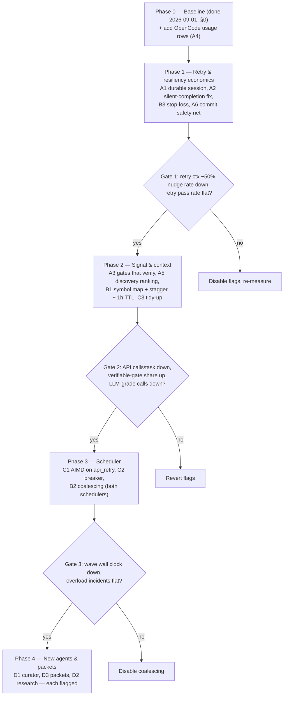

# Blueprint Execution Improvements — Research & Implementation Guide (v2, corrected 2026-09-01)

**Audience:** an LLM (or a future session) that will implement these changes without having participated in this research. Every claim below was re-verified against HEAD `2d79fc28` (v1.0.97) on 2026-09-01. Line numbers drift fast — treat them as "near here" and re-grep before editing.

**Mandate:** improve the blueprint pipeline (spec → clarify → plan → tasks → review → build → verify) on four axes — token usage, execution speed, performance, resiliency — for **both** the Claude CLI path and the OpenCode SDK path. Core constraint: **reuse existing infrastructure wherever possible**. This codebase already ships most of the primitives these improvements need; the work is wiring, not building.

**v2 changes vs v1:** v1 analysed the wrong Claude runner (see §1.3), assumed no session-resume infrastructure existed (it does, for six of seven phases), proposed `repomap-mcp` as a library dependency (unused in `src/`, zero-adoption package), and ordered phases by token economics when the measured pain is retries and lost sessions. The audit that produced these corrections is `docs/blueprint-execution-improvements-audit.md`. Section 0 below is new: measured baseline from the local usage database.

---

## 0. Measured baseline (2026-09-01, local SQLite: dev DB 17 blueprints / 384 tasks; packaged-app DB 7 blueprints / 83 tasks)

Where the tokens go (dev DB, all time; `ctx` = input + cache_read + cache_creation):

| feature | ctx tokens | share | output tokens | cache hit |
|---|---|---|---|---|
| blueprint-build | 3.03 B | **77 %** | 14.2 M | 97.1 % |
| chat | 0.68 B | 17 % | 2.6 M | 95.1 % |
| blueprint-verify | 0.16 B | 4 % | 1.3 M | 93.8 % |
| specify + clarify + plan + tasks + review | 0.045 B | **1.2 %** | 1.1 M | 72–87 % |
| recovery_nudge | 0.023 B | 0.6 % | 0.07 M | **18.6 %** |

Packaged-app DB has the same shape: build 82 %, verify 11 %, creation phases < 5 %.

Build-task economics (dev DB, 491 attempts, Claude path):

| metric | value |
|---|---|
| cumulative ctx per attempt (avg / max) | 5.3 M / 26.7 M tokens |
| peak context window per attempt (avg / max) | 166 K / 370 K tokens |
| implied API calls per attempt (cumulative ÷ peak) | ≈ 30 |
| output per attempt (avg) | 29 K tokens |
| task wall clock (avg / max) | 6.7 / 23.5 min |
| attempts needing a recovery nudge (silent completion) | **125 / 491 = 25 %** |
| attempts per completed task, dev DB | 1.28 |

Retry economics (packaged-app DB, `blueprint_tasks.attempts`, 83 tasks):

| metric | value |
|---|---|
| tasks completed first try | 50 / 83 |
| tasks needing ≥ 1 retry | **33 / 83 = 40 %** |
| tasks needing ≥ 3 attempts | 11 / 83 = 13 % (max seen: 7) |
| wall clock, 0 retries vs 2–3 retries | 8.0 min vs 16.3 min |
| two blueprints (33 tasks) that ran on OpenCode | **100 % of tasks retried, 78 retries; zero rows in `usage_log`** |

Quality-gate signal (packaged-app DB, 33 tasks with `gates_json`):

| gate | pass | fail | unverifiable |
|---|---|---|---|
| task-tests | 0 | 0 | 27 ("no test command resolved for this task") |
| test-integrity | 1 | 0 | 26 (declared test files did not exist) |
| write-set | 22 | 6 (all "outside write-set: node_modules") | 5 |
| stub-scan | 27 | 0 | 0 |

Artifacts carried between phases (dev DB, avg chars): verify 63 K, plan 46 K, build 37 K, tasks 26 K, specify 22 K, review 7 K, clarify 3 K.

**What the numbers say:**
1. The build phase is the only place token work pays. Creation-phase context economics (v1's B3) is a ~1 % lever.
2. Cache hit rate is already 97 %; prompt-ordering work (v1's A1) is not where the tokens go. The lever is **API calls per task (~30) and peak context (166 K)** — fewer exploration turns, smaller per-turn context, and not restarting cold.
3. Retries are common (40 % of tasks) and double wall clock; on OpenCode they are universal. Cold retries and lost sessions are the biggest measurable waste.
4. A quarter of Claude attempts end in a silent completion that needs a cold nudge.
5. Gates are producing almost no signal: `task-tests` was unverifiable in every recorded task. LLM grading is carrying verification alone.
6. ~~The OpenCode path is unobservable: no usage rows.~~ **False — corrected 2026-09-02, see §0.3.** OpenCode emits `_meta` through the same `recordTurn` sink as Claude; the "zero rows" was a usage artifact (no blueprint has been run on OpenCode on this machine). The real gap is that no usage row records **which backend** served it, so Claude-vs-OpenCode cost is not answerable even in principle. Fixed by migration 150.

Reproduce: copy `~/Library/Application Support/Code Atelier/code-atelier.db` (+ `-wal`, `-shm`) to a scratch dir and query `usage_log` (`feature`, `conversation_id = blueprint-build-<bp>-<task>-<ts>`), `blueprint_tasks` (`attempts`, `gates_json`, `outcome_kind`), `blueprint_phases` (`started_at/completed_at`, `artifacts_json`).

---

## 0.1 The prefix multiplier — where token spend actually concentrates (measured 2026-09-01, packaged DB)

§0 establishes *which phase* spends tokens (build, 77–82 %). This section establishes *what inside the build phase* those tokens are, which is what determines **token** ROI as opposed to wall-clock or resiliency ROI.

Measured on the packaged-app DB (`usage_log` + `turn_usage`, `feature='blueprint-build'`, 214 attempts, 55 of them carrying peak-context rows):

| metric | measured | how |
|---|---|---|
| API calls per attempt | **30.8 avg** (min 8.7, max 58.7) | per-row `cumulative ctx ÷ context_tokens` in `turn_usage` |
| peak context per attempt | 167 K avg, **103 K minimum**, 234 K max | `turn_usage.context_tokens` |
| what the 103 K floor means | an attempt that emitted only 4.8 K output still carried 103 K of context | smallest `context_tokens` row |
| cache-read share of context volume | **97.7 %** (292 M of 299 M) | `usage_log` sums |
| effective cost split (input-equivalents; read ×0.1, create ×1.25, output ×5) | **cache read 62 %**, cache creation 18 %, output 20 % | derived from the same sums |

**The structural fact.** The build system prompt is task-invariant *by design*: `blueprint-build.adapter.ts:52–67` composes `basePrompt + TOOL_PRIORITY_DIRECTIVE_BUILDER + taskSection` specifically so that all tasks in a run share the longest possible prefix, and the 97.7 % cache-hit rate proves the sharing works as intended. The problem is not cache efficiency — it is that the shared prefix is **~100 K tokens**, and it is re-sent on **every one of the ~31 calls** of every attempt of every task.

Token spend therefore factorises as `prefix_size × calls_per_attempt × attempts`. Today that is roughly `100 K × 31 × 491`. Those three factors are three different levers and they are **not** equally cheap to move:

| lever | factor attacked | items | leverage |
|---|---|---|---|
| **Shrink the prefix** | `prefix_size` | **A9** (new, below), **E8**, **E7** | Linear, immediate, deterministic: **every 10 K tokens removed ≈ 310 K context tokens saved per attempt ≈ 22 % of an average attempt.** No LLM behaviour change required. |
| Fewer turns | `calls_per_attempt` | B1 symbol map, D2 scout | 31 → 20 calls would be −35 %, but the mechanism is indirect — better context in the *hope* of less exploration. Unproven until measured. |
| Fewer attempts | `attempts` | A1, A2, B3 | Only reaches the 20–40 % of tasks that retry, and only the infra-failure subset of those. Strongest lever for **wall clock and resiliency**, weakest for tokens. |

### What the ~100 K prefix is actually made of (blueprint `45efdb29`, measured)

| block | measured size | cap today | note |
|---|---|---|---|
| `plan` artifacts | 66 K + 64 K chars md; 57 K + 53 K chars json | 40 K chars per artifact (medium tier) | **two** plan artifacts, both injected |
| `tasks` artifacts | 57 K + 64 K chars md; 46 K + 52 K chars json | ditto | **two** tasks artifacts, both injected — and the *entire* task list, not just the current wave |
| `{{WORKSPACE_DOCS}}` | 24 K chars in this repo | 30 K chars **per file**, **no total cap** → up to 120 K chars | E8 |
| MCP tool schemas (5 servers) | ~12–16 K tokens | **32 tools.** `leanBuildMcp` drops 2 servers = **10 of them** (semantic-search 3 + code-analysis 7) ≈ **2–5 K tokens**, not 12–16 K; **defaults OFF**. `code-graph` alone is **15 always-on tools ≈ half the block** — the larger candidate | `blueprint-build.adapter.ts:99–129`, `shared/constants.ts` `MCP_TOOLS` |
| `build-phase.md` + tool directive | 8.1 K chars | — | E7 dedupe target |
| `{{BLUEPRINT_CONTEXT_JSON}}` incl. `settings.grillDecisions` | varies with ledger length | uncapped | E7: same content injected up to 3× — **fixed 2026-09-01**, settings are whitelist-projected |
| constitution | null in this DB | **uncapped** | E7 — **fixed 2026-09-01**, tier-scaled cap 8 K/20 K/40 K chars |

**New finding — duplicate artifacts (drives new item A9).** `assemblePhaseContextInner` (`blueprint.service.ts:1535–1544`) pushes *every* artifact whose type is relevant, from every prior phase. There was no "latest only" rule until 2026-09-01. The disk-mirror code immediately below (`:1609–1626`) openly documents the expectation — *"Three plans give plan-1.md, plan-2.md, plan.md"*. So whenever PLAN or TASKS is re-run (revision, retry, phase rewind), the single largest block in the prefix is injected **twice**, and because `capArtifactForContext` caps each artifact **independently** (`:1645–1647`), the per-artifact cap never catches the duplication. (A **total** budget does exist — `formatArtifacts` Stage 4, `blueprint-prompt-loader.ts:222–236` — but it truncates the **tail**, so the copy it drops is the newest one. That is why A9 is a correctness fix as well as a token fix.) Prevalence in this DB: 1 blueprint in 8 — but that one carried 240 K chars of plan plus 219 K chars of tasks, roughly doubling the prefix, on *every task of the entire run*.

### Gate T, measured (2026-09-02) — **not met; and the "floor" was the wrong quantity**

Gate T (§3, Phase T) *was* `MIN(turn_usage.context_tokens)` over `blueprint-build` turns, target **under 65 K** — re-pointed at `prefix_tokens` on 2026-09-02, see the retraction below. Query: join `turn_usage` to `usage_log` on `(conversation_id, turn_number)`, filter `feature='blueprint-build'` and `context_tokens > 0`, group by day.

| day | turns | min ctx *(read at the time as "prefix floor")* | avg ctx | peak |
|---|---|---|---|---|
| 2026-08-27 | 52 | **103,527** | 166,412 | 233,510 |
| 2026-09-02 | 63 | **104,923** | 135,827 | 196,863 |

The 08-27 row reproduces §0.1's stated 103 K floor / 167 K average almost exactly, which is how we know the query is the right one.

**The floor did not move** (103.5 K → 104.9 K) while the *average* fell 18 %. E8 capped workspace docs, which **vary per run** and so move the average, while the floor stayed flat.

**RETRACTED 2026-09-02 — "the next lever is the BUILD prompt scaffold" is off by roughly an order of magnitude, because `context_tokens` is not a prefix.** The arithmetic does not permit it:

| quantity | value | source |
|---|---|---|
| assembled BUILD system prompt, canonical | 37,574 chars ≈ **9.4 K tokens** | `blueprint-prefix-size.test.ts:90` |
| assembled BUILD system prompt, doc-heavy | 75,147 chars ≈ **18.8 K tokens** | same, `revised` baseline |
| MCP tool schemas (5 servers) | **12–16 K tokens** | §0.1 |
| → total invariant prefix | **≈ 22–35 K tokens** | |
| measured Gate T "prefix floor" | **102,986** | packaged DB |

So **~68–78 % of the measured floor is not prefix at all.** Deleting the *entire* system prompt would move 103 K to roughly 85–94 K, against a target of under 65 K — prefix trimming cannot reach the gate. `build-phase.md` is 11.5 K chars ≈ 2.9 K tokens, i.e. **2.8 %** of the number it was supposed to move.

**Why the metric misled.** Every blueprint-build conversation has exactly one turn (129 turns, all `turn_number = 1`): one user message driving one agentic loop. `TokenAccountant.accumulateFromMessageStart` *overwrites* `contextWindowTokens` on every round-trip, so the stored value is the **last** call's prompt — after all tool results accumulated — not the first. The smallest task shows it plainly: `input_tokens = 22`, `cache_read = 1,014,653`, `context_tokens = 102,986` → ≈ 9.9 round-trips each re-reading ~103 K. **Gate T was measuring end-of-loop context and calling it a prefix floor.**

**The replacement query.** `TurnUsageRepository.getBlueprintPrefixStats(blueprintId?)` is the supported reader — use it rather than re-deriving SQL, and do **not** reuse the `context_tokens` query above:

```sql
SELECT COUNT(*) AS turns, COUNT(prefix_tokens) AS measured,
       MIN(prefix_tokens) AS floor, AVG(prefix_tokens) AS avg, MAX(prefix_tokens) AS max
FROM turn_usage
WHERE blueprint_id IS NOT NULL AND task_id IS NOT NULL;
```

No join to `usage_log`: `task_id IS NOT NULL` identifies BUILD turns directly (every phase stamps `blueprint_id`; only per-task BUILD work carries a task id). **Read `measured` before reading `floor`** — the expected failure of this metric is an absent number, not a wrong one. **Judge prefix work on MIN, not AVG:** the first call includes the per-task user message, so the average moves with task size while the floor tracks the invariant part. For a before/after on one change (e.g. `leanBuildMcp`), compare the same task, or compare floors.

**Fixed as instrumentation (migration 152, 2026-09-02).** `turn_usage.prefix_tokens` now records the **first** round-trip's prompt size — write-once, never overwritten — and Gate T re-points at it. `context_tokens` keeps its existing meaning (end-of-loop occupancy; the compaction badge and modal read it). Historical rows keep `NULL`: the prefix of a past turn is not reconstructible, and copying `context_tokens` across would manufacture the very number this corrects. **The <65 K target is unvalidated until a run produces `prefix_tokens` data** — first check is whether it lands in the predicted 22–35 K band. If it comes back near 100 K, the fixtures understate the real prefix and the §0.1 composition table needs re-deriving.

Two caveats on reading these numbers:

- **The 09-02 row is not a clean before/after.** It reflects whatever build was running that day. E8 and A9(a) landed 2026-09-01; **A9(c) shipped in v1.0.100 and is almost certainly not represented.** Do not attribute the 18 % average drop to any specific ledger item without a run on a known build.
- **The denominator was biased until 2026-09-02.** `context_tokens` covered only ~43 % of blueprint-build turns (115 of 267). Cause established and fixed — see §0.3. Both rows above are computed on the populated subset and should be read as indicative.

---

## 0.3 Findings from implementing Phase T (2026-09-01) — corrections and new leads

Implementing A9 / E8 / E7 falsified two claims in this document and surfaced two defects that were not visible from reading the DB. Recorded here so a future session does not re-derive them.

**Corrected — A9(b) was wrong.** §0.1 and item A9 said `artifactBudgetChars` is "computed and currently only passed through". It is not: `blueprint-prompt-loader.ts:460` passes it into `formatArtifacts`, whose Stage 4 (`:222–236`) enforces a total budget of 25 K / 50 K / 100 K chars by tier, and BUILD does pass the context window (`blueprint-build.service.ts:478–482`). A9(b) was deleted rather than implemented.

**Corrected — E6 was stale.** All ten phase callers already pass `resolveWorkspaceContextWindow(workspacePath)`. Marked ☑ in the §0.2 ledger.

**Corrected — E7's Tool Priority premise was wrong.** The "identical 2,337-byte Tool Priority block in specify/plan/tasks" is real (verified: byte-identical, same md5), but specify, plan and tasks are **three different prompts, each rendered once per phase**. Consolidating them into `TOOL_PRIORITY_DIRECTIVE` saves **zero tokens** — it is source-file DRY, not prefix reduction — and would change the guidance three phases receive. Deliberately not done. Note also that `base.adapter.ts:257–260` only injects the generic directive when `## Tool Priority` is **absent**, so removing the blocks from those prompt files would simply substitute a differently-worded block of similar size.

**NEW — BUILD renders `## Tool Priority` twice (open).** `build-phase.md:149–170` ends with a full 2,272-byte Tool Priority section, and `blueprint-build.adapter.ts:66` then appends `TOOL_PRIORITY_DIRECTIVE_BUILDER`, which opens with its own `## Tool Priority`. So the highest-cost phase in the pipeline (77–82 % of all tokens) carries two overlapping routing tables in its task-invariant prefix, on every one of ~31 calls per attempt. Roughly 1.6 K chars of it is genuinely redundant; the `build-phase.md` copy uniquely adds lint/typecheck/test routing and the greenfield caveat, and the directive uniquely adds the Finalization Checklist — so this is a merge, not a delete. **Not fixed here:** it edits agent-facing instructions in the phase whose pass rate Gate T is defined by, and no unit test can validate that. Needs a live run to land safely.

**FIXED — the `tasks` artifact rendered as `{}` (was: "blocks A9(c)"; A9(c) is now dropped as superseded).** `renderSingleArtifact` prefers projected `contentJson` over `contentMd` for `plan` and `tasks`. But `TASKS_PROJECTION_KEYS` allowed `id/title/wave/files/scope/status/taskId/userStory/filePathsJson/description` — per-task **leaf** keys — while TASKS emits `{totalTasks, waves:[…], userStoryPhases, parallelOpportunities, mvpScope}` (`tasks-phase.md:145`). `projectFields` is shallow at the top level, so no key matched and the whole artifact collapsed to `{}`: every phase that received it got an empty object plus a disk pointer. `PLAN_PROJECTION_KEYS` never had this problem — `summary`, `techStack`, `items`, `mustHaves`, `existingPatterns` all match what PLAN emits. **This is why §0's "tasks artifacts 26 K chars" and §0.1's "46–52 K chars of JSON" never appeared in the rendered prefix** — those are *stored* sizes.

**Why it survived:** `blueprint-prompt-loader-pure.test.ts:326` pinned the projection against `contentJson: { id: 'T1', title: 'Task 1', wave: 1 }` — a flat shape production never emits. The test passed, the allow-list looked deliberate, and the artifact was empty in production the whole time. A characterization test now asserts the old key set matches **no** top-level key of the real shape, so re-narrowing fails loudly.

**Landed as an asymmetric fix, not the planned wave scoping.** The allow-list was corrected to the emitted shape *and* `tasks` was dropped from BUILD's relevance set in the same step. REVIEW is the phase that actually consumes this artifact — `review-phase.md:29–30` asks for "cross-artifact analysis of the blueprint's spec, plan, and tasks" and `:121` demands a Coverage Summary with "requirements with tasks X/Y, user story traceability, unmapped tasks" — and it was the one being handed `{}`. BUILD does not need it: its per-task section already carries taskId, wave, description, userStory, files, dependsOn, discoveries, prior-attempt output, failure reason and the **full work packet**, all from `blueprint_tasks` rows (`buildTaskContext`), and `build-phase.md:74` points the agent at the plan and spec. Measured: BUILD −224 chars on both prefix fixtures, REVIEW a new 51,400-char baseline of which 20,793 is the artifacts block. Net negative on the phase that is 77–82 % of tokens, positive only on a single creation-phase session (~1 %). `packet` is excluded from the projection deliberately — it is BUILD's execution contract and the bulk of the JSON by size. Also capped at `MAX_TASKS_RENDERED = 120`, because `formatArtifacts` Stage 4 truncates whole artifacts from the tail and `tasks` renders last, so an oversized list is dropped whole rather than trimmed. **Measured** at ~250 rendered chars per task: 40 tasks ≈ 10.0 K chars, 60 ≈ 14.9 K, 120 ≈ 29.7 K — so the cap is what keeps the artifact inside the **medium (50 K) and large (100 K)** budgets. It does **not** rescue the small tier: 25 K is already exceeded at the cap itself, so a 100+ task blueprint on a small-window model still loses the block to Stage 4. Not a regression (it rendered as `{}` before), but if small-tier REVIEW coverage matters later the fix is a tier-aware cap, not a bigger budget.

**Corrected — BUILD assembles context ONCE per phase, not once per task.** `blueprint-build.service.ts:478` is the only `assemblePhaseContext` call in the file; `phaseContext` is then threaded as a parameter to every task. This falsifies the reasoning (not the fix) in the E5 entry below and in the `writeAtomically` comment, both of which said BUILD assembles per task. The real concurrent writers were the sibling peer-review passes (per task, during BUILD — now removed by E5) and the review passes that assemble around them; the prompt naming `blueprints/<name>/plan.md` and `tasks.md` is `review-phase.md:21`. It also rules out wave-scoping the projection at assembly time: there is no "current wave" there, so a wave-scoped projection would be wave 1 forever, and scoping per task instead would break the KV-cache prefix design in `blueprint-build.adapter.ts:56–60`.

**NEW — E5 is a concurrency defect, not a token optimisation (re-ranked).** The doc filed E5 under "removes a latent footgun", token ROI `–`. Implementing it showed the footgun is already live. Verified: `peer-review-pass.md` contains **zero** `{{…}}` placeholders, and `BlueprintPeerReviewAdapter` touches `phaseContext` in exactly one place (`buildPeerReviewSystemPrompt`, `blueprint-peer-review.adapter.ts:50`) — so the full `assemblePhaseContext(…,'build',…)` at `:121` was discarded **in its entirety**, and a unit test now asserts the two prompts are byte-identical. What was not discarded were its side effects, paid once per **task**: phase + revision-request DB reads, CLAUDE.md/README.md/PLAN.md/package.json reads, and `mkdirSync` + `writeFileSync` over `blueprints/<name>/{plan,tasks,spec,build}.md`. That last one races: `runPeerReviewIfEnabled` is invoked from inside `executeTaskWithGates` (`blueprint-build.service.ts:2182`) the moment **one** task's gates pass, while its wave-siblings are still running (`params.inFlight`) — and `build-phase.md` / `review-phase.md` instruct those siblings to `Read` exactly those paths. `writeFileSync` truncates before writing, so a sibling can observe an empty or partial `plan.md`. The content is usually identical, so the damage is a **torn read**, not stale data — silent, and it scales with wave width. Fixed by giving peer review `assembleLitePhaseContext` (no artifacts, no doc reads, no disk writes) and, as defence in depth, making the remaining mirror writes atomic (temp file + `renameSync`). **Corrected 2026-09-01 (A9(c)):** the closing clause used to read "since BUILD itself still assembles per task" — it does not, it assembles once per phase (see the correction above). The atomic write stays because the *review* passes still read those mirrors concurrently, which is the reason `review-phase.md:21` names them.

**NEW — the disk mirror was coupled to the relevance map, and dropping `tasks` from BUILD exposed it (found in review of A9(c), fixed).** `assemblePhaseContextInner` wrote `blueprints/<name>/<type>.md` from `rawArtifacts` — the **relevance-filtered** list — so a type was only ever mirrored by phases that happened to carry it in context. That was invisible while `tasks` was relevant to both REVIEW and BUILD. Dropping it from BUILD left REVIEW as the only phase that mirrored `tasks.md`, and **REVIEW is skippable** (`BLUEPRINT_SKIP_PHASE`), while `verify-phase.md:32–37` instructs VERIFY to load `spec.md` / `plan.md` / `tasks.md` / build report and VERIFY deliberately carries **no** tasks JSON in context (`PHASE_ARTIFACT_RELEVANCE.verify`). Skip REVIEW and VERIFY was pointed at a file nobody had written — a silent degradation of verification quality, not a crash. Fixed by giving the mirror its own explicit set, `MIRRORED_ARTIFACT_TYPES = {spec, plan, tasks, build}`, independent of `PHASE_ARTIFACT_RELEVANCE`: the relevance map decides what enters the *prefix*, the mirror set decides which *files the prompts promise an agent can Read*. Those are different questions and sharing one list to answer both is what produced the bug. Prefix-neutral — all three ratchets moved `+0`. **General lesson:** the mirror is a durability contract with the agent, so it must be driven by what the prompts name, never by what the current phase happens to need.

**NEW — dropping `package.json` keys cost more than it saved (P2).** E8's summariser reduced package.json to name/version/scripts/dependency-**names**. That also dropped `type`, which decides ESM vs CJS for every file the builder writes — the exact class of mistake that costs a retry, for ~40 chars. `engines` and `packageManager` are now kept for the same reason, and dependency ranges are rendered at **major** precision (`react: "^19"`) rather than dropped, restoring the signal that distinguishes a v18 API from a v19 one. Cost: +870 chars on the canonical prefix fixture (~6 chars × 145 deps), recorded as a deliberate baseline raise in `blueprint-prefix-size.test.ts`. One retry costs far more than 220 tokens.

**FALSIFIED — A4's premise. OpenCode telemetry was never missing (2026-09-02).** §0 claim 6 and item A4 both rested on "zero `usage_log` rows for OpenCode build tasks". The opposite is true, and the write path is **shared with Claude, not Claude-only**: `opencode-executor.ts:1671–1682` yields a `_meta` chunk, `agent-session.service.ts:2146` routes it to `processMetaChunk`, and `agent-stream-processor.ts:106` calls `recordTurn`, which writes **both** `turn_usage` and `usage_log`. The rows exist — 515 in the dev DB and 275 in the packaged DB tagged `feature='blueprint-build'`, as recent as today. The "zero" was a **usage artifact**: all 275 packaged rows are `model='claude-opus-5'`, i.e. **no blueprint has ever been run on OpenCode on this machine.** Building A4 as specified would have added instrumentation that already exists.

**The real gap was attribution, and it is now fixed (migration 150).** Three things were genuinely missing, and none of them is instrumentation:

- **No backend column.** `model` was the only proxy for "which path served this", and it is unreliable — OpenCode serves Claude-named models, so a row reading `claude-opus-5` is ambiguous. "What does a blueprint cost on OpenCode vs Claude" was unanswerable *in principle*, not just unmeasured.
- **No `blueprint_id` / `task_id` / `attempt`.** Joining a usage row back to a blueprint meant string-parsing `conversation_id`.
- Both tables now carry nullable `provider` / `blueprint_id` / `task_id` / `attempt`. `provider` records the **LLM provider** (`'claude'` | `'local-llm'` | `'glm'`) resolved for that turn, never the model name. It deliberately stores the *provider* rather than the derived `ExecutorBackend`: the backend is a pure function of the provider (`claude` → `cli`, everything else → `opencode`) so nothing is lost, whereas storing the backend would merge a **free local model and paid GLM** into one indistinguishable `'opencode'` bucket and bill them alike. Historical rows keep `NULL` — the provider that served them is not inferable after the fact, and a guess would be worse than an absence.

The carrier is a `telemetryContext` on the role adapter, read at `agent-stream-processor.ts` token-record time. The adapter is the only object spanning both worlds — the stream processor sees session state, blueprint/task identity lives in `blueprint-build.service`. It is declared on **`BlueprintBaseAdapter`**, not on the build adapter, so all **12** blueprint phases stamp `blueprint_id`; putting it on the leaf would have meant "what did this blueprint cost" silently returned "what did its BUILD phase cost". `taskId`/`attempt` are passed up through `super()` by the one phase that executes a task. `attempt` is derived from the existing `blueprint_tasks.attempts` counter, which `recordAttempt` bumps *after* each `executeTask` returns.

**Known gaps, recorded rather than fixed (2026-09-02 audit).**

- **`attempt` repeats on the overload-retry path.** `recordAttempt` fires at `blueprint-build.service.ts:2166` / `:2274` / `:2434`, but the overload re-dispatches at `:1288` / `:1820` call `executeTask` directly and never bump the counter — so two executions can share one attempt number, on precisely the failure path the column exists to study.
- **Five other `recordUsage` callers leave `provider` NULL** — `one-shot-claude.ts:144`, `one-shot-local.ts:135`, `prompt-optimizer.service.ts:254`, `agent-recovery-nudge.ts:288` / `:411`. Recovery nudges are the notable one: they fire *inside* a blueprint BUILD session, are billed to `feature='recovery_nudge'`, and cannot be joined back to the blueprint that caused them. `NULL` therefore no longer cleanly means "pre-v150 row".
- **The columns have no reader.** No query, no IPC, no UI consumes them, so a regression in population would surface only when somebody hand-writes SQL months later. Giving them one aggregation method would also give them a test.

**NEW — the `context_tokens` coverage gap was self-inflicted, and it biased Gate T (found + fixed 2026-09-02).** Only ~43 % of blueprint-build turns carried `context_tokens`, so every Gate T number was computed on under half the data. Two hypotheses were disproved first: turn numbers do not collide (456 conversations, 0 duplicates) and it is not a feature-introduction cutoff. The actual cause is a write/backfill mismatch. `recordTurn` inserted a `turn_usage` row for **every** meta chunk including ones reporting all-zero usage, while the backfill at `agent-stream-processor.ts:194` is guarded on `totalContextTokens > 0` **and** `updateLastTurnContextTokens` only ever targets the **latest** turn — so a zero row is never revisited and the hole is permanent. Measured: within `feature='blueprint-build'`, **100 % of rows missing `context_tokens` had zero input, output, cache-read and cache-creation tokens** (packaged DB 152/152, dev DB 1/1). Fixed by not writing a `turn_usage` row for an all-zero meta chunk — it describes no API round-trip, so it is not a turn worth analysing. `usage_log` still records it; that table is the cost ledger, not the analytics denominator. The guard tests `input | output | cacheRead | cacheCreation`, not just input/output, so a **fully-cached** round-trip (input 0, cache-read 4 K) is still recorded.

**Where the prefix actually is, measured at the unit level** (`blueprint-prefix-size.test.ts`, large tier, post-Phase-T): workspace docs 59–80 %, prompt scaffold 15–31 %, artifacts 5–10 %, context JSON < 1 %. The §0.1 table describes *stored* artifact sizes; the rendered split is dominated by `{{WORKSPACE_DOCS}}` and the phase prompt file itself. ~~If more prefix reduction is wanted, the next lever is the phase prompt scaffold (11.5 K chars for BUILD), not artifacts.~~ **Retracted 2026-09-02** — these are shares of a **22–35 K token** prefix, and Gate T's 103 K "floor" is not that quantity. Trimming the scaffold moves ≈2.9 K tokens against a 38 K gap. See the retraction in §0.1.

**NEW — `context_tokens` never measured a prefix, and was not comparable across backends (found + instrumented 2026-09-02).** Three facts, none previously recorded:

1. **The value is a last-call snapshot, not a first-call one.** `TokenAccountant.accumulateFromMessageStart` (`token-accountant.ts:52`) *overwrites* `contextWindowTokens` on every round-trip by design — the badge wants current occupancy. It is the correct number for compaction and the wrong number for a prefix floor, and nothing recorded the difference.
2. **Every blueprint-build conversation has exactly one turn** (129 turns, all `turn_number = 1`): one user message drives one agentic loop, so "per-turn" growth analysis over a blueprint has nothing to compare. The whole loop collapses into a single row whose `context_tokens` is its *last* API call.
3. **The column was not comparable across backends.** `TokenAccountant` is used only by `cli-executor.ts:652`. `opencode-executor.ts` (`sumAssistantTokensSince`) accumulates with `+=` and never sets `contextWindowTokens`, so `agent-stream-processor.ts` fell back to the **summed** total — a ~10–30× over-count of occupancy. Harmless only because all 275 rows are Claude; the first OpenCode blueprint run would have silently poisoned every average.

**Landed:** `firstCallContextTokens` on `TokenUsage` (write-once), `turn_usage.prefix_tokens` (migration **152**, nullable), written in the same `UPDATE` as `context_tokens` and gated on the same `turnRecorded` flag. There is deliberately **no summed-total fallback** for the prefix — OpenCode records `NULL`, which can be filtered out of an average, rather than a wrong number that cannot. `context_tokens` is untouched, including its existing OpenCode fallback: it feeds the compaction badge and modal, and removing it would break those for OpenCode users while fixing nothing the new column does not already fix.

**Still open on the OpenCode path:** giving it a real per-call snapshot means tracking per-message `input + cache.read + cache.write` in `sumAssistantTokensSince` and setting first/last snapshots there. Worth doing when someone actually runs a blueprint on OpenCode — until then `prefix_tokens IS NULL` correctly marks the backend as unmeasured, and the gap is recorded in that method's doc comment.

**Two caveats on `prefix_tokens` itself.**

- **It is only a "prefix" where a conversation is one turn.** The column stores the first round-trip *of its turn*. Blueprint conversations have exactly one turn, so that is the invariant prefix. On a chat conversation, turn 3's first call already contains the whole prior transcript — so `AVG(prefix_tokens)` across features is meaningless. `getBlueprintPrefixStats` filters to per-task BUILD turns for this reason; anything else should too.
- **It is written at INSERT, by `record()`, not back-filled.** `context_tokens` is a back-fill onto "the newest row for the conversation" and always carried the risk of landing on the wrong row; the prefix is known when the row is created, so it is written once with the row and that class of bug does not apply to it. `getLastTurn` and the back-fill now also tie-break on `created_at`/`rowid` — `turn_number` is not unique by construction, and on a tie SQLite was returning the *oldest* row.

**Migration numbering hazard (2026-09-02).** 152 is only correct relative to two migrations that are **uncommitted** in this tree: 150 (usage-attribution, A4) and 151 (memory-legacy-tier-amnesty, unrelated work). HEAD is at **149**. If 151 lands on another branch with different content, or these land out of order, 152 must be renumbered — `migration_count_matches_schema_version` in `migration-replay.test.ts` fails loudly if it is not, which is the intended outcome. The bad case is two branches each shipping a "152"; check `git log -1 -- src/main/db/index.ts` before adding the next one.

---

**Sequencing conclusion.** The doc's Phase 1 (A1 / A2 / B3) is correctly ranked for *resiliency and wall clock*, which is what §0 measured as the operational pain. It is **not** the top token lever. For token saving specifically, the prefix-reduction cluster — **A9 + E8 + E7** — is the highest-ROI work available: all three are size S, all deterministic, none touches the retry state machine or the scheduler, and they are fully independent of Phase 1. See **Phase T** in §3.

---

## 0.2 Implementation status ledger — single source of truth

**This table is the only place status is recorded.** Item bodies in §2, §6 and §7.4 deliberately carry no status markers, so the two can never drift. Update this table in the same commit that lands the change.

**Status values:** `☐` not started · `◐` partial (started or partly landed — the Notes column must say what is left) · `☑` done (landed + tested + measured) · `⊘` dropped or superseded (Notes must say why).

**Token ROI:** `★★★` prefix-multiplier win (saving × ~31 calls × every attempt) · `★★` material · `★` modest or indirect · `–` neutral for tokens (value is wall clock, resiliency, quality or telemetry) · `+` *increases* token spend by design, justified by quality.

| ID | Item | Size | Token ROI | Phase | Status | Notes / evidence |
|---|---|---|---|---|---|---|
| A9 | Latest-artifact-only + tasks projection repair | S | ★★★ | T | ☑ | (a) newest-only landed 2026-09-01 — `keepNewestArtifactPerType`; artifacts block for a re-run PLAN 2.00× → 1.00×, revised-fixture prefix −3,505 chars. **Also fixes a correctness bug** (the newest artifact was the one truncated). **Corrected 2026-09-01:** shipped first as a deny-list (dedupe every type except `discoveries`/`*-partial`), which was the wrong polarity — `build` artifacts **accumulate**: `blueprint-build.service.ts:775` appends one per BUILD run and VERIFY re-triggers BUILD for up to 2 remediation rounds, whose report covers only the remediation tasks, and `build` is relevant to both `verify` and `code-review`. Deduping them handed VERIFY a partial file list on exactly the runs that already went wrong. Now an allow-list, `SUPERSEDABLE_ARTIFACT_TYPES = {spec, plan, tasks}`: over-deduping costs correctness, under-deduping costs tokens, and only the second is acceptable under a "gate-pass rate unchanged" stop condition. (b) dropped — total budget already exists (§0.1 corrected). (c) **wave scoping dropped as superseded, landed as an asymmetric projection repair instead (2026-09-01).** Wave scoping is unimplementable where it was specified: BUILD assembles context **once per phase** (`blueprint-build.service.ts:478` is the only call) and threads it to every task, so there is no "current wave" at assembly time and a wave-scoped projection would be wave 1 forever; scoping per task instead would break the shared-prefix KV-cache design in `blueprint-build.adapter.ts:56–60`. It is also unnecessary — BUILD's tasks come from `blueprint_tasks` rows per task, packet included. What was actually broken is that `TASKS_PROJECTION_KEYS` listed per-task leaf keys only and matched **no** top-level key of the emitted shape, so the artifact rendered as literal `{}`. Fixed the allow-list, dropped `tasks` from BUILD's relevance set, capped the list at 120 tasks, and decoupled the disk mirror from the relevance map (`MIRRORED_ARTIFACT_TYPES`) — the drop had otherwise left `tasks.md` unwritten whenever REVIEW was skipped, which VERIFY reads. BUILD −224 chars on both fixtures; REVIEW — the phase `review-phase.md:121` makes responsible for the task-coverage matrix — gets a real list for the first time, new 51,400-char baseline. See §0.3 |
| E8 | Total cap + tiering for `{{WORKSPACE_DOCS}}` | S | ★★★ | T | ☑ | Landed 2026-09-01. Tier budget 12 K/30 K/60 K chars, priority CLAUDE→README→PLAN→package.json, omitted docs named. Doc-heavy fixture 104,661 → 60,191 chars (−42 %). **Amended 2026-09-01 (P2):** the package.json projection was over-aggressive — `type`/`engines`/`packageManager` restored and dependency ranges rendered at major precision, +870 chars on the canonical fixture. See §0.3 |
| E7 | Deduplicate static prompt text; stop triple-injecting grill decisions | M | ★★ | T | ◐ | Landed: settings whitelist projection (ledgers + modelSnapshot/baseline/round counters out of `{{BLUEPRINT_CONTEXT_JSON}}` in every phase) and tier-scaled constitution cap (8 K/20 K/40 K). **Not done — premise was wrong:** the "identical Tool Priority block in specify/plan/tasks" is three *separate* prompts each rendered once, so consolidating saves zero tokens. **Still open — real duplication found:** BUILD renders `## Tool Priority` **twice**, see §0.3. Like every other prefix cut, it waits on `prefix_tokens` data — and note the MCP row it would be ranked against was **corrected 2026-09-02** (`leanBuildMcp` is 2–5 K, not 12–16 K; §0.1), so rank the two on the corrected numbers |
| B1 | Token-budgeted symbol map + stagger + 1 h cache TTL | M | ★★ | 2 | ☐ | Attacks calls-per-attempt |
| B2 | Task coalescing for file-overlapping ready tasks | M | ★★ | 3 | ☐ | Amortises one prefix over N tasks |
| E2 | Deterministic verify gates before the verify LLM | M | ★★ | 2 | ☐ | Skips the priciest single session |
| B3 | Retry stop-loss on repeated failure fingerprint | S | ★★ | 1 | ☑ | **Landed 2026-09-02.** The machinery existed only at PHASE level (F4: `fingerprintPhaseError` + a persisted `recurrence` counter gating the renderer's Retry button); the TASK ladder had none, so a deterministic gate failure bought all `MAX_BUILDER_ATTEMPTS = 3` rungs — each a full cold session paying the whole prefix — to reproduce the same bytes. The fingerprint is now `src/main/services/blueprint-failure-fingerprint.ts` (pure, no DB/Electron/clock), with `blueprint.service.ts` re-pointed at it and a new `fingerprintGateFailure` that fingerprints each **failing** gate separately (a 200-char cap over joined evidence would let the first gate crowd out the rest) and sorts, so `shortCircuited` gate ORDER never reads as a new failure. `executeTaskWithGates` stops the builder ladder on the **second identical** fingerprint and goes straight to `escalateToLead` — a different model on a different prompt is the only rung that can move a deterministic failure. **A varying fingerprint keeps today's behaviour exactly.** The skip is recorded via `setOutcome({ failureReason: 'stop-loss after N identical gate failure(s)…' })` rather than being silent; `outcome_kind` is deliberately left alone — its four values describe how a task *closed*, and a stop-loss does not close one (escalation still follows). Saves one full BUILD session per stalled task; costs nothing when the builder is converging |
| A1 | Durable session per build task (infra resume / gate cold + failure memory) | L | ★ | 1 | ☐ | Headline resiliency item |
| A2 | Silent-completion fix at the source | M | ★ | 1 | ☐ | 25 % of attempts; nudges are only 0.6 % of ctx |
| A5 | Relevance-ranked discoveries | S | ★ | 2 | ☐ | Pure function |
| A3 | Make gates produce signal (resolve test command) | M | ★ | 2 | ☐ | Fewer LLM-grade calls |
| A7 | Clean-context grader + independent test author | M | ★ | 2 | ☐ | Flag-gated |
| A8 | Per-task definition-of-done contract | M | ★ | 2 | ☐ | Pairs with A3 + E9 |
| E1 | Auto-skip CLARIFY when spec has zero clarification markers | S | ★ | 1 | ☐ | Ships with anything |
| E3 | Compute the feature diff once, inject into verify | S | ★ | 2 | ☐ | Fewer verify tool turns |
| E9 | Validate task `files` against workspace and plan at persist time | M | ★ | 2 | ☐ | Fewer write-set failures → fewer retries |
| E10 | Provider-aware stall windows + tokens/s on OpenCode | M | ★ | 3 | ☐ | Each false stall costs a full retry |
| C3 | Cache-friendly task-tail ordering | XS | ★ | 2 | ☐ | Only meaningful after A1 |
| A6 | Git commit per completed task | S | – | 1 | ☐ | Enables exact per-task diffs |
| A4 | Backend + blueprint attribution for usage rows *(was: "OpenCode usage telemetry")* | S | – | 0 | ☑ | **Premise corrected 2026-09-02 — the original item was based on a false reading.** OpenCode is *not* missing telemetry: it emits `_meta` → `processMetaChunk` → `recordTurn`, the same sink Claude uses, and 275 packaged / 515 dev `blueprint-build` rows exist. The "zero rows" was a usage artifact (all rows are `claude-opus-5`; no blueprint has been run on OpenCode here). What was actually missing was **attribution**: no column said which backend served a row (`model` is not a proxy — OpenCode serves Claude-named models), and joining to a blueprint meant string-parsing `conversation_id`. Landed as migration **150**: nullable `provider`/`blueprint_id`/`task_id`/`attempt` on both `usage_log` and `turn_usage`, threaded through the single `recordTurn` write point via an optional `telemetryContext` on the role adapter; `provider` records the resolved **LLM provider** (`claude`/`local-llm`/`glm`) rather than the executor backend — the backend is derivable from it, while the reverse would merge free local and paid GLM into one bucket. Declared on `BlueprintBaseAdapter` so all 12 phases are attributed. Historical rows stay `NULL` (not inferable). Also fixed here: `turn_usage` no longer records all-zero meta chunks, which were **100 %** of the rows missing `context_tokens` and had cut Gate T's denominator to 43 %. **Audit follow-ups landed:** a `turnRecorded` flag stops the context back-fill from overwriting the *previous* turn when the current one wrote no row (reachable — one such row exists in the dev DB), and `processMetaChunk` now has direct coverage of the derivation. Three residual gaps recorded in §0.3. **Follow-up landed 2026-09-02 — the `attempt` column was wrong on the overload path.** `recordAttempt` ran after three of the five `executeTask` call sites; the two overload re-dispatch sites (`executeDag`, `executeWave`) did not bump it, so a task that hit an API overload and was retried shared ONE attempt number across TWO executions — on precisely the failure path this column exists to study. Both schedulers fixed together (§1.2's standing warning), recording **after** the call to match the ladder sites, since `executeTask` derives its own attempt number by reading `attempts`. `blueprint-overload-attempts.test.ts` pins it for both schedulers as a delta: with `dispatchTask` stubbed a clean run must add 0 attempts and an overload-retried run exactly 1 |
| A10 | Gate T metric repair — `turn_usage.prefix_tokens` | S | – | 0 | ☑ | **Landed 2026-09-02 (migration 152).** Gate T was reading `context_tokens` as a "prefix floor"; it is the **last** round-trip of the agentic loop, not the first, so ~68–78 % of the 103 K figure is in-loop tool-result accumulation and prefix trimming could never reach the <65 K target (full arithmetic in §0.1). `TokenUsage.firstCallContextTokens` is now set once on the first `message_start` and never overwritten, and persisted to the new nullable `prefix_tokens` column in the **same** `UPDATE` as `context_tokens`, under the same `turnRecorded` gate. No summed-total fallback: OpenCode records `NULL` rather than a ~10–30× over-count. `context_tokens` semantics unchanged (compaction badge/modal read it). **No prefix reduction is done here** — this makes prefix work measurable, so `leanBuildMcp` (built and defaulting OFF) becomes a one-flag experiment with a real before/after — worth **2–5 K tokens**, not the 12–16 K the whole MCP block costs (**corrected 2026-09-02**: the flag removes 10 of BUILD's 32 tools; `code-graph`'s 15 always-on tools are the bigger half). No backfill: a historical prefix is not reconstructible. **Gate T's target is unvalidated until a run produces data**. **Follow-ups landed same day:** the prefix is written at INSERT by `record()` rather than back-filled (no lost-write window, and the "newest row" targeting bug class does not apply to it); `getBlueprintPrefixStats()` gives the column a tested reader and the exact Gate T query lives in §0.1; `stream-normalizer.test.ts` pins the `message_start` → accountant seam that was the only silent-drop path; `blueprint-prefix-size.test.ts` fails if the assembled prompt stops implying the documented 22–35 K band; `getLastTurn`/back-fill tie-break on `created_at`/`rowid` |
| E11 | Attempt-level telemetry + stall/nudge incidents | M | – | 0 | ☐ | Makes every §0 metric queryable. **Deliberately deferred behind A4 (2026-09-02):** attempt/stall/recovery tables are far more useful once rows can be joined to a blueprint and task, so A4's attribution is its prerequisite, not the reverse. Stalls and nudges remain console-only today |
| E12 | Backoff + jitter + second auto-retry for cold-start/overload | S | – | 1 | ☐ | Failed turn produced no tokens |
| E4 | Parallelise tasks map sessions; drop dead one-shot start | S | – | 3 | ☐ | Wall clock |
| E5 | Stop assembling full build context for peer review | S | – | 2 | ☑ | Landed 2026-09-01, and **re-ranked**: not a footgun but a live concurrency defect — the discarded assembly's disk mirror truncates `blueprints/<name>/*.md` while wave-siblings `Read` them (§0.3). Peer review now calls `assembleLitePhaseContext`; tests pin that the produced prompt is byte-identical and that the path writes nothing under the workspace. The remaining per-task mirror writes from BUILD are now atomic (temp + `renameSync`) |
| E6 | Pass resolved context window to every `assemblePhaseContext` call | S | – | 2 | ☑ | Already implemented — all 10 phase callers pass `resolveWorkspaceContextWindow(workspacePath)`: specify `:286`, clarify `:671`, plan `:95`, tasks `:102`, review `:96`, build `:478`, verify `:234`, code-review `:236`, lead-review `:142`. **Closed out 2026-09-01:** the last 3-arg caller was `buildSystemPrompt`, which backs the `blueprint:buildPrompt` **preview** — so the prompt shown to the user was assembled at medium-tier caps with no workspace docs while the real run got large-tier and full docs. It now resolves the window itself and the IPC handler passes `workspacePath`. Peer review is no longer a caller at all (see E5) |
| C1 | AIMD parallelism on `api_retry` signal | M | – | 3 | ☐ | Throughput |
| C2 | Provider circuit breaker | M | – | 3 | ☐ | Keyed by provider |
| C4 | Speculative next-wave context prefetch | M | – | 3 | ☐ | Defer until B1 lands |
| D3 | Structured inter-phase handoff packets | M | – | 4 | ☐ | Quality, not tokens |
| D1 | Wave-boundary knowledge curator | M | + | 4 | ☐ | Cost cap < 5 % of build tokens |
| D2 | Research scout per wave | M | + | 4 | ☐ | Only after B1 numbers |
| D4 | Best-of-N at escalation | M–L | + | 4 | ☐ | ~13 % of tasks; default off |

**How to update:** flip the symbol, then put the measured delta in Notes (e.g. `☑ prefix 100 K → 62 K, −38 % ctx/attempt, PR #123`). For `◐`, name the remaining work explicitly so a later session can resume without re-reading the whole document. For `⊘`, state the reason so the idea is not silently re-proposed.

---

## 1. Verified current state (read this first)

### 1.1 Pipeline & state

- `src/main/services/blueprint.service.ts` (2339 lines) — orchestrator. `PHASE_ARTIFACT_RELEVANCE` (:72), `ARTIFACT_MD_CAPS_BY_TIER` (:178), `capArtifactForContext` (:194), `isRetryableError` (:612), `scheduleAutoRetry` (:628), `assemblePhaseContext` (:1458) / `assemblePhaseContextInner` (:1506), `buildSystemPrompt` (:1759 — phase-scoped, **task-invariant**), `saveRetryContext` fingerprint/recurrence detection (:1801–1858; incident note: "attempt counter reached 10 with the identical gate failure").
- `src/main/services/blueprint-state-machine.ts` (291 lines) — `VALID_TRANSITIONS` (:38), `ABSORBED_LATE_TERMINAL` (:117).
- 29 `blueprint-*.ts` services.

### 1.2 The DAG executor — `src/main/services/blueprint-build.service.ts` (3686 lines)

- `executeDag` (:930): cap from `parallelBuildAgents` pref (:945; clamped 1–6 by the pref layer), **halved once on overload** (:1226–1233), never raised again; `recordParallelism` (:1066) is a histogram only. File-overlap exclusivity via `allInFlightFiles` (:1047) + `filesOverlap` (:297); empty-file tasks are exclusive (:1168–1173). `runDrainPointGates` (:1114). Resume pre-pass (:966–1004). `isCascadeSkipped` (:1032); reachability cascade (:1343+).
- **A second scheduler is still live:** `executeWave` (:1423) runs as `mode: 'wave-fallback'` when the `dagScheduling` pref is off or the DAG has a cycle (:651–705). It has its own `allInFlightFiles` (:1544) and overload logic. Scheduler changes must cover both or explicitly exclude the fallback.
- Constants: `TASK_TIMEOUT_MS = 30 min` (:124), `MAX_BUILDER_ATTEMPTS = 3` (:132), `OVERLOAD_MAX_RETRIES = 2` (:135), `OVERLOAD_BACKOFF_BASE_MS = 60 s` (:136); `STALL_TIMEOUT_MS = 5 min` from `blueprint-phase-watchdog.ts:28`.
- Code graph is bootstrapped **before wave 1** against the execution worktree via a shadow workspace (:607–637).
- `buildTaskContext` (:3522) renders, in order: task id / wave / description → user story → `**Files**` flat list → depends-on → discoveries `.slice(-20)` (:3554) → prior-attempt output capped `MAX_PRIOR_CHARS = 4000` (:3564) → prior failure reason (:3578) → work packet `renderWorkPacket` (:3594; deliberately after retry context) → `gateFixInstructions` last (:3602).
- `handleTaskCompletion` (:2676): discoveries merged `.slice(-20)` (:2720) and persisted as artifact type `'discoveries'` (:2724–2729); failures via `blueprintRepository.setOutcome` (:2744). **No deterministic git commit anywhere in the build path**; the prompt asks the agent to commit per task (`src/main/blueprints/prompts/build-phase.md:78–84`, adapter `getPhaseMessage :70–79`).
- Three retry rungs, **all cold**: gate retry in `executeTaskWithGates` (:2046, loops to `MAX_BUILDER_ATTEMPTS`, then `escalateToLead` :2374); overload retry in `executeDag` (:1214–1277); user phase retry `retryPhase` (`blueprint.service.ts:1172`). `executeTask` (:2952) rebuilds context (:2996), creates a **new** `BlueprintBuildAdapter` + **new** `AgentSessionService` (:3006–3017) and a **fresh** `syntheticConvId = blueprint-build-${bp}-${task}-${Date.now()}` (:3104). "Prior attempt output" comes from a `build-partial` artifact regex lookup (:2986–2993).
- Escalation ladder: `gradeTask`, `escalateToLead`, `runPeerReviewIfEnabled`, `runWaveGates` (grep; anchors moved).

### 1.3 Claude path — the real one

**v1 error:** `agentic-claude-runner.ts` (`claude -p … --output-format text`) is used only by Deep Scan / memory extraction / specialist builder (`memory-reflection.service.ts`, `specialist-builder.service.ts`, `memory-extraction.service.ts`, `memory-bootstrap/executors.ts`). No blueprint file calls it.

Build tasks run:
```
executeTask → new BlueprintBuildAdapter → new AgentSessionService(adapter, instanceId)
  → session.send(adapter.getPhaseMessage(), syntheticConvId)                     // :3143
  → agent-session.service.ts:1728   sessionId = this.sessionMap.get(conversationId)   // empty for a fresh id ⇒ no --resume
  → cli-executor.ts buildCLIArgs (:1628–1703)
      claude --output-format stream-json --input-format stream-json --verbose --include-partial-messages
             --model … --permission-mode … --system-prompt-file <tmp> --max-turns … --mcp-config … --allowedTools … --disallowedTools …
             [--resume <id>]   // :1686–1699; guarded by markSessionPoisoned (:450) + UUID check (:1694)
      session_id captured from system/init at :816 → getSessionId() :439
```
- Build parses `parsePhaseCompletionBlock(session.getStreamedContent())` (:3172), not `parseSentinelBlock`.
- Build MCP/tool surface (`role-adapters/blueprint/blueprint-build.adapter.ts:90–119`): native Read/Write/Edit/Glob/Grep/Bash/WebSearch/WebFetch/ListDir + MCP **code-graph, semantic-search, git-context, code-analysis, memory** (lean mode drops two); disallowed Agent/ToolSearch/AskUserQuestion/TodoWrite.
- Prompt is already cache-ordered: `buildPhaseSystemPrompt` (:53–67, "Phase 1.2") = `basePrompt + TOOL_PRIORITY_DIRECTIVE_BUILDER + taskSection`; only the task tail differs across tasks. Because `--system-prompt-file` replaces the CLI's default system prompt, the git-status snapshot that normally sits in the prefix is absent — the cross-task prefix is `tools + phase prompt`.
- **Session resume already exists for six phases:** spec (`blueprint-spec.service.ts:425`), plan (:145), tasks (:255), review (:147), verify (:292), code-review (:292) all do `if (priorConvId && conversationRepository.getSessionId(priorConvId))` on retry. BUILD is the exception because of the per-attempt conversation id.
- Installed CLI 2.1.257 also offers `--session-id <uuid>`, `--fork-session`, `--json-schema` (structured output), `--no-session-persistence`, `system/api_retry` stream events (`error: rate_limit | overloaded`, `retry_delay_ms`), and `CLAUDE_CODE_PROMPT_CACHE_TTL=1h`.

### 1.4 OpenCode path — `src/main/services/opencode-executor.ts` (2865 lines)

- `ServerRefTracker` (:346), `MAX_TRANSIENT_RETRIES = 3` (:178), `processEventStream` (:945), `CIRCUIT_BREAKER_THRESHOLD = 5` consecutive errors (:404 / :1441 / `resetCircuitBreaker` :2620 — a counter, not a provider breaker), `killStaleServer` (:2632).
- Session primitives: `getSessionId` (:1949), `primeSession` (:1972), `revertSession`/`unrevertSession` (:2084/:2096 — OpenCode file-snapshot revert, not git), `summarizeSession` (:2105), `compactSession` (:2137), `autoCompactIfNeeded` (:2155), `getOrCreateSession` (:2500, private, **keyed by conversationId**).
- Callers outside the executor are `agent-session.service.ts` and `chat-agent.service.ts` only. Build reaches OpenCode through `AgentSessionService`; the fresh conversation id per attempt means a new session and a new `primeSession` every retry.
- **No usage rows are written for OpenCode build tasks** (packaged DB: two OpenCode blueprints, 33 tasks, 78 retries, 0 `usage_log` rows).
- Supporting: `opencode-event-normalizer.ts`, `agent-recovery-manager.ts`, `agent-recovery-nudge.ts`, `opencode-transient-patterns.ts`, `agent-executor-factory.ts`.

### 1.5 Reusable infrastructure already shipped

| Asset | Location | Currently used for | Underexploited for |
|---|---|---|---|
| Session resume (CLI + OpenCode) | `cli-executor.ts:1686`, `agent-session.service.ts:1728`, `conversationRepository.getSessionId` | Chat; six blueprint phases on retry | **Build-task retries** |
| code-graph DB | `code-graph.service.ts`, `code-graph-edge.repository.ts` | MCP tools for agents; bootstrapped pre-build | Deterministic symbol-map injection at dispatch |
| Per-task discoveries artifacts | `handleTaskCompletion :2724` | Recency window | Relevance-ranked retrieval |
| `usage_log` / `turn_usage` | `src/main/db/repositories/usage-log.repository.ts`, `turn-usage.repository.ts` | Display | Already records cache tokens with `feature='blueprint-build'`; baseline + AIMD input. Missing: OpenCode rows, `blueprint_id`/`task_id`/`attempt` columns |
| `saveRetryContext` fingerprinting | `blueprint.service.ts:1801` | Detect identical repeated gate failures | Stop-loss for non-converging retries (instead of a quarantine lane) |
| Tier-based artifact caps | `blueprint.service.ts:178` | Capping raw artifacts | Pattern for any new injected block |
| Handoff envelope | `blueprint-handoff-message.ts` | Blueprint → Chat handoff | Inter-phase packets (low priority, see §0) |
| Gates / peer review / lead escalation | `blueprint-gates.service.ts`, `blueprint-peer-review.service.ts`, `blueprint-lead-review.service.ts` | Post-task verification | Gates currently unverifiable in practice (§0) |
| `blueprint-dag-scheduler.test.ts` | `:204–500` | Scheduler tests | Harness for coalescing / AIMD |

### 1.6 External precedents (verified sources in the audit doc)

- **Aider repo map** (tree-sitter defs/refs graph, PageRank, binary-search to a token budget). No published benchmark uplift. Pattern, not proof.
- **Claude Code**: `--resume` / `--session-id` / `--fork-session`; automatic prompt caching with 1-hour TTL on subscription runs; fan-out staggers same-prefix launches ≤ 5 s so siblings read the first agent's cache; sub-agent docs say keep phases that share context in one conversation.
- **OpenHands condenser**: summarise the middle of history keeping goals/progress/remaining work/critical files/failing tests. Measured: 54 % vs 53 % SWE-bench Verified at under half the per-turn cost. The only precedent here with a number.
- **Anthropic context-engineering + multi-agent posts**: structured note-taking outside the window; sub-agents for verbose self-contained search; multi-agent is wrong for "most coding tasks" that share state. **Cognition, "Don't build multi-agents"**: parallel agents make conflicting implicit decisions. **MAST** (1,600 traces): failures cluster in inter-agent misalignment.
- **Devin Knowledge**: curated knowledge items retrieved on trigger; no published outcome metrics.
- **AIMD**: Netflix concurrency-limits, promptfoo (−50 % on 429, +1 after sustained success). Anthropic rate-limit docs: ramp gradually.
- **Policy**: Anthropic announced and then paused (2026-06-15) moving `claude -p` / SDK usage off subscription limits. Spawning the unmodified CLI with the user's login is permitted; the Agent SDK with OAuth is not; `--bare` needs an API key. Keep the CLI-spawn design.

---

## 2. Improvement catalog — grouped by measured ROI × risk

Each item: problem (evidence) → change (files) → reuse → measurement → tests → rollback.

### Quadrant A — High ROI, Low Risk

#### A1. Durable session per build task (Claude + OpenCode) — *was v1 B1; promoted*
- **Problem:** 40 % of tasks retry; every retry is cold (new conversation id, :3104), pays ~5 M ctx tokens and doubles wall clock (§0). Six other phases already resume. OpenCode additionally re-primes the session each attempt.
- **Change (split by failure class — see §7 evidence):** one conversation id per (blueprint, task). **Infrastructure failures** (stall, no-activity timeout, overload/rate-limit, process crash, silent completion with no block, `max_output_tokens`) → **resume the same session** with a short continuation message. **Quality-gate failures** → **cold restart with structured failure memory**: replace the 4,000-char raw `build-partial` dump with a ≤1–2 K-token structured summary of each failed attempt (hypothesis tried, files touched, failing gate output head/tail, what not to repeat), written by a cheap model from the transcript. Research: continuing a contaminated context resolves ~21 % fewer tasks at equal budget than a clean restart ("Why Retrying Fails", 2026), but a clean restart *with* failure memory beats both (AgentRewind: 87.8 % vs 62.2 % continue vs 51.2 % no memory). Our commit log says infrastructure failures dominate, so the resume path still carries most of the win. Details: reuse the conversation id across overload retries; persist executor session id on `blueprint_tasks` (ALTER migration, see `schema.sql:593` rule) so a phase retry after app restart can also resume; on retry send a short incremental message (gate verdict + `gateFixInstructions`) instead of the full task context; keep the cold path when no id exists, the session is poisoned (`markSessionPoisoned`), or the id is not a UUID. Lead escalation (`escalateToLead`) stays cold or uses `--fork-session` (model switch invalidates cache anyway).
- **Must-do on every resume (CLI docs):** re-pass `--mcp-config`, `--allowedTools`, `--permission-mode` (bypass is never restored), `--settings`, `--add-dir`; assert expected servers in `system/init.mcp_servers` (failed MCP on resume is silent); never run two processes on one session id; do not pass an OpenCode `ses_…` id to `claude --resume` (commit `06f491f9`).
- **Reuse:** `cli-executor.ts` resume path, `agent-session.service.ts` session map, `conversationRepository.getSessionId`, OpenCode `getOrCreateSession` by conversation id.
- **Measure:** ctx tokens per retry attempt by failure class (infra target −50 % or better), retry wall clock, gate-pass rate on retry (cold + memory must not be worse than today's cold + raw dump), nudge rate (must not rise).
- **Tests:** extend `blueprint-build.service.test.ts` for conversation-id stability across attempts; `cli-executor` args test for re-passed flags on resume; live test in `electron-live`.
- **Rollback:** flag; cold path retained.

#### A2. Silent-completion fix at the source — *new; 25 % of attempts*
- **Problem:** 125 / 491 Claude attempts needed a `recovery_nudge` (no completion block), each nudge a cold prompt (18.6 % cache hit). Commits `0f811c73`, `06f491f9` C, `bf221960` are symptoms.
- **Change:** (a) make completion structural: use `--json-schema` for the completion block on the CLI path if the installed CLI honours it in `stream-json` mode (open question 1), else a stricter completion contract in `build-phase.md` with a one-line "if you are done, emit X" reminder as the *last* system-prompt line; (b) when a session ends without a block, send the nudge **into the same session** (A1 gives us the id) rather than a cold prompt; (c) log `outcome_kind='nudged'` so the rate is trackable.
- **Measure:** nudge rate, nudge cost.
- **Rollback:** flag per sub-item.

#### A3. Make gates produce signal — *new*
- **Problem:** `task-tests` unverifiable in 27 / 27 recorded tasks ("no test command resolved"); `test-integrity` unverifiable in 26 / 27; `write-set` fails are all `node_modules`. Verification is falling through to LLM grading, which is the expensive rung.
- **Change:** preflight (`blueprint-preflight.service.ts`) resolves and caches the workspace test command (package.json scripts, `vitest`/`jest`/`pytest`/`dotnet test` detection) and stores it on the blueprint; `task-tests` runs only the test files in the packet (fast) and falls back to the suite at drain points; `write-set` ignores `node_modules`, lockfiles, and build output by default; tasks-phase prompt must declare `testFiles` that exist or be marked `noTests: true` explicitly so `unverifiable` becomes rare and meaningful.
- **Measure:** share of tasks with a verifiable `task-tests` verdict; LLM-grade calls per task.
- **Rollback:** per-gate config.

#### A4. Backend + blueprint attribution for usage rows — *rescoped 2026-09-02; the original premise was false*
- **~~Problem: zero `usage_log` rows for OpenCode build tasks.~~ Falsified.** OpenCode already records per-turn usage through `tokenTracker.recordTurn` — the same sink Claude uses, not a Claude-only path (`opencode-executor.ts:1671–1682` → `agent-session.service.ts:2146` → `agent-stream-processor.ts:106`). 275 packaged / 515 dev `blueprint-build` rows exist. The apparent absence was a **usage** artifact: every row is `claude-opus-5`, because no blueprint has been run on OpenCode on this machine. **Do not re-implement this as instrumentation.**
- **Real problem:** the rows could not be attributed. No column recorded which backend served a call — and `model` cannot stand in, because OpenCode serves Claude-named models — so Claude-vs-OpenCode cost was unanswerable in principle. Joining a row to a blueprint required string-parsing `conversation_id`.
- **Change (landed):** migration 150 adds nullable `provider` / `blueprint_id` / `task_id` / `attempt` to **both** `usage_log` and `turn_usage`, plus a `blueprint_id` index on each. Threaded through the one existing write point (`recordTurn`); the carrier is `telemetryContext` on `AgentRoleAdapter`, declared on `BlueprintBaseAdapter` so every blueprint phase is attributed. `provider` is taken from the provider resolved for the turn (`StreamLoopState.llmProvider`, falling back to the session default), never inferred from the model name, and stores the provider rather than the derived backend so `local-llm` and `glm` stay distinguishable. Historical rows keep `NULL`.
- **Measure:** `SELECT provider, COUNT(*), SUM(cost_cents) FROM usage_log WHERE feature='blueprint-build' GROUP BY provider` — and per-blueprint/per-task/per-attempt rollups without parsing ids. `provider IN ('local-llm','glm')` is the OpenCode path. A genuine OpenCode blueprint run is still needed before the comparison has two sides.

#### A5. Relevance-ranked discoveries — *was v1 A2*
- Unchanged from v1: rank by file-path overlap with the task's `filePathsJson`, recency as tiebreaker, recency-only fallback. Pure function, unit-tested.

#### A6. Git commit per completed task — *was v1 A3, reframed*
- **Problem:** the prompt asks for a per-task commit (`build-phase.md:78–84`) but nothing enforces it; verify/review lack precise per-task diffs; rollback is manual.
- **Change:** in `handleTaskCompletion` success branch: if the execution worktree is dirty, `git add -A && git commit -m "blueprint <id> task <taskId>: <description>"`; if clean (agent already committed), skip. Only on the run worktree/branch (`blueprint-track.ts` modes `auto|fork|takeover`); never when the track fell back to `primary`. Landing stays manual (`track.ipc.ts:113`).
- **Reuse:** `simple-git` already in `blueprint-track.ts`. Precedent: aider auto-commits; Claude Code checkpointing does not see Bash edits so it is not a substitute.
- **Tests:** temp git repo unit test; e2e in TestingPage Blueprint category.

#### A9. Latest-artifact-only injection + tasks projection repair — *new; highest measured token lever (§0.1)*
- **Problem (measured):** two failures compound in the same place. (1) `assemblePhaseContextInner` (`blueprint.service.ts:1535–1544`) injects *every* relevant artifact from every prior phase with no "latest only" rule, so a re-run PLAN or TASKS phase duplicates the largest prefix block — observed at 240 K chars of plan + 219 K chars of tasks in blueprint `45efdb29`. Each copy is capped independently (`:1645–1647`), so no total budget catches it. (2) The `tasks` projection carries the **whole** task list to every build task, although a builder only needs its own task, its dependencies, and the current wave. Both blocks sit in the task-invariant prefix, so both are re-read on all ~31 calls of every attempt.
- **It is a correctness bug, not just waste (found while implementing).** `formatArtifacts` renders artifacts in array order and truncates the **tail** once the budget is hit (`blueprint-prompt-loader.ts:227–233`). A duplicate therefore makes the **older** copy render first and consume the budget, so the artifact dropped with `_(N artifact(s) truncated…)_` is the **newest** one. Duplicates could silently feed the builder a **superseded plan**.
- **Duplicates remain reachable on current code.** `replaceArtifactOfType` (repo `:510`) is used at only a few write sites (`blueprint-plan.service.ts:208`, `blueprint-plan-revision.service.ts:313`, `blueprint-tasks.service.ts:353`, review preflight), while `appendArtifact` (repo `:497`) is still live at ~15 sites. Fixing this at the **read** side is one change instead of a 15-site audit.
- **Change:** (a) ☑ in `assemblePhaseContextInner`, reduce `rawArtifacts` to the newest per type (`keepNewestArtifactPerType`, `blueprint.service.ts`) between the disk mirror and the per-artifact cap; ordering signal is **array append order**, the same signal the disk mirror's `totalByType`/`seenByType` numbering already relies on — `BlueprintArtifact` has no timestamp, so do **not** invent a `createdAt`. `discoveries` are exempt (`formatArtifacts` merges entries across them, `:187–200`) and `*-partial` artifacts are exempt (they are the retry payload). Every version still reaches disk. (b) ⊘ **dropped — the claim was wrong.** `artifactBudgetChars` is not "only passed through": `blueprint-prompt-loader.ts:460` passes it into `formatArtifacts`, whose Stage 4 (`:222–236`) already enforces a total budget (25 K / 50 K / 100 K chars by tier), and BUILD does pass the context window (`blueprint-build.service.ts:478–482`). A total artifact budget already exists and is active. (c) ☑ **superseded — shipped as an asymmetric projection repair, not wave scoping.** See the note below.
- **Note on (c), from measurement then implementation.** The rendered saving was ~0 because `TASKS_PROJECTION_KEYS` contained none of the top-level keys TASKS actually emits (`totalTasks`, `waves`, `userStoryPhases`, `mvpScope` — `tasks-phase.md:145`), so a tasks artifact with `contentJson` projected to literally `{}`. Wave scoping was then found to be both **unimplementable** where specified (BUILD assembles once per phase, so there is no current wave at assembly time; per-task assembly would break the KV-cache prefix) and **unnecessary** (BUILD's task, wave, dependsOn and full work packet come from `blueprint_tasks` rows via `buildTaskContext`). Shipped instead: correct the allow-list to the emitted shape, drop `tasks` from BUILD's relevance set, exclude `packet` from the projection, and cap at `MAX_TASKS_RENDERED = 120` so an over-budget list loses its tail rather than the whole artifact. The result is asymmetric on purpose — REVIEW gains the task list it is asked to audit, BUILD loses a dead `{}` stub. See §0.3.
- **Reuse:** `capArtifactForContext`, `artifactMdCapsForTier`, `artifactBudgetForTier`, the disk-mirror ordering — all already in the file. No new dependency, no new abstraction.
- **Measure (re-pointed 2026-09-02):** prefix floor = `MIN(turn_usage.prefix_tokens)` for `blueprint-build` conversations — the **first** round-trip's prompt size (migration 152, A10). The old measure, `MIN(context_tokens)`, is the **last** round-trip of the agentic loop and over-states a prefix by ~3–4×; its 103 K "baseline" is not a prefix number and must not be compared against `prefix_tokens`. Secondary: average `context_tokens` (baseline **167 K**) still tracks end-of-loop occupancy. Target: prefix floor under 65 K — **unvalidated until a run produces `prefix_tokens`**; the static estimate is 22–35 K, so the target may prove already met or the estimate wrong (see §0.1). Unit-level: `blueprint-prefix-size.test.ts` ratchets the assembled BUILD prompt in chars. **Measured 2026-09-02 on the old metric: floor 103,527 → 104,923 (flat), average 166,412 → 135,827 (−18 %).** The flat floor was read as "the scaffold is the next lever"; it is not — that conclusion is retracted in §0.1.
- **Tests:** ☑ `blueprint-prefix-size.test.ts` (ratchet + artifacts-block ratio, plus a `review` scenario and the BUILD/REVIEW asymmetry), `blueprint-artifact-cap.test.ts` (newest-only, discoveries exemption, `*-partial` exemption, `tasks` reaches REVIEW not BUILD), `blueprint-prompt-loader-pure.test.ts` (emitted-shape projection, `packet` exclusion, over-cap truncation, and a characterization guard that the old leaf-only key set yields `{}`), `blueprint-service-logic.test.ts` (pure `keepNewestArtifactPerType`), and the two updated `blueprint-plan-revision.test.ts` cases — which keep every disk assertion, since disk behaviour is unchanged. Registered in both runners per §3.
- **Rollback:** (a) is a single call site with a pure helper; no state-machine or scheduler impact.

### Quadrant B — High ROI, Medium Risk (phase separately, measure between)

#### B1. Fewer turns per task: token-budgeted symbol map + tool-output hygiene — *was v1 A4, source changed*
- **Problem:** ≈ 30 API calls and 166 K peak context per task (§0). The agent discovers file contents by reading them or calling code-graph tools optimistically; `**Files**` is a flat list (:3542).
- **Change:** at dispatch, build a ranked, token-budgeted symbol map for the task's files + 1-hop neighbours **from `code-graph-edge.repository.ts`** (already indexed pre-build against the shadow workspace, :614–627), budget by context tier (copy `ARTIFACT_MD_CAPS_BY_TIER`), inject as one block in `buildTaskContext`. Do **not** add `repomap-mcp` as a runtime dependency (unused in `src/`, single maintainer); use its `dist/repomap.js` PageRank + binary-search budgeting as reference code only.
- **Also:** stagger same-prefix launches at wave start by 2–5 s so the first task writes the cache and siblings read it; set `CLAUDE_CODE_PROMPT_CACHE_TTL=1h` in the spawn env and confirm via `usage.cache_creation.ephemeral_1h_input_tokens`.
- **Measure:** API calls per task (cumulative ÷ peak from `turn_usage`), peak context, tokens/task, wall clock.
- **Tests:** map builder against a fixture graph; snapshot the block.
- **Rollback:** flag; flat list remains.

#### B2. Task coalescing for file-overlapping ready tasks — *unchanged from v1, plus*
- Must handle `executeWave` fallback (:1423) as well as `executeDag`. Prior art (Anthropic, Cognition, MAST) supports one context for state-sharing tasks. Decide the multi-task completion format before touching the parser; partial success settles per member.

#### B3. Retry stop-loss instead of quarantine — *replaces v1 D3*
- **Problem:** identical gate failure repeated up to 10 times (incident note :1801); `MAX_BUILDER_ATTEMPTS` is a count, not a convergence check.
- **Change:** feed `saveRetryContext`'s fingerprint into `executeTaskWithGates`: two identical failure fingerprints in a row → skip remaining builder attempts and escalate/park immediately with the failure classified (environmental vs code). Commits `f4ee2fc0` / `998ad13f` started this for environmental gates; generalise.
- **Measure:** attempts per failed task; wasted ctx tokens on repeated identical failures.

### Quadrant C — Medium ROI, Low Risk

#### C1. AIMD parallelism on a real signal — *was v1 C1*
- **Problem:** cap halves once (:1226) and never rises; `recordParallelism` is a histogram.
- **Change:** consume `system/api_retry` stream events (category `rate_limit`/`overloaded`, `retry_delay_ms`) as the overload signal; +1 cap (≤ clamp) after N consecutive task completions in a wave with zero `api_retry` events; halve on any. Treat "usage limit reached" (Max plan window) as stop, not backoff.
- **Tests:** `blueprint-dag-scheduler.test.ts` fixtures.

#### C2. Provider circuit breaker (closed / open / half-open) — *was v1 D4 minus failover*
- Keyed by provider, fed by `api_retry` events and `opencode-transient-patterns` hits; when open, pause dispatch for the whole wave instead of burning per-task retries. No Claude ↔ OpenCode failover (capability cliff).

#### C3. Cache-friendly task-tail ordering — *was v1 A1, demoted*
- Outer ordering is already optimal (:53–67). Inside the task tail, move stable packet before volatile retry context **only once A1 makes retries resume** (then the retry message is incremental anyway). 30-minute tidy-up, not a phase.

#### C4. Speculative next-wave context prefetch — *unchanged from v1 C2; defer until B1 makes assembly expensive.*

### Quadrant D — Medium ROI, Higher Risk (last, each behind its own flag)

#### D1. Wave-boundary knowledge curator — *unchanged from v1 D1*
- Cheap-model call once per wave maintaining `run-knowledge.md` (conventions, decisions + rationale, deviations, open questions), injected capped. Cost cap < 5 % of build tokens. Precedent: Anthropic structured note-taking; Devin Knowledge (no published metrics). Not a resident orchestrator.

#### D2. Research subagent per ambiguous task — *unchanged from v1 D2; only after B1 numbers*
- Note `CLAUDE.md` architecture: no sub-agents via the Agent tool. This is a separate cheap-model process, permitted, but it adds LLM calls; ship after deterministic wins are measured.

#### D3. Structured inter-phase handoff packets — *was v1 B3, demoted by §0 (creation phases ≈ 1 % of tokens)*
- Still worth doing for **quality** (lossy caps on 46 K-char plans), not for tokens. Gate on verify pass-rate evidence.

---

## 3. Execution strategy: phased, measurement gates between layers



**Phase T — prefix reduction (token sprint; runs before or in parallel with Phase 1).** §0.1 shows token spend factorises as `prefix_size × calls_per_attempt × attempts`, and that the prefix factor is the only one that is deterministic and immediately addressable. **A9 + E8 + E7** attack it, are all size S–M, touch only context assembly and prompt loading, and share no code with the retry/session work in Phase 1 — so the two phases can proceed concurrently without merge risk. Gate T: prefix floor (`MIN(turn_usage.prefix_tokens)`, re-pointed 2026-09-02 — A10) under 65 K, average peak down from 167 K, and gate-pass rate unchanged (a smaller prefix must not cost correctness — if pass rate drops, the cut removed something the builder needed, so restore it block by block). **Status 2026-09-02: average met (167 K → 136 K, −18 %); the floor half of the gate was never measurable.** `context_tokens` is an end-of-loop snapshot, so the "flat 103 K floor" was ~68–78 % in-loop accumulation and could not respond to prefix work at all — the previous conclusion that the BUILD scaffold is the remaining lever is **retracted** (§0.1). `prefix_tokens` now records the real first-call prefix; **the gate cannot be re-judged until a blueprint run populates it.** When it does, the cheapest experiment is `leanBuildMcp` (already built, defaults OFF) — but **corrected 2026-09-02, it is a ~2–5 K lever, not 12–16 K.** The 12–16 K figure is the cost of *all five* MCP servers (32 tools); the flag drops only semantic-search (3 tools) and code-analysis (7) = **10 of 32**, so it removes roughly a third of the MCP block, i.e. the same order as `build-phase.md`'s 2.9 K rather than an order of magnitude above it. **The larger MCP candidate is `code-graph`: 15 always-on tools, about half the block on its own.** `ESSENTIAL_CODE_GRAPH_TOOLS` (`workspace-mcp-config.ts:31`, 6 of the 15) already exists and is proven for small-tier local models, so a BUILD-scoped essential subset is a bigger win than the flag — but it changes what the builder can *do*, so it waits for `prefix_tokens` data and the gate-pass-rate half of Gate T.

### Phase contents (including §6 and §7 items)
- **Phase 0 (done + telemetry):** A4 OpenCode usage rows, E11 attempt-level telemetry.
- **Phase 1 — retry & resiliency:** A1 (infra → resume; gate → cold + failure memory), A2 silent-completion fix, B3 stop-loss, E12 backoff + second auto-retry, A6 commit safety net, E1 clarify auto-skip (trivial, ships with anything).
- **Phase 2 — signal & context:** A3 gates that verify, A8 definition-of-done contract, E9 path validation, A7 clean-context grader, A5 discovery routing by overlap, B1 symbol map + stagger + 1 h TTL, E2 deterministic verify gates first, E3 shared feature diff, E5/E6/E7/E8 prompt and context hygiene, C3 tidy-up.
- **Phase 3 — scheduler:** C1 AIMD on `api_retry`, C2 provider breaker, E10 provider-aware stall windows, B2 coalescing (both schedulers), E4 parallel map sessions.
- **Phase 4 — new LLM roles, each flagged, default off:** D2 scout per wave, D1 curator, D4 best-of-N at escalation, D3 handoff packets.

### Testing conventions
- New unit test files must be registered in `src/main/services/__tests__/run-tests.ts` (474 entries) **and** `src/main/__tests__/run-all.ts` (633 entries).
- In-app E2E scenarios: TestingPage catalog (`docs/e2e-master-test-catalog.md`, Blueprint category).
- Playwright live-LLM tests: `electron-live` project (15-min timeout) — for A1/A2/D1/D2.

---

## 4. What we deliberately are NOT doing (and why)

- **Resident orchestrator LLM** answering task-agent queries: highest cost and fragility; Anthropic and Cognition both argue against agent-to-agent chatter for coding. D1's curated artifact delivers the memory benefit at one cheap call per wave.
- **Worktree-per-task with agent-resolved merges:** merge resolution by agents is a resiliency cost; coalescing (B2) and file-overlap exclusivity get most of the win.
- **Migrating build to the Agent SDK:** not permitted with subscription login; spawning the unmodified CLI is the compliant path.
- **Claude ↔ OpenCode failover:** capability cliff; a task planned for Opus will not clear gates on a local 30B model.
- **Quarantine lane for dependents of failed tasks (v1 D3):** correctness risk; replaced by B3 stop-loss.
- **Creation-phase token work as a priority:** ≈ 1 % of spend (§0).

## 5. Open questions for the implementer

1. Does CLI 2.1.257 honour `--json-schema` in interactive `stream-json` mode (our build path), or only with `-p`? Decides A2(a) and the B2 completion format.
2. Does `--resume` preserve the session id on this CLI version (older issues #12235 / #10806 reported a new id)? Verify once, empirically.
3. Transcripts live under `~/.claude/projects/<cwd-slug>/`; build runs in a worktree. Confirm resume finds the session across attempts (docs: v2.1.223+ searches worktrees).
4. OpenCode: confirm reusing `getOrCreateSession` across attempts does not collide with the refcounted server lifecycle (`2d12310b`) or the worktree event-bus fix (`2ab33c13`, `87e31855`).
5. Which OpenCode SDK event carries per-message token usage, so A4 can hook it?

---

## 6. Second pass — the pipeline outside the build executor (verified 2026-09-01)

Creation phases are ~1 % of tokens, so these items are ranked by **wall clock, resiliency and quality**, not tokens, unless stated. Every phase (specify … verify, peer/lead/code-review) is a full agentic loop with tools (`blueprint-base.adapter.ts:118–148`), CLI `--max-turns 200` (`agent-session-host.ts:186`), 30-min phase timeout, 5-min stall window.

| # | Item | Evidence | Change | Effect | Size |
|---|---|---|---|---|---|
| E1 | **Auto-skip CLARIFY when the spec has zero clarification markers** | `blueprint-spec.service.ts:519–522` computes `needsClarification` then always dispatches CLARIFY; `specify-phase.md:137–142` already emits `clarificationCount`; manual `skipClarifyPhase()` exists (:990) | if `clarificationCount === 0 && !needsClarification` → call the skip path | −1 agentic session and minutes per clean blueprint | S |
| E2 | **Run deterministic verify gates before the verify LLM** | LLM session at `blueprint-verify.service.ts:331` precedes `runVerifyQualityGates` at :467; a red suite forces `gaps_found` anyway (:474–490) | run full-suite/smoke/disk-scan first; on red, skip the agent and build remediation from gate evidence (`buildGateFixInstructions`, `blueprint-gates.service.ts:1281`); setting-gated | saves the pipeline's most expensive single session (verify ≈ 5–11 % of all tokens) whenever the suite is red; drops the Haiku extractor call on that path | M |
| E3 | **Compute the feature diff once; inject it into verify** | identical `git diff <baseline>..HEAD` in `blueprint-code-review.service.ts:492–514`, `blueprint-lead-review.service.ts:349–369`, and the verify agent rediscovers it (comment at `blueprint-verify.service.ts:1056`) | cache `(blueprintId, baseline, HEAD) → diff`; give verify the capped diff in its first message | fewer verify tool turns; consistent truncation across reviewers | S |
| E4 | **Parallelise tasks map-reduce map sessions; drop the dead one-shot start** | serial `for` loop `blueprint-tasks.service.ts:160–200`; one-shot `session.start()` at :248 even when map-reduce bypasses it (:298–311) | `Promise.all` with provider-capped concurrency (2–3); construct the one-shot session only in the `else` branch | tasks-phase wall clock ÷ N docs; one fewer process spin-up | S |
| E5 | **Stop assembling full build context for peer review** | `blueprint-peer-review.service.ts:121` called `assemblePhaseContext(...,'build',...)` per task; `peer-review-pass.md` has **zero** `{{…}}` placeholders, so the whole result was discarded — but its disk mirror (`blueprint.service.ts`) still truncated `blueprints/<name>/{plan,tasks,spec,build}.md` while the task's wave-siblings were reading them | pass a lite context (header + constitution, no artifacts, no doc reads, **no disk writes**); make the remaining mirror writes atomic | removes a **live torn-read race**, not just a footgun; also per-task latency and DB/disk I/O | S |
| E6 | **Pass the resolved context window to every `assemblePhaseContext` call** | only tasks (`blueprint-tasks.service.ts:102`) and peer review pass it; spec/plan/review/verify/code-review/lead call the 3-arg form → medium caps regardless of model (`blueprint.service.ts:1437–1456` sync resolver defaults to medium for unknown local models) | thread `resolveWorkspaceContextWindow` through all callers; warm the async resolver once per pipeline | Claude phases stop truncating at 50 K when 100 K is allowed; small local models stop overflowing | S |
| E7 | **Deduplicate static prompt text; stop triple-injecting grill decisions** | identical 2,337-byte Tool Priority block in specify/plan/tasks (+ variants in review/build/verify ≈ 14 KB total); `{{BLUEPRINT_CONTEXT_JSON}}` embeds `settings` incl. `grillDecisions`/`revisionRequests` (`blueprint.service.ts:1651`), rendered again by `{{GRILL_DECISIONS}}`/`{{REVISION_FEEDBACK}}` (`blueprint-prompt-loader.ts:470–493`) and a third time in `blueprint-specify.adapter.ts:54–62`; constitution uncapped in every phase | whitelist-project `settings`; move Tool Priority into `TOOL_PRIORITY_DIRECTIVE` (adapter already supports it, `base.adapter.ts:257–260`); one source per block | 1–3 K tokens per phase, more with long grill ledgers; one place to edit | M |
| E8 | **Cap `{{WORKSPACE_DOCS}}` as a block and tier it** | 4 files × 30 K chars, no total cap (`blueprint-document-loader.ts:265–292`), injected into 9 templates incl. peer/lead/code-review | tiered total budget (e.g. 12 K / 30 K / 60 K chars), prefer CLAUDE.md, summarise package.json to name/scripts/deps | up to ~30 K tokens per phase on large repos; fewer small-model overflows | S |
| E9 | **Validate task `files` against the workspace and the plan at persist time** | `validateTaskGraph` checks IDs/cycles/waves only (`blueprint-task-validator.ts:35–109`); `persistTasksFromJson` stores LLM paths verbatim (`blueprint-tasks.service.ts:493–560`); same-wave overlap not validated; only `verifyTaskFileClaims` checks at completion | resolve paths, flag new vs existing, check same-wave overlap and plan ⊆ tasks coverage; one corrective turn on violations (pattern: `CLARIFY_CORRECTION_MESSAGE`) | fewer write-set / "planned file missing" failures → fewer retries (see §0 write-set fails) | M |
| E10 | **Provider-aware stall windows + measured tokens/s on OpenCode** | fixed `NO_ACTIVITY_TIMEOUT_MS = 120 s`, `MID_TURN_STALL_MS = 240 s` (`opencode-executor.ts:421–422`), `STALL_TIMEOUT_MS = 5 min`; no throughput metric anywhere; reasoning deltas visible in `opencode-event-normalizer.ts:365–366` but not counted as activity | track output tok/s per session; scale windows by provider class; count reasoning parts as activity | fewer false stall kills on local models (each costs a full retry), faster detection on hosted | M |
| E11 | **Persist attempt-level telemetry and stall/nudge incidents** | `blueprint_tasks.attempts` is a counter, no per-attempt rows; stall/nudge/recovery only in electron-log; five adapters share `usage_log.feature='blueprint-review'`; `SchedulerStats` in-memory only | `events` rows (`category='telemetry'`) per stall/nudge/auto-retry keyed by blueprint/phase/task/attempt; tag usage with `task:attempt`; distinct features for peer/lead/code-review | every §0 metric becomes queryable over time | M |
| E12 | **Backoff + jitter + a second auto-retry for cold-start/overload phase failures** | `scheduleAutoRetry` = one retry after flat 5 s (`blueprint.service.ts:657–690`); retryable set includes "Failed to create OpenCode session" (MCP handshake) and rate-limit/overloaded, which need > 5 s | per-class delay (cold-start 15–30 s, overload 30–60 s + jitter, 2 attempts); reuse `isSlowTransientError` (`opencode-transient-patterns.ts:54–56`) | fewer failures surfaced to the user; no extra tokens (failed turn produced none) | S |

OpenCode SDK capabilities present in `@opencode-ai/sdk@1.18.18` but unused by `opencode-executor.ts`: `session.fork`, `session.diff` (could replace the three `git diff` calls for OpenCode runs), `session.message` (single-message fetch instead of the whole `messages` list in the token backstop, :2290–2330), `mcp.status` (instead of the 10 s connected gate), `tools?:` per-prompt override (drop write-tool schemas from read-only phases on small local models), `Session3.context` (live context usage → tier-aware caps), v2 health endpoint (instead of `session.list()` every 30 s, whose 3-strike auto-restart kills every in-flight session regardless of refcount, :1811–1853). Note the system prompt is re-sent on **every** `prompt()` call unless `CODE_ATELIER_SYSTEM_PROMPT_FILE` routes it through the plugin hook (`:2575–2611`, `opencode-config-writer.ts:214,801`) — on providers without prefix caching that is 10–15 K tokens per turn.

Dead config: `templates/spec.md|plan.md|tasks.md` are mapped in `blueprint-prompt-loader.ts:70–74` but no template uses `{{TEMPLATE_CONTENT}}`.

---

## 7. Cross-platform survey — what others do, what they walked back, and what maps onto us (2026-09-01)

Platforms reviewed against primary docs/source: Kiro, OpenAI Codex + Symphony, Cursor, Claude Code (subagents / agent teams / workflows / `/batch`), Cline, Roo, Kilo, Vibe Kanban / Conductor / Claude Squad, Devin, Factory, Jules, Plandex, OpenHands SDK, SWE-agent / mini-swe-agent, Agentless, Aider, Goose, Refact, Amp, Augment Intent, Gemini CLI, Copilot cloud agent; academic: MetaGPT, ChatDev, AgentCoder, MAST, CodeMonkeys, Trae, RTV/PDR, AgentRewind, "Why Retrying Fails", TRACE, context-rot. Full URL list in the audit doc's companion notes.

### 7.1 Patterns that recur (count = platforms with verified evidence)

| Pattern | Count | Our status |
|---|---|---|
| Structured prompt down, **short summary up**; never the transcript | 15 | Partly (completion block); discoveries are unstructured |
| Plan read-only on a stronger model → plan file → execute in fresh context | 14 | Yes (spec/plan/tasks → build) |
| Isolation per task via worktree/VM; **merge is human- or planner-owned, never automatic** | 18 | Yes (single run worktree, manual landing) — keep |
| Read-only scout on a cheaper model returning **paths/locations, not contents** | 12 | No (v2 D2) |
| Verifier separate from the worker, **clean context**, external evidence | 15 | Partly (verify agent; LLM grade sees builder output) |
| Compaction/handoff keyed to a **structured state snapshot** (goal, constraints, artifact trail, next steps) | 13 | No (fixed char caps) |
| Tool output truncated head/tail, full output spilled to a file path | 8 | CLI does it natively; OpenCode path unknown |
| Per-role **static** model routing (planner/worker/reviewer/summariser) | 13 | Yes (ModelAction bindings) |
| Loop/stall detection with explicit thresholds + backoff | 8 | Partly (fixed 5-min stall; no loop detection) |
| Hard budget caps that also stop children | 9 | Turn caps only; no USD/token cap per task |
| **Best-of-N + test/critic selection** as the parallelism that measurably helps hard tasks | 11 | No |
| Dependency-aware **waves with file-overlap exclusion**, no worktree per task | 4 (Kiro, Augment Intent, CAID, us) | Yes |
| Lazily triggered knowledge (keyword/path triggers) instead of always-on context | 7 | No (workspace docs always injected) |

### 7.2 Patterns tried and walked back (do not build these)

- **Resident orchestrator LLM**: Kilo deprecated Orchestrator mode; Roo stripped it to pure delegation; Claude Code removed `TeamCreate/TeamDelete`, made task tools opt-in, documents agent teams at ~7× tokens with no resume; Anthropic dropped sprint decomposition for Opus 4.6; Codex turned `update_plan` off; Amp deleted its TODO list. What survived is a **code** scheduler (Symphony, Claude Code Workflows, Kiro waves, Goose review orchestrator) with LLMs only at decision points. This is what we already have.
- **Automatic lead/worker model switching inside one session**: Goose removed lead/worker and Autopilot; Codex Multi-Agent V2 dropped per-spawn model overrides; Cognition's "smart friend" failed when the model gap was wide. The one that works (Devin Fusion) switches only at compaction boundaries where the cache is already lost.
- **Compaction ↔ handoff flip-flop**: Amp removed compaction for `/handoff`, then reversed; Goose is removing tool-pair summarisation for cache reasons; TRACE shows compression causes instability rather than uniform loss.
- **Flat swarms sharing a tree, or agent-to-agent negotiation**: Cursor (20 agents → throughput of 2–3), Goose (5 parallel UI subagents incoherent), Kiro issue #8402 (sub-agents kill each other's builds), Claude Code docs ("two teammates editing the same file leads to overwrites").
- **Worktree-per-task auto-merge as a product**: nobody ships it; Vibe Kanban and Crystal shut down.
- **Self-verification by the author**: every platform moved the critic to a clean context (Anthropic, Devin, Jules, OpenHands critic, MAST evidence).
- **Embedding indexes as primary retrieval**: Augment (no help on SWE-bench), Agentless Mini dropped them; grep + scout + skeletons won.
- **Retrying by continuing the contaminated context** on quality failures: "Why Retrying Fails" (7.1× error cascade), AgentRewind. Cold retry is the validated default; it just needs failure memory (A1 split).

### 7.3 Techniques that map onto our pipeline (ranked), and where they land in §2

| # | Technique | Who does it / evidence | Lands in |
|---|---|---|---|
| 1 | Cold retry **+ structured failure memory** (≤1–2 K tokens: hypotheses, files touched, failing gate head/tail, what not to repeat) | AgentRewind 87.8 % vs 51.2 %; RTV/PDR: summaries beat raw trajectories, steps 41 → 14 | **A1** (quality-failure branch) |
| 2 | Schema'd builder handoff `{files_changed, interfaces_added, decisions, gotchas, test_cmds, open_questions}`; route to downstream tasks by **file/module overlap + DAG parents**, not recency-20 | MetaGPT subscription-by-profile; Chroma "a single distractor reduces performance" | **A5** (+ `--json-schema`, A2) |
| 3 | Cheap read-only **scout per wave** emitting a cached context brief of paths + symbol skeletons | Gemini `codebase_investigator`, Cline subagents, Agentless skeletons 58 % vs 53 % | **D2** → promote to Phase 2 alongside B1 if B1's map alone does not cut turns |
| 4 | Cache-aware prompt layout + **spawn stagger ≤ 5 s**; never switch model/tool set mid-attempt | Claude Code fan-out docs; Devin Fusion; Goose #11764 | **B1** (already listed) |
| 5 | **Clean-context verifier** that never sees the builder transcript, grading against per-task acceptance criteria; **independent test author** before the builder runs | Devin ("do not share any context"), AgentCoder test accuracy 61 → 88 %, MAST verifiers "superficial" | new **A7** (below) |
| 6 | Waves + **coalescing** by file-overlap graph; keep the single run worktree | Kiro, Augment Intent, Factory ("prefer a single expert when it fits one window") | **B2** |
| 7 | **Error classification → resume vs cold** (infra → resume with continuation guidance + backoff `min(10 s·2ⁿ, 5 min)`; gate → cold + memory) | Symphony, Codex `exec resume`, "Why Retrying Fails" | **A1** split, **E12** |
| 8 | Tiered stall/loop detection: event-inactivity, identical tool-call hash ×5, action-error streak ×3 with one nudge, consecutive-failure breaker, per-task budget cap that kills children | Symphony 5 min, Gemini 5/10/30, OpenHands 4/3/3/6, Kiro Crew 5, Claude `--max-budget-usd` | **C2**, **E10**, **B3** |
| 9 | **Best-of-N at escalation** (2–3 parallel attempts on the 3rd try, select by tests then a cheap judge over structured summaries) instead of a third identical attempt | Codex `--attempts`, Cursor `/best-of-n`, Jules `--parallel`, Trae +8–10 pts, CodeMonkeys | new **D4** (below) |
| 10 | Per-task **definition-of-done contract** (acceptance criteria + shell `checks` + expected files) written in the tasks phase, enforced by the gate, graded by the verifier | Anthropic sprint contract, Goose recipe `retry.checks`, Kiro PBT, SWE-bench Pro (spec text ≈ 3× success) | new **A8** (below); fixes the §0 gate-signal problem together with A3 |

### 7.4 New catalog items from the survey

#### A7. Clean-context LLM grade + independent test author
- **Problem:** `gradeTask` and peer review grade with builder context available; tests are written by the builder that is graded on them; `task-tests` gate is unverifiable in practice (§0).
- **Change:** (a) grader runs as a fresh process with only the task DoD (A8), the per-task diff (A6 commit makes it exact) and gate evidence; never the builder transcript; (b) optional "test author" cheap-model pass in the tasks phase (or first thing in the wave) that writes failing tests from the acceptance criteria into the packet's `testFiles`, so `test-integrity` has files that pre-exist and `task-tests` has a red→green proof.
- **Measure:** false-pass rate (tasks graded pass that later fail verify), verifiable-gate share.
- **Size:** M. Flag-gated.

#### A8. Per-task definition-of-done contract
- **Problem:** tasks carry description + files; acceptance is implicit; the builder decides when it is done.
- **Change:** tasks-phase schema gains `acceptance[]` (observable statements), `checks[]` (shell commands, e.g. the resolved test command scoped to `testFiles`), `expectedFiles[]`; `renderWorkPacket` prints it; the gate runs `checks[]` deterministically; the completion block must reference each acceptance item. Pair with E9 (path validation) so `expectedFiles` are real.
- **Measure:** share of tasks with ≥ 1 verifiable check; retries caused by "done but not done".
- **Size:** M.

#### D4. Best-of-N at escalation
- **Problem:** the third builder attempt is usually the same model with the same context; escalation to lead is serial.
- **Change:** when attempt 3 is reached, launch 2–3 parallel attempts (lead model, a second Claude model, and the local model when available) in `--fork-session`s / separate worktrees, select by `checks[]` pass first, then a cheap judge over the structured summaries. Cap: only for tasks that reach escalation (≈ 13 % of tasks by §0). 
- **Size:** M–L. Default off.

### 7.5 Explicit non-recommendations, restated with sources
No resident orchestrator LLM streaming context to builders (walked back by Kilo, Roo, Claude Code, Amp; 7–15× tokens). No builder-to-builder messaging (Cursor, Goose, Kiro failures). No mid-attempt model switching (Goose, Codex V2). No worktree-per-task auto-merge (no platform ships it). Keep the coordinator in code and let builders pull context through tools; spend LLM calls at decision points only (scout, failure-memory summary, grade, best-of-N judge).

---

## 8. Path applicability — Claude CLI vs OpenCode (read before implementing any item)

Both paths share `AgentSessionService`, the DAG scheduler, gates, context assembly and the task repository, so every item that lives there is shared. Five mechanisms named in this plan are Claude CLI features; each has an OpenCode equivalent or a stated fallback below. Items marked *OpenCode-only* fix gaps that exist only on that path.

| Item | Claude CLI | OpenCode | Notes |
|---|---|---|---|
| A1 durable session per task | `--resume <uuid>` via `cli-executor.ts:1686`; re-pass flags | **Same fix**: `opencode-executor.ts` `sessionMap` is keyed by `conversationId` (:397, :1949, :2500); reusing the id reuses the session and skips `primeSession` | The failure-class split (infra → resume, gate → cold + failure memory) applies to both. Lead escalation: `--fork-session` on CLI; `session.fork` exists in the SDK and is unused |
| A2 silent-completion fix | `--json-schema` structured output (if honoured in stream-json) | **No structured-output option in `@opencode-ai/sdk` types** — keep the fenced-block parser and `agent-recovery-nudge.ts`, but send the nudge into the same session (A1) instead of cold | Sub-item (b) "nudge in-session" is the shared part and the larger win |
| A3 gates that verify | shared | shared | Gate engine is executor-agnostic |
| A4 usage telemetry | already recorded | ***OpenCode-only gap***: zero `usage_log` rows; SDK message parts carry `tokens` (`types.gen.d.ts:117, :290`) | Prerequisite for measuring anything on OpenCode |
| A5 discovery routing | shared | shared | Context assembly |
| A6 commit per task | shared | shared | Git on the run worktree; OpenCode's `session.revert` is an extra rollback tool, not a replacement |
| A7 clean-context grader, A8 DoD contract | shared | shared | Grader can run on either provider per role binding |
| B1 symbol map | shared | shared | Built from code-graph, provider-agnostic |
| B1 stagger + 1 h TTL | `CLAUDE_CODE_PROMPT_CACHE_TTL`, Anthropic prefix cache | Prefix reuse depends on the local server (llama.cpp / Ollama / oMLX KV-cache) and on identical prefixes; **OpenCode re-sends the full system prompt on every `prompt()` call** unless routed through the plugin hook (`opencode-executor.ts:2575–2611`, `CODE_ATELIER_SYSTEM_PROMPT_FILE`) | The OpenCode token item here is "make the system prompt hook the default", not TTL |
| B2 coalescing, B3 stop-loss | shared | shared | Scheduler + `saveRetryContext` |
| C1 AIMD signal | `system/api_retry` stream events | `opencode-transient-patterns.ts` already classifies `overloaded` / `429` / `503` (:18–22) and `isSlowTransientError` (:54) | Same AIMD controller, two signal adapters |
| C2 provider breaker | `api_retry` + exit codes | transient-pattern hits + `CIRCUIT_BREAKER_THRESHOLD` counter (:404) | Key the breaker by provider id so a GLM outage does not pause a Claude wave |
| D1 curator, D2 scout, D4 best-of-N | shared | shared; D4 can mix providers | Cheap-model role bindings decide the provider |
| E1–E9, E11, E12 | shared | shared | Creation phases and telemetry. **Prefix-reduction work (A9, E7, E8, E5) benefits both backends**: `BlueprintBuildAdapter` and `buildPhaseSystemPrompt` are backend-agnostic and the Claude/OpenCode split happens *below* them in `AgentSessionService`, so a prefix char removed is removed on both paths. The asymmetry is only in what it buys: Claude re-reads a cached prefix, while OpenCode re-sends the full system prompt on every `prompt()` call unless routed through the plugin hook — so prefix cuts are worth **more** on the OpenCode path, not less. **A9(c) is asymmetric across phases, not across backends**: BUILD loses the dead `{}` tasks stub (−224 chars × ~31 calls × every attempt, on both backends) while REVIEW gains a real task list once per blueprint — so the OpenCode path, which re-sends the prefix every call, collects proportionally more of the BUILD saving and pays the same one-off REVIEW cost |
| E10 stall windows | fixed 5-min watchdog | ***OpenCode-only***: `NO_ACTIVITY_TIMEOUT_MS` / `MID_TURN_STALL_MS` (:421–422), count reasoning deltas as activity, tok/s per provider | Claude path rarely false-stalls |
| SDK extras | — | `session.diff`, `session.message`, `mcp.status`, v2 health, `tools?:` per-prompt override | Optional; see §6 |

**Rule for the implementer:** any new mechanism must name its OpenCode equivalent in the PR description, or state explicitly that it is CLI-only and why. Tests for shared items should run the `blueprint-dag-scheduler` and `blueprint-build.service` suites with both executor backends stubbed.

---

**Document status:** v2.4 — A9 closed ☑. Review of A9(c) found and fixed one regression it introduced (the disk mirror was driven by `PHASE_ARTIFACT_RELEVANCE`, so dropping `tasks` from BUILD left `tasks.md` unwritten when REVIEW is skipped) and corrected one overclaim (`MAX_TASKS_RENDERED` protects the medium/large tiers, not small — measured). A9(c) wave scoping dropped as superseded and shipped instead as an asymmetric projection repair: `TASKS_PROJECTION_KEYS` never matched the emitted shape (the artifact rendered as `{}` everywhere), `tasks` dropped from BUILD's relevance set, list capped at 120. Also corrects the "BUILD assembles context once per task" claim that appeared in §0.3's E5 entry — it assembles once per phase. §0.3 records both. v2.3 — A9(a) corrected to an allow-list, E5 landed and re-ranked as a concurrency defect, E6 closed out (preview path), E8's package.json projection amended. §0.3 records all four. v2.2 — Phase T partially landed on 2026-09-01 (A9(a), E8, E7 settings/constitution). §0.3 records the corrections and the two open findings that implementation surfaced. v2.1 — research complete, baseline measured, no code changed. §0.1 (prefix multiplier), item A9, Phase T and the §0.2 status ledger were added on 2026-09-01 after measuring the packaged-app DB directly.

**Where to start:** Phase T's prefix cluster is now closed except for E7's BUILD double-`## Tool Priority`. Per §0.3's measured split, the next prefix lever is the **BUILD phase prompt scaffold** (11.5 K chars, 31 % of the canonical prefix), not artifacts. For **token saving** historically, Phase T (**A9 → E8 → E7**) — the prefix is ~100 K tokens re-read ~31× per attempt, so this is the only lever that is both large and deterministic. For **resiliency and wall clock**, Phase 1 (A1) remains the entry point. **A4 telemetry should land first regardless**, because the OpenCode path currently writes zero usage rows and no improvement on it can be measured until it does.

**Track all progress in the §0.2 ledger.** Item bodies carry no status markers by design.
