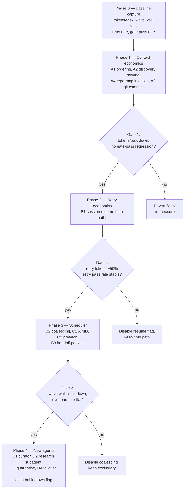

# Blueprint Execution Improvements — Research & Implementation Guide

**Audience:** an LLM (or a future session) that will implement these changes without having participated in this research. Every claim below is anchored to a file and line verified at research time. Re-verify anchors before editing — the codebase moves fast.

**Mandate:** improve the blueprint pipeline (spec → clarify → plan → tasks → review → build → verify) on four axes — token usage, execution speed, performance, resiliency — for **both** the Claude CLI path and the OpenCode SDK path. Core constraint: **reuse existing infrastructure wherever possible**. This codebase already ships most of the primitives these improvements need; the work is wiring, not building.

---

## 1. Verified current state (read this first)

### 1.1 Pipeline & state

- `src/main/services/blueprint.service.ts` (~2260 lines) — orchestrator. Phase context assembly at `assemblePhaseContext` (:1429) / `assemblePhaseContextInner` (:1477). Artifact capping is tier-based: `ARTIFACT_MD_CAPS_BY_TIER` (:159), `capArtifactForContext` (:175). Auto-retry: `isRetryableError` (:583), `scheduleAutoRetry` (:599).
- `src/main/services/blueprint-state-machine.ts` (292 lines) — formal state machine, `VALID_TRANSITIONS` (:38), idempotent-absorb rules for late terminal events (`ABSORBED_LATE_TERMINAL` :117).
- 28 `blueprint-*.ts` services total, including peer review, lead review, gates, watchdog, preflight, task verification, error reporter.

### 1.2 The DAG executor — `src/main/services/blueprint-build.service.ts` (~3605 lines)

- `executeDag` (:922): parallel cap clamped 1–6 (default from `parallelBuildAgents` pref), **halved on overload**; file-overlap exclusivity via `allInFlightFiles` (:1039) — tasks touching the same files never run concurrently; drain-point gates (`runDrainPointGates` :1106); resume pre-pass (already-complete/user-skipped tasks never re-dispatch, :960–1004); cascade-skip semantics (`isCascadeSkipped` :1024) — stale cascade-skips stay blocked, never silently unblock downstream.
- Constants: `TASK_TIMEOUT_MS = 30min` (:124), `MAX_BUILDER_ATTEMPTS = 3` (:132), `OVERLOAD_MAX_RETRIES = 2` (:135), `OVERLOAD_BACKOFF_BASE_MS = 60s` (:136).
- `buildTaskContext` (:3441): task ID/wave/description/user story/files/deps → discoveries `.slice(-20)` (recency window) → prior attempt output capped 4000 chars → prior failure reason → work packet (`renderWorkPacket`) → gate-fix instructions last.
- `handleTaskCompletion` (:2619): on success, discoveries merged into `result.discoveries` capped at 20 AND persisted per-task as a phase artifact of type `'discoveries'` (:2665–2671). Failure reasons persisted via `blueprintTaskRepository.setOutcome`.
- Escalation ladder: `gradeTask` (:2284), `escalateToLead` (:2364), `runPeerReviewIfEnabled` (:2190), `runWaveGates` (:2445).

### 1.3 Claude path — `src/main/services/agentic-claude-runner.ts` (341 lines)

- Spawns `claude -p <prompt> --mcp-config <tmp> --permission-mode bypassPermissions --allowedTools <list> --model <m> --output-format text --max-turns <n>` (`buildClaudeArgs` :323).
- **No session continuity**: `-p` cold prompt every call; `--output-format text` means no session id is captured. Every retry pays full context re-ingestion.
- MCP config (`buildMinimalMcpConfig` :79): `memory` + `code-graph` servers only.
- `parseSentinelBlock` (:123) extracts structured completion between sentinel markers.

### 1.4 OpenCode path — `src/main/services/opencode-executor.ts` (2331 lines)

- Server lifecycle (`ServerRefTracker` :274, stale-server cleanup :210), transient retries (`MAX_TRANSIENT_RETRIES` :168), stall watch inside `processEventStream` (:843), health checks, circuit breaker (`resetCircuitBreaker` :2114).
- **Already has session primitives the Claude path lacks**: `getOrCreateSession` (:2026), `getSessionId` (:1553), `primeSession` (:1576), `compactSession` (:1741), `autoCompactIfNeeded` (:1759), `summarizeSession` (:1709), and **`revertSession`/`unrevertSession`** (:1688/:1700) — session-scoped git revert.
- Supporting: `opencode-event-normalizer.ts`, `agent-recovery-manager.ts`, `opencode-transient-patterns.ts`, `agent-executor-factory.ts` (path selection).

### 1.5 Reusable infrastructure already shipped (the "reuse" inventory)

| Asset | Location | Currently used for | Underexploited for |
|---|---|---|---|
| code-graph DB + `repomap-mcp` | `src/main/db/repositories/code-graph-edge.repository.ts`, dep in package.json | MCP tools for agents (`repomapEnabled` gates `MCP_TOOLS.CODE_GRAPH` in `blueprint-build.adapter.ts:106`) | Deterministic repo-map injection at dispatch (we rely on the agent choosing to call the tool) |
| Per-task discoveries artifacts | persisted in `handleTaskCompletion` | Recency window `.slice(-20)` | Relevance-ranked retrieval (data is already queryable) |
| OpenCode session ids / compact / revert | `opencode-executor.ts` | Chat sessions | Build-task retry resume & rollback |
| Usage-log repository | `src/main/db/repositories/usage-log*` | Display | Token telemetry for adaptive parallelism & phase ROI measurement |
| Tier-based artifact caps | `blueprint.service.ts:159` | Capping raw artifacts | (pattern to copy for new injected context) |
| Handoff envelope pattern | `blueprint-handoff-message.ts` (87 lines) | Blueprint→Chat handoff; deliberately points at files instead of inlining | Inter-phase handoff packets |
| Gates / peer review / lead escalation | `blueprint-gates.service.ts`, `blueprint-peer-review.service.ts`, `blueprint-lead-review.service.ts` | Post-task verification | Extend to scheduler-level decisions (quarantine lane) |

### 1.6 External precedents (why these ideas, not others)

- **Aider's repo map** (tree-sitter + PageRank, token-budgeted): the benchmark for context selection. Cuts blind file-reading turns dramatically. We ship the dependency; we don't inject its output.
- **Claude Code / Agent SDK subagents**: orchestrator-worker Task tool; `--resume` session reuse makes retries incremental instead of cold.
- **OpenHands condenser**: learned context compression vs our fixed char caps.
- **Devin knowledge base**: long-lived context as a *curated artifact*, not a resident LLM — validates the "long-living agent" instinct but suggests the cheap shape.
- **AutoGen/CrewAI cautionary tale**: agent-to-agent chatter is a token furnace. Avoid resident orchestrator conversation.

---

## 2. Improvement catalog — grouped by ROI × Risk

Each item: problem (code evidence) → change (files) → reuse → measurement → tests → rollback.

### Quadrant A — High ROI, Low Risk (do these first, all at once is safe)

#### A1. Cache-friendly prompt ordering
- **Problem:** `buildTaskContext` (:3441) interleaves stable and volatile content. Discoveries (volatile) render before the work packet (stable); retry context sits mid-prompt. Claude prompt caching prices cached-prefix hits ~10× cheaper — interleaving defeats it.
- **Change:** reorder `buildTaskContext` and `buildSystemPrompt` (`blueprint.service.ts:1730`): stable prefix (system prompt, spec/plan slices, work packet) → volatile tail (discoveries, prior-attempt output, failure reason, gate-fix instructions — already last, keep it). No content changes, pure reordering.
- **Reuse:** none needed. Pure refactor of string assembly.
- **Measure:** cached-prefix token ratio per task (usage-log), tokens/task.
- **Tests:** existing `buildTaskContext` tests assert content presence, not order — verify none assert order; add one asserting stable-before-volatile.
- **Rollback:** trivial (revert commit).

#### A2. Relevance-ranked discoveries (replace recency window)
- **Problem:** `priorDiscoveries.slice(-20)` (:3473) and `result.discoveries.slice(-20)` (:2662) — recency, not relevance. Stale discoveries ride into every prompt.
- **Change:** rank discoveries by file-path overlap with the current task's `filePathsJson` (deterministic, cheap) with recency as tiebreaker. Data is already persisted per-task (artifact type `'discoveries'`, :2665) — this is a query + sort change at context-assembly time.
- **Reuse:** discoveries artifacts (already in DB); optionally embedding similarity later via the existing embedding provider — start with path overlap, zero new infra.
- **Measure:** tokens/task; qualitative — spot-check prompts contain discoveries mentioning the task's files.
- **Tests:** unit test the ranking function (pure, isolated export).
- **Rollback:** feature-flag or revert; recency path stays as fallback when no overlap matches.

#### A3. Git commit per completed task
- **Problem:** no per-task checkpoint on the execution path. A bad task mid-wave is hard to roll back surgically; verify/review phases lack precise per-task diffs.
- **Change:** in `handleTaskCompletion` success branch (:2634), `git add -A && git commit` on `executionPath` with message `blueprint <id> task <taskId>: <description>`. Respect the existing run-worktree/branch machinery (`blueprint-track.ts`).
- **Reuse:** OpenCode path already has `revertSession`/`unrevertSession` — git commits give **cross-path uniformity** (Claude path gets the same capability). `enrichGitContext` (:1628) shows git integration patterns.
- **Measure:** rollback latency (manual drill); diff quality fed to verify phase.
- **Tests:** unit test with a temp git repo; e2e via TestingPage catalog (Blueprint category).
- **Rollback:** commits are additive; disable flag stops new commits.
- **Caveat:** commit only on the run worktree, never the user's primary tree without the track machinery; empty commits skipped.

#### A4. Token-budgeted repo-map injection at dispatch
- **Problem:** `buildTaskContext` passes `filePathsJson` as a flat list (:3461). The agent learns what's in those files only by spending turns reading them or calling code-graph tools optimistically.
- **Change:** at dispatch time, generate a PageRank-ranked, token-budgeted symbol map for the task's file set (plus 1-hop neighbors from the code-graph edge repo) and inject it as a capped block in `buildTaskContext`. Budget by context tier — copy the `ARTIFACT_MD_CAPS_BY_TIER` pattern.
- **Reuse:** `repomap-mcp` (shipped dep) — call its library surface directly or spawn the server in-process; `code-graph-edge.repository.ts` for the graph; tier-cap pattern from `blueprint.service.ts:159`.
- **Measure:** exploration turns per task (tool-call counts from session logs), tokens/task, wall clock.
- **Tests:** unit test the map builder against a fixture repo; snapshot the rendered block.
- **Rollback:** flag-gated injection; flat file list remains.

### Quadrant B — High ROI, Medium Risk (phase separately, measure between)

#### B1. Session resume on retry (Claude path) + session reuse (OpenCode path)
- **Problem:** Claude retries rebuild the entire prompt including 4K of prior-attempt output (:3479–3493). Cold context every retry = the single biggest retry-token cost. Meanwhile the OpenCode path *already has* session ids (`getSessionId` :1553) that build tasks don't reuse.
- **Change (Claude):** switch `--output-format text` → `json` in `buildClaudeArgs` to capture `session_id`; persist it on the task record; on retry, pass `--resume <session_id>` with a short incremental prompt ("prior attempt failed gate X; here's the verdict; continue") instead of the full cold prompt. Keep the cold path as fallback when no session id exists.
- **Change (OpenCode):** thread the task's session id into retry dispatch via `getOrCreateSession` — the primitive exists.
- **Reuse:** `buildClaudeArgs` is exported for testing (extend it); sentinel parsing unaffected (JSON output still contains stdout text — verify); OpenCode session machinery as-is.
- **Measure:** tokens per retry (should drop 50–80%), retry wall clock, gate-pass rate on retry (must not regress — resumed sessions can drift).
- **Tests:** `agentic-claude-runner.test.ts` (exists) — extend for json parsing + resume arg; integration test retry path.
- **Rollback:** flag; cold-prompt retry path retained.
- **Risk detail:** JSON output format changes stdout shape — `parseSentinelBlock` and `onLine` streaming must be re-verified against real CLI output before shipping.

#### B2. Task coalescing for file-overlapping ready tasks
- **Problem:** file-overlap exclusivity (:1039) is correct for safety but serializes tasks sharing files — three tasks touching `index.ts` become a serial chain, each paying cold context on the same files.
- **Change:** in `executeDag`'s dispatch, when selecting a task, coalesce *other ready tasks whose files overlap only with this cluster* into one multi-task dispatch (one agent run, one shared context, multiple completion blocks). Both tasks settle together in `handleTaskCompletion`.
- **Reuse:** existing work packets (`renderWorkPacket`) — render multiple; existing completion parsing (sentinel block already returns structured completion — extend to array); `filesOverlap` (:290) already exists.
- **Measure:** wave wall clock on file-heavy DAGs; tokens/task (shared context should *reduce* total).
- **Tests:** DAG scheduler unit tests with overlapping-file fixtures; assert both tasks complete or both roll back.
- **Rollback:** flag; scheduler falls back to exclusivity-wait.
- **Risk detail:** partial success inside a coalesced run (task A done, task B failed) needs explicit handling — split completion blocks and settle statuses individually; failure of the run fails only unfinished members.

#### B3. Structured inter-phase handoff packets
- **Problem:** the next phase reads capped raw artifact markdown (`capArtifactForContext`, `assemblePhaseContextInner` :1477). Capping is lossy and phase-agnostic.
- **Change:** each finishing phase emits a typed handoff packet (goal recap, decisions with rationale, deviations from spec, open questions, file inventory) generated once while the model's context is hot; `assemblePhaseContextInner` consumes the packet as primary currency and demotes raw artifacts to on-demand lookup.
- **Reuse:** the pattern is proven in `blueprint-handoff-message.ts` (points-at-files-not-inlining philosophy); phase artifact persistence already exists; `PHASE_ARTIFACT_RELEVANCE` (:72) informs which fields matter per phase.
- **Measure:** tokens per phase-context assembly; downstream phase quality (verify pass rate).
- **Tests:** packet schema validation; per-phase emitter unit tests.
- **Rollback:** packets additive — old artifact path stays as fallback when packet absent.

### Quadrant C — Medium ROI, Low Risk (batch with A or B)

#### C1. AIMD parallelism (additive increase)
- **Problem:** cap halves on overload (multiplicative decrease — good) but never rises when the provider is fast and token burn is under budget.
- **Change:** in `executeDag`, on N consecutive fast successful tasks with burn under budget, `cap + 1` (never above the 1–6 clamp). Decrease path unchanged.
- **Reuse:** `recordParallelism` (:1058) already tracks; usage-log repo supplies burn telemetry.
- **Measure:** wave wall clock distribution; overload incident rate (must not increase).

#### C2. Speculative next-wave context prefetch
- **Problem:** context assembly (repo map, discovery ranking — heavier after A4/A2) sits on the critical path at dispatch.
- **Change:** while wave N executes, precompute wave N+1 task contexts into a cache keyed by taskId; dispatch reads through cache. Invalidate on upstream discoveries that change ranking.
- **Reuse:** the assemblies built in A2/A4 — this is memoization of them.
- **Measure:** dispatch-to-first-token latency.

### Quadrant D — Medium ROI, Higher Risk (last, each behind its own flag)

#### D1. Wave-boundary knowledge curator (the "long-lived agent", cheap shape)
- **Problem:** institutional memory across waves is only the 20-entry discoveries list; conventions and decisions learned in wave 1 evaporate.
- **Change:** a cheap-model call (Haiku-class) at each wave boundary (not resident — runs once per wave) maintains a compact `run-knowledge.md`: conventions discovered, decisions + rationale, deviations, open questions. Injected capped into every `buildTaskContext`. Auditable — it's markdown the user can read/edit in the UI.
- **Reuse:** `runAgenticClaude` with a cheap model + read-only tools; discoveries artifacts as input; tier-cap pattern for injection.
- **Precedent:** Devin's knowledge-as-artifact. Explicitly NOT a resident orchestrator LLM (AutoGen token-furnace failure mode; recurses the context-management problem).
- **Measure:** cross-wave consistency (verify pass rate on later waves); curator cost must stay <5% of build tokens.

#### D2. Research subagent per ambiguous task
- **Problem:** expensive builder models spend 3–5 turns exploring before writing.
- **Change:** pre-dispatch, a cheap-model subagent produces a task brief (relevant symbols, patterns to copy, pitfalls) — cached on the task record, injected like A4's map. Trigger only for tasks flagged ambiguous (no packet, high file-count, or first-in-wave on unfamiliar paths) to keep latency off the critical path; run concurrently with other dispatches, never blocking.
- **Reuse:** `runAgenticClaude` (already supports model + tool whitelist per call); code-graph tools read-only.
- **Precedent:** Claude Code Task-tool orchestrator-worker.
- **Measure:** builder exploration turns; end-to-end task latency (brief cost vs saved turns).

#### D3. Quarantine lane instead of pure cascade-skip
- **Problem:** a task failing past `MAX_BUILDER_ATTEMPTS` cascade-skips dependents (:1024) even when the dependency edge is softer than the DAG implies.
- **Change:** bounded option: dependents dispatch with an explicit "upstream X failed because R — adapt or explicitly block" packet. Cap quarantine dispatches per run; any gate failure in the lane reverts to cascade-skip.
- **Reuse:** escalation philosophy already in `escalateToLead`/peer review; failure reasons already persisted (`setOutcome`).
- **Risk detail:** correctness — downstream code built against a failed upstream can waste more tokens than it saves. Hard-cap it; default off; measure before enabling broadly.

#### D4. Provider circuit breaker + build-task failover
- **Problem:** overload backoff is per-task; a provider-wide outage still burns the retry budget task by task.
- **Change:** a rung above per-task backoff: trip the provider (existing circuit-breaker pattern in `opencode-executor.ts:2114` generalizes), and optionally fail over Claude ↔ OpenCode for build tasks — both write to the same execution worktree, so the handoff is mechanical.
- **Risk detail:** model capability mismatch — a task planned for Claude may not clear gates on a weaker failover model. Failover should mark tasks for re-verification (existing `gradeTask`/gates cover this).

---

## 3. Execution strategy: phased, not all-at-once

**Answer: phased, with measurement gates between layers.** Reasons:

1. A1–A4, B1–B3 all touch the same two hot functions (`buildTaskContext`, `executeDag` dispatch) — landing them simultaneously makes attribution of regressions impossible.
2. Several later items *depend* on earlier ones paying off (C2 memoizes A2/A4; D1 injects through A4's mechanism; B1's session resume changes what retry prompts look like, which A1 ordered).
3. Token/latency claims need a baseline captured before any change, or "improvement" is unfalsifiable.

### Phase 0 — Baseline (no product change)
- Capture from usage-log + `SchedulerStats` (already tracked in `BuildResult`): tokens/task, wall clock per wave, retry count, gate pass rate first-attempt vs retry, overload incidents. Record in this doc's appendix when done.

### Phase 1 — Context economics (Quadrant A: A1, A2, A4, A3)
- All four are additive, flag-gated, and confined to context assembly + a commit hook. Safe to land as one phase. **Gate 1:** tokens/task measurably down; gate pass rate not regressed.

### Phase 2 — Retry economics (B1)
- Alone, because it changes the runner contract (JSON output, session persistence) and the shape of retry prompts. **Gate 2:** retry token cost −50% target; retry success rate stable or better.

### Phase 3 — Scheduler + handoff (B2, C1, C2, B3)
- Scheduler semantics change here. **Gate 3:** wave wall clock down on multi-wave blueprints; overload incident rate flat.

### Phase 4 — New agent roles (D1–D4)
- Each independently flagged, default-off, enabled per-workspace after soak. These add LLM calls to the pipeline — only ship after Phases 1–3 prove the deterministic wins are banked.

### Testing conventions (per workspace memory)
- New unit test files must be registered in `src/main/services/__tests__/run-tests.ts` (currently 271 imports) **and** `run-all.ts` (known to drift out of sync — add to both).
- In-app E2E scenarios go in the TestingPage catalog (`docs/e2e-master-test-catalog.md`, Blueprint category).
- Playwright live-LLM tests use the `electron-live` project (15-min timeout) — appropriate for B1/D1/D2 integration tests.

---

## 4. What we deliberately are NOT doing (and why)

- **Resident orchestrator LLM** answering task-agent queries on demand: highest cost, highest fragility, recurses the context-management problem (OpenHands' token bills; AutoGen's chatter). The curator artifact (D1) delivers the institutional-memory benefit at ~1 cheap call per wave.
- **Worktree-per-task with agent-resolved merges:** merge-conflict resolution by agents is a resiliency cost; coalescing (B2) gets most of the parallelism win without it.
- **Replacing fixed caps with learned compression (OpenHands-style condenser):** our tier-cap pattern is deterministic and debuggable; revisit only if Phase 1 measurements show caps are the binding constraint.

## 5. Open questions for the implementer

1. Does `claude --resume` interact correctly with `--mcp-config` and `bypassPermissions` in the pinned CLI version? Verify against the real CLI before B1 (the version-mismatch memory re: electron suggests pinning discipline matters here too).
2. Does JSON output format preserve the sentinel block in stdout for `parseSentinelBlock`? Test first; if not, parse the JSON `result` field instead.
3. Repo-map generation: call `repomap-mcp` as a library or spawn in-process? Check whether its API surface is importable from the main process without the MCP hop.
4. Where do coalesced-task completion blocks live in the sentinel format — one block with arrays, or repeated blocks? Decide in B2 design; keep backward compatibility with single-task parsing.

---

**Document status:** research complete, no code changed. Implementation starts at Phase 0 (baseline capture).
