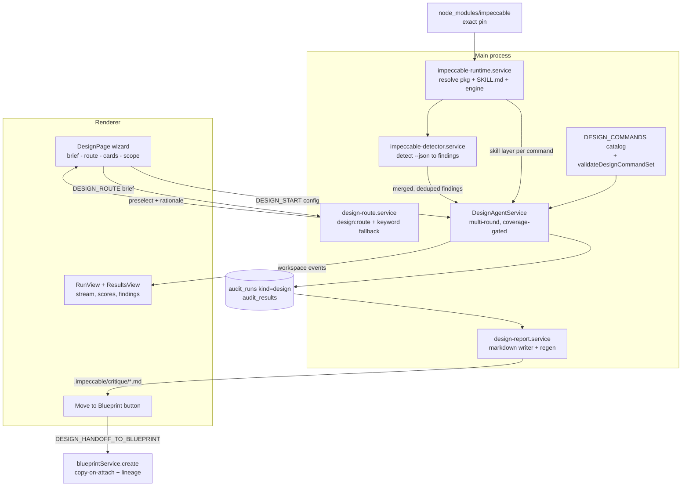

# Design Audit — Impeccable-Powered Design Review & Blueprint Handoff

> **Tracking file**: this document is the single source of truth for implementation status.
> **Status legend** — each item carries one of: `[ ] pending` → `[C] coded` → `[V] verified` (tests green) → `[A] audited` (reviewed by a second model/human). Update the status inline as you work. **Work strictly bullet-by-bullet; never start a phase with a prior phase below `[V]`.**
> **Intended execution**: this file is the input brief for a Code Atelier Blueprint run. Paste it (or attach it) as the blueprint description; SPECIFY/PLAN/TASKS decompose the phases below. Phases are ordered by build dependency, not by importance.

## Vision (context for any session picking this up)

Add an **Audit Design** capability parallel to the existing code audit (Workspace Health), powered by the [`impeccable`](https://github.com/pbakaus/impeccable) npm package (design skill pack: 1 skill, 23 commands, 61 deterministic detector rules, Apache-2.0):

- A **wizard** ("what do you want to accomplish") → LLM command preselection → Impeccable-style **command cards** (critique, audit, polish, harden, …) with a combination matrix that blocks nonsense pairs (`bolder`↔`quieter`, `distill`+additive passes) → **scope** selection (whole project vs pages/files).
- A design **run** executes **evaluate-class commands only** (`audit`, `critique`) as agent sessions with Impeccable SKILL.md guidance injected into the prompt, always merged with the **deterministic detector** (`impeccable detect --json`, zero LLM cost). Fix-class commands never execute here — they shape the remediation brief.
- On completion: a **findings report file** written to the workspace (`.impeccable/critique/`, Impeccable's own convention for tracked review artifacts) plus a DB mirror for history/restart.
- **Move to Blueprint**: one blueprint ingesting the report (attached via copy-on-attach) plus a **prefabricated remediation brief** encoding Impeccable's command routing (audit P0s→`harden`, theming/type→`polish`/`typeset`, perf→`optimize`, slop→`polish`/`distill`, copy→`clarify`), with lineage in `settingsJson`. Design-sourced blueprints inject the Impeccable skill layer into BUILD task prompts so fixes apply the same design vocabulary the audit used.
- A new **Design section** in the model configuration (3 role rows: Evaluate / Route / Init).

Integration model is **reference, not copy**: `impeccable` is an exact-pinned production dependency; its skill markdown is read at runtime and injected via the existing SkillPromptComposer pattern; the detector runs as a subprocess. Updates = bump the pin. (Internal tool; Apache-2.0; no license concern.)

## Decision ledger (resolved in interview)

| # | Topic | Decision |
|---|---|---|
| Q1 | Integration model | npm-managed package + prompt injection + detector CLI. No vendoring/copying. Exact pin (upstream ships multiple releases/week: 3.0→3.6 in ~3 months). |
| Q2 | Feature surface | Dedicated **DesignPage** (wizard UX diverges from track toggles) with its own `DESIGN_*` IPC namespace, but **shared audit storage**: `kind` discriminator (`'code' \| 'design'`) on `audit_runs` so AuditRepository, history, results, and handoff machinery are reused, not duplicated. *Alternative rejected: own `design_runs` tables (more migration code, duplicated retention/handoff for marginal isolation).* |
| Q3 | Command cards | 16 selectable commands (2 evaluate + 14 refine) in shared constants with an `incompatibleWith` matrix. Create/new-surface is **not** a card (out of scope). Multi-select = what runs now (evaluate) + what the blueprint brief gets told to do (refine route). |
| Q4 | INIT automation | `init` is interactive by design (interview writing PRODUCT.md) — **not a card, never auto-run**. It becomes an auto-**detected** wizard prerequisite: status chip (ready / missing / stale), one-click guided setup. `document` (DESIGN.md) is a pure code scan → runs unattended after init. Runs without context proceed with a degraded-quality warning. |
| Q5 | Scope | Wizard scope step: whole project vs selected files/dirs, filtered to design-relevant extensions. Default = detected UI source dir. |
| Q6 | Brief + LLM preselect | Step 1 free-text brief with prefabricated example chips. New `design:route` action (cheap model) maps brief → preselected commands + scope hint; deterministic keyword fallback when LLM unavailable. Preselect fills the card step; user confirms/edits. |
| Q7 | Wizard order | Brief → (LLM route in background) → command cards pre-filled & validated → scope → run. |
| Q8 | Model settings | New `design` ModelRoleGroup, 3 rows: **Evaluate** (`design:audit`), **Route** (`design:route`, haiku-class default), **Init** (`design:init`). |
| Q9 | Findings file | Written to `<workspace>/.impeccable/critique/YYYY-MM-DD-<commands>-<scope-slug>.md` (Impeccable's tracked-artifact convention — future `/impeccable` sessions discover it) + full result persisted in DB as source of truth (report regenerable). |
| Q10 | Execution engine | New `DesignAgentService` mirroring `AuditAgentService` (multi-round, coverage-gated `AgentSessionService` sessions); per-command Impeccable guidance as a prompt layer; detector runs for `audit` AND `critique` (Impeccable merges detector output into both) and its findings are deduped in. |
| Q12 | Skill provisioning | Impeccable's skill markdown is **not in the npm tarball** — it is materialised by the engine's `install` subcommand. We run that once into an **app-managed directory under `userData`** (`userData/impeccable-skill/`) and read from there. *Alternative rejected: installing into the user's workspace `.claude/skills/` — mutates their repo and dirties their git status without consent.* |
| Q11 | Move to Blueprint | ONE blueprint: description = prefabricated design-remediation brief (goal + command routing table + selected findings inline, severity-ordered); report attached as reference doc via **copy-on-attach** (durable against repo edits mid-pipeline; workspace-file no-copy is the rejected alternative); `settingsJson` = `{ source: 'design', sourceDesignRunId, commandIds, scope, reportPath }`. Mirrors `AUDIT_HANDOFF_TO_BLUEPRINT`. Design-sourced blueprints get skill injection into BUILD. |

## Resolved at implementation time (re-verify, do not trust memory)

- `CURRENT_SCHEMA_VERSION` in `src/main/db/index.ts` — memory values (85/94/100/120/147/157) are all stale records from different eras. Read it; the migration number for this feature is `CURRENT + 1`.
- Test runners: `src/main/services/__tests__/run-tests.ts` (unit) and `src/main/db/repositories/__tests__/run-tests.ts` (repo) are the executed entrypoints; `src/main/__tests__/run-all.ts` is the coverage aggregator with known drift. Register new tests in **both** run-tests.ts AND run-all.ts.
- Detector `--json` output schema (field names, severity level names) — undocumented in full; capture real output once and pin the mapper to it.
- Actual model IDs available in `AVAILABLE_MODELS` (memory disagrees: opus-4-7 vs opus-4-8, sonnet-4-6 vs sonnet-5) — use whatever the `audit` role defaults to as the Evaluate default.

## Verified grounding (seams this plan builds on)

- **Audit orchestration**: `src/main/services/audit-agent.service.ts` (890 lines — per-workspace state, sequential auditors, retry, events `progress`/`result`/`intermediate_findings`/`stream`/`complete`), `audit-coverage-tracker.ts`, `audit-response-parser.ts` (progressive ` ```audit-finding ` + ` ```audit-score ` blocks), `audit-prompt-templates.ts` (**has an unused `skillContent` param — wiring precedent**), `audit-discovery.service.ts`.
- **Audit storage**: `audit_runs` / `audit_results` / `audit_plans` / `audit_finding_handoffs` via `AuditRepository` (10-run retention, CASCADE, dynamic SET updates). `AuditFinding` = `{ id, severity: info|low|medium|high|critical, title, description, filePath?, recommendation? }` (`src/shared/types.ts` ~2287).
- **Blueprint intake**: `blueprintService.create({ workspaceId, title, description, priority, settingsJson })`; copy-on-attach at `src/main/ipc/blueprint.ipc.ts:82–128` (`userData/blueprint-docs/{ws}/{bp}/N-{filename}`, max 50 attachments, 25MB/file); reference docs budget-capped at **50K chars/file** in phase prompts (`blueprint-document-loader.ts:39`); format precedent `src/shared/audit-blueprint-format.ts` (`deriveBlueprintPriority`, `buildAuditBlueprintTitle`, `formatAuditFindingsBrief`); handoff handler precedent `AUDIT_HANDOFF_TO_BLUEPRINT` (`audit.ipc.ts:881–971`, `MAX_BLUEPRINT_FINDINGS = 50`, trusts DB not renderer payload, records envelope + handoff row).
- **Skill injection seam**: `SkillPromptComposer` (`skill-prompt-composer.ts`) — mtime-cached reads, budget tiers (minimal/standard/full, 4K hard cap), `buildBaselineSkillsLayer()` pattern, dev/packaged root split at :313 (`app.isPackaged ? userData : cwd`). Baseline skills live in `.claude/skills/{name}/SKILL.md`.
- **CLI probe pattern**: `runProbeAsync` in `blueprint-preflight.service.ts:313–355` (5s budget, parallel, never throws, Windows `.cmd` via `shell`, timeout ⇒ warn not blocker). `KNOWN_SERVICES` registry is the extension point.
- **Agent sessions**: `runAgenticClaude()` (`agentic-claude-runner.ts`) — `-p`, `--mcp-config`, `--allowedTools`, `--model`, `--max-turns`; **no `--skills` flag exists** — skill content must ride in the prompt.
- **Model config**: `ModelAction` union (`src/shared/types.ts:665`), `DEFAULT_MODEL_CONFIG` + `MODEL_ROLE_ROWS` + `MODEL_ROLE_GROUP_LABELS` (`src/shared/constants.ts:1025/1075/1206`), resolution via `resolveAssignment` (roles → overrides → defaults), optional-role off-binding (`OPTIONAL_MODEL_ROLE_ACTIONS`), UI `ModelRolesSection.tsx` (group sections via `rolesInGroup(group)`).
- **Page wiring**: `HealthPage.tsx` views `landing|configure|active|plan`; tab render in `WorkspaceSettingsContent.tsx:130+`; zustand precedent `audit.store.ts`; handoff hook `health/useAuditHandoff.ts`.
- **Packaging**: prod deps survive `npm prune --omit=dev` (`scripts/build-mac.sh:119+`); **`build/afterPack.js`** (registered at `electron-builder.yml:12`) prunes "non-essential assets" from copied node_modules (keeps `.js/.mjs/.cjs/.ts/.json`) — the impeccable payload is now explicitly whitelisted; `OnlyLoadAppFromAsar: false`.
- **Detector contract**: `impeccable detect --json <target>` — exit `0` clean / `2` findings / `1` failure; JSON on stdout, human output on stderr; honors `.impeccable/config.json` + inline `impeccable-disable` waivers; web files only (html/css/jsx/tsx/vue/svelte/astro/css-modules + configured template extensions); design-system checks unlock only when DESIGN.md exists; `--scope type|layout` domain narrowing available.

## Architecture



---

## P1 — Foundation: dependency, runtime resolver, provisioning, packaging

> **Status: `[C]` coded, unit-verified. ⚠️ The packaging/DMG gate is DEFERRED, not passed.**
>
> **Deferred gate (must run before P3 — P3 is the detector work that actually spawns the engine in a shipped app):**
> `scripts/build-mac.sh` → `codesign --verify --deep --strict` → mount the DMG → confirm
> `Contents/Resources/app/node_modules/@impeccable/cli-darwin-arm64/bin/impeccable` is present, executable, and runs `--version` → launch the packaged app and repeat the dev smoke to prove `app.getAppPath()` resolution works in production.
> Deferred because the script runs `npm prune --omit=dev` against the shared tree and relies on an EXIT trap to restore it; a SIGKILL (or a backgrounded/timed-out invocation) skips the trap and leaves `node_modules` stripped. Recovery is `rm -rf node_modules && npm install --include=dev`.
> **P2 does not depend on this gate** — it is shared types, catalog, migration, model roles and an IPC skeleton, none of which touch the engine binary.

### Ground truth captured during implementation (supersedes earlier guesses)

| Topic | Verified fact (engine v0.1.3 / npm 4.0.4, 2026-09-07) |
|---|---|
| Version | Latest npm is **`4.0.4`** (published 2026-09-06), not 3.6.1. Pinned exactly. |
| afterPack hook | Lives at **`build/afterPack.js`** (`electron-builder.yml:12`). `scripts/` has no afterPack. |
| Tarball contents | **No skill markdown at all.** 6 files: `cli/bin/cli.js` (4.3 KB launcher shim), `package.json`, `LICENSE`, `README*.md` × 3. |
| Real engine | Self-contained **12.7 MB Mach-O** in an `os`/`cpu`-gated optional dep: `@impeccable/cli-darwin-arm64@0.1.3` → `bin/impeccable`. **No Node required** — so we spawn it directly and sidestep the `RunAsNode: false` fuse. |
| Platform packages | `@impeccable/cli-{darwin,linux,windows}-{arm64,x64}` — note the OS token is **`windows`**, not node's `win32`; exe is `impeccable.exe` there. |
| Resolution tiers | Upstream order (`cli/bin/cli.js`): `$IMPECCABLE_BIN` → optional dep → **`$IMPECCABLE_HOME`/`~/.impeccable`/bin/**`<engineVersion>`**/** (version-partitioned, not flat) → download. |
| Three version numbers | npm pkg `4.0.4` · engine binary `0.1.3` (the optionalDependency range; its `--version` prints `4.0.0`) · skill content `4.2.2` (SKILL.md frontmatter). Do not conflate. |
| `install` flags | `-y`, `--providers=`, `--scope=project|global`, `--no-hooks`, `--force`. Fully non-interactive with `-y`; exits 0. |
| **`--scope=project` containment** | **Walks UP to the nearest `.git` and installs into that repo root — it ignores cwd.** Verified: running from `<repo>/nested/deep` wrote `<repo>/.claude`. Setting `cwd` is NOT containment. An empty `.git` dir planted at the provision root stops the walk. (This bit us: an early test run wrote into this repo.) |
| Install payload | `.claude/skills/impeccable/SKILL.md` (11.7 KB) + `reference/*.md` × 35 per-command playbooks (`audit` 7.9 KB, `critique` 42.7 KB — budget before injecting) + `scripts/command-metadata.json` (command catalog, useful for P2.1) + `scripts/` launchers + a duplicate 12 MB engine under `scripts/bin/<target>/`. Also `.claude/agents/impeccable-*.md` × 4. ~14 MB total. |
| Payload source | `install` **downloads** the skill payload — first provisioning needs network; offline → degrade path. |
| Prune survival | `@impeccable/*` survives `npm prune --omit=dev` (optional dep of a prod dep). Confirmed via dry-run. |

> ⚠️ **Environment trap:** this shell has `NODE_ENV=production`, which makes npm default to `omit=dev` — a bare `npm install <pkg>` silently removed all 828 dev packages. Always run `NODE_ENV=development npm install --include=dev` here.

- [C] **P1.1** `package.json`: `"impeccable": "4.0.4"` in **dependencies** (exact pin, like `better-sqlite3`). Installed layout verified: `node_modules/impeccable/cli/bin/cli.js`, `node_modules/@impeccable/cli-darwin-arm64/bin/impeccable` (12.7 MB, mode 755), `.bin/impeccable` + `.bin/impeccable-darwin-arm64`.
- [C] **P1.2** NEW `src/main/services/impeccable-runtime.service.ts` — sole owner of engine-path knowledge:
  - `resolvePlatformTarget()` — platform → `{ target, packageName, exeName }`, replicating the upstream mapping.
  - `resolveEngineBinary()` — 4-tier resolution above, `X_OK`-checked, memoised, returns the bare name as a PATH fallback; **never `npx`** (no Node guarantee in the packaged app).
  - `checkAvailability()` — `--version` probe, 5 s budget, memoised, shared in-flight promise, never throws.
  - `runEngine(args, opts)` — the only spawn point; 32 MB `maxBuffer` for `detect --json`; a non-zero exit is reported as a `code`, not an error (the detector uses exit 2 for "findings").
- [C] **P1.3** NEW `src/main/services/impeccable-provision.service.ts` — lazy, app-managed skill provisioning under `userData/impeccable-skill/`, stamp fast-path (`.provision-stamp.json`), single in-flight install, `.git` containment marker, mtime-cached `readSkillMarkdown()` / `readCommandMarkdown(id)` (the seam P3.2 injects into prompts), sync `getProvisionState()`.
- [C] **P1.4** `build/afterPack.js`: `PROTECTED_PATH_PATTERNS` short-circuits `prune()` for `node_modules/@impeccable/**` and `node_modules/impeccable/**`; post-copy **hard assertion** throws if `impeccable` is a prod dep but no `@impeccable/cli-*` engine is present/executable; the `strip -x` pass is documented as `.node`-only so the vendor Mach-O is never touched.
- [C] **P1.5** NEW `impeccable-runtime.test.ts` + `impeccable-provision.test.ts` (33 tests), registered in **both** `run-tests.ts` and `run-all.ts`.
  - Async bodies are wrapped in `runExclusive()` because they swap `process.env.IMPECCABLE_BIN`, and the harness starts every async test concurrently.
  - **No test may call `process.chdir()` or reassign `process.env.PATH`.** `runExclusive` only serialises against *other* `runExclusive` users, so a global mutation still corrupts the rest of the 271-file suite. The bundled-dependency tier is instead redirected with the `__setAppRootForTests()` seam, and the "engine unavailable" branch is driven by an engine whose `--version` exits non-zero rather than by emptying PATH.
- [C] **P1.6** (unplanned, root-cause fix) `src/main/services/__tests__/workspace-mcp-config-logic.test.ts` replaced the whole `require.cache` entry for `src/main/logger` with `{ chatAgentLogger }` and never restored it. Because it is registered at position 227 and never undone, **every** file loaded after it saw `skillLogger`/`dbLogger`/etc. as `undefined` — which is what actually made all 27 Impeccable tests fail in the aggregate run while passing standalone (`TypeError: Cannot read properties of undefined (reading 'info')`). The stub now spreads the real exports and overrides only `chatAgentLogger`. Two other test files (`memory-engine-pipeline-p26`, `memory-extract-body-p26`) carry comments describing this same "module-level `log` undefined" symptom, so this landmine had already cost time elsewhere. Both Impeccable services additionally route logging through an optional-call shim, since they promise never to throw.
- **Verify**: [V] `npm run typecheck` clean · [V] 33/33 Impeccable unit tests green **in the full 271-file `npm run test:unit` run** (12 909 passed / 5 failed; all 5 failures belong to unrelated pre-existing uncommitted WIP — `opencode-token-backstop`, `specialist-ingestion-gate`, `blueprint-session-resume`, `blueprint-preflight` login-shell env — and none are Impeccable) · [V] eslint clean · [V] dev smoke against the real engine (`available: true`, version `4.0.0`, SKILL.md 11 661 chars, `reference/{audit,critique,polish,harden}.md` all read, repo `git status` byte-identical before/after) · [ ] **DMG gate outstanding**: `scripts/build-mac.sh` incl. `codesign --verify --deep --strict`, then mount and confirm the engine is present + executable and `--version` runs from `Contents/Resources/app/node_modules/@impeccable/cli-darwin-arm64/bin/impeccable`. **Hard gate before P3.**

## P2 — Shared catalog, types, migration, model roles, IPC skeleton

> **Status: `[C]` coded, typecheck + unit + repo suites green.**
>
> **Deviations from the original P2 text, and why:**
> 1. The catalogue lives in a NEW `src/shared/design-commands.ts`, not in `constants.ts` — `constants.ts` is already 3.3k lines, and P2.2 explicitly allowed a dedicated module. Types stayed in `types.ts` as specified.
> 2. The catalogue is grounded in the engine's own `scripts/command-metadata.json` (23 commands) and the SKILL.md `argument-hint` families rather than invented. The plan's 16 map **exactly** onto Impeccable's own groupings: evaluate (audit, critique) · refine/amplify (animate, bolder, colorize, delight, layout, quieter, typeset) · simplify (adapt, clarify, distill) · harden (harden, onboard, optimize, polish).
> 3. **`overdrive` is the one refine command the plan omitted** — it is a real, non-deprecated command ("technically ambitious implementations"). It is excluded for now and documented as such in `design-commands.ts`; adding it later is a one-entry change. The other 6 engine commands (`shape`, `init`, `document`, `extract`, `live`, deprecated `craft`) are excluded per Q3/Q4.
> 4. Migration number is **160** (`CURRENT_SCHEMA_VERSION` was 159, not the stale 85/94/120 in memory).
> 5. Retention is now **per-kind**. The original text only mentioned filtering read paths, but `createRun`'s 10-run prune was workspace-scoped — unfiltered, a burst of design runs would have silently evicted the user's Workspace Health history. A test pins this.
> 6. `DESIGN_DELETE_RUN` verifies `kind === 'design'` before deleting, so the design page cannot delete a Health run by id.

- [C] **P2.1** `src/shared/design-commands.ts` (not constants.ts — see deviation 1): `DESIGN_COMMANDS: readonly DesignCommandDef[]` — 16 entries: evaluate (`audit`, `critique`) + refine (`polish`, `harden`, `optimize`, `distill`, `animate`, `typeset`, `layout`, `bolder`, `quieter`, `colorize`, `delight`, `adapt`, `clarify`, `onboard`). Each: `{ id, name, category: 'evaluate'|'refine'|'simplify'|'harden', description, impeccableCommand, incompatibleWith: DesignCommandId[] }`. Matrix per Impeccable's own philosophy: `bolder`↔`quieter` (two halves of voice, never neutral); `distill` vs additive (`animate`, `colorize`, `delight`, `bolder`); evaluate combines freely with everything. Plus `IMPECCABLE_DESIGN_EXTENSIONS` (html, css, jsx, tsx, vue, svelte, astro, mjs + css-module patterns) and `DESIGN_BRIEF_EXAMPLES` (chips: "I want to animate this user page", "Audit the current UX", "This page feels generic / AI-made", …).
- [C] **P2.2** Pure helpers in the same module: `validateDesignCommandSet(ids)` (conflicts normalised to catalogue order so a clash yields ONE badge, not two; unknown ids ignored so a stale id cannot mask a real conflict), `evaluateCommandsSelected(ids)`, `refineCommandsSelected(ids)`, `isDesignRelevantPath(p)`, `getDesignCommand(id)`.
- [C] **P2.3** `src/shared/types.ts`: `DesignCommandId` (union), `DesignRunConfig { commandIds, scope, brief, llmProvider? }`, `DesignContextStatus { productMd: boolean; designMd: boolean; stale: boolean }`; extend `ModelAction` with `'design:audit' | 'design:route' | 'design:init'`; extend `ModelRoleGroup` with `'design'`; `AuditFinding.source?: string` (`'impeccable-detector'` vs LLM).
- [C] **P2.4** `src/shared/constants.ts` — note `MODEL_ACTIONS_META` is a THIRD `Record<ModelAction, …>` the original text missed; all three must gain the new actions or typecheck fails. `DEFAULT_MODEL_CONFIG` += design actions (evaluate → same default as `audit` role; route/init → haiku/sonnet-class); `MODEL_ROLE_ROWS` += 3 design rows (Evaluate: actions `[design:audit]`; Route: `[design:route]`; Init: `[design:init]`); `MODEL_ROLE_GROUP_LABELS.design = 'Design'`; IPC channels `DESIGN_ROUTE`, `DESIGN_START`, `DESIGN_CANCEL`, `DESIGN_GET_LATEST`, `DESIGN_GET_HISTORY`, `DESIGN_DELETE_RUN`, `DESIGN_CONTEXT_STATUS`, `DESIGN_GENERATE_REPORT`, `DESIGN_HANDOFF_TO_BLUEPRINT` (namespace `design:*`).
- [C] **P2.5** Migration **160**: `ALTER TABLE audit_runs ADD COLUMN kind TEXT NOT NULL DEFAULT 'code'` + index on `(workspace_id, kind)`. Sweep `AuditRepository` read paths to filter `kind = 'code'` (Health) — existing flows must be untouched.
- [C] **P2.6** NEW `src/main/ipc/design.ipc.ts` — read paths (`GET_LATEST`/`GET_HISTORY`/`DELETE_RUN`) are fully functional and kind-scoped; execution channels validate eagerly and return a structured `{ ok: false, reason }` until P3 rather than throwing. `parseDesignRunConfig` re-enforces the incompatibility matrix in main, so an out-of-date renderer cannot start a contradictory run. — skeleton with `requireObject/requireString` validation mirroring audit.ipc.ts; register in `src/main/ipc/index.ts` `registerAllIpcHandlers()` (currently 49 modules).
- [C] **P2.7** Tests: NEW `src/main/services/__tests__/design-commands.test.ts` (31 tests — catalogue integrity incl. symmetry of the matrix, every conflict pair, partitioning, extension helpers), registered in `run-tests.ts` + `run-all.ts`; `kind` round-trip, per-kind history/latest isolation and per-kind retention appended to the existing `audit.repository.test.ts` (already registered in the repo runner).
- **Verify**: [V] `npm run typecheck` + eslint clean · [V] `npm run test:repo` **612 passed / 0 failed** · [V] `npm run test:unit` **12 938 passed / 7 failed**, and every design + impeccable suite executed and passed. Of the 7:
  - **1 was a real regression from this phase and is fixed** — `model-roles-assignment.test.ts` asserted "covers all five groups"; adding the `design` group made it six. Renamed and updated. (Grepped for other group-count assumptions: none.)
  - 3 are load-flakiness (`blueprint-preflight` ×2, `blueprint-build-deep-phase25`) — all pass standalone on an unloaded machine (42/42 and 53/53).
  - 3 are pre-existing and unrelated (`infers_dotnet_and_csharp_from_cs_files`, `resume / rotation / flag-off / stale`, and a login-shell env probe), present in the baseline run before any of this work.
- [ ] Health **e2e** regression not yet run — the `kind` filter is covered by repo-level tests (per-kind history, latest, and retention isolation), but the e2e pass is still outstanding.

## P3 — Execution engine

- [ ] **P3.1** NEW `src/main/services/design-agent.service.ts` — mirror `AuditAgentService` structure: per-workspace `{ running, abortController, session }`, sequential command execution (order: detector first, then `critique`, then `audit`), retry (MAX_RETRIES=1), events `progress`/`result`/`intermediate_findings`/`stream`/`complete`. One `audit_results` row per command (`trackId = 'design:<commandId>'`), run row with `kind: 'design'`, `selected_tracks` reused for commandIds, `selected_skills` for `{ brief, scope }`. Reuse `AuditCoverageTracker` + coverage gate; `applicability: 'not-applicable'` when scope has zero design-relevant files.
- [ ] **P3.2** NEW `src/main/services/design-prompt-templates.ts` — per-command system prompt = audit scaffold + **Impeccable layer** (SKILL.md content trimmed to the command's guidance via tiered budgets, hard cap ~6–8K chars) + PRODUCT.md/DESIGN.md contents when present (the context files Impeccable commands expect) + user brief + scope file list. Output contract: same progressive ` ```audit-finding ` / ` ```audit-score ` blocks so `parseAuditResponse` works **unchanged**. Detector summary injected into round-2+ prompts (feedback loop).
- [ ] **P3.3** NEW `src/main/services/impeccable-detector.service.ts` — `runDetection(workspacePath, targets)`: spawn engine `detect --json <targets>`, `cwd = workspacePath` (honors `.impeccable/config.json` + inline waivers), 60s timeout, `windowsHide`; exit 0/2 → parse stdout; 1 → `{ status: 'failed' }` warn-skip. Defensive JSON mapper → `AuditFinding[]` with `source: 'impeccable-detector'`; severity mapping pinned against captured real output.
- [ ] **P3.4** Merge logic in the service: detector findings deduped against LLM findings by `filePath + normalized title prefix`; `skillsUsed += ['impeccable-detector']`; detector output excluded from coverage stats (it is not agent evidence).
- [ ] **P3.5** Wire `DESIGN_START/CANCEL` → service; persist via `AuditRepository`; forward events through `getSessionEventRouter().sendWorkspaceEvent()` (mirror audit.ipc.ts wiring).
- [ ] **P3.6** Tests: templates (layer inclusion per command, budget caps, context-file injection, brief/scope presence), detector mapper (fixture JSONs, exit-code semantics, timeout, dedupe), orchestration with stubbed sessions (event emission, per-command result rows, not-applicable path). Register everywhere.
- **Verify**: unit green; one stubbed run end-to-end produces a completed run row with findings.

## P4 — Wizard UX, model settings section, navigation

- [ ] **P4.1** `ModelRolesSection.tsx`: `const DESIGN_ROLES = rolesInGroup('design')` + section JSX between Quality & Council (Evaluate / Route / Init rows — RoleRow handles persistence automatically; no backend work).
- [ ] **P4.2** NEW `src/renderer/src/store/design.store.ts` — mirror `audit.store.ts` (currentRun, isRunning, progress/result/stream handlers, history, delete).
- [ ] **P4.3** NEW `src/main/services/design-route.service.ts` — one-shot `design:route` call: `{ brief, contextStatus }` → `{ commandIds, scopeHint, rationale }`; deterministic keyword fallback (`animate→animate`, `audit/review→audit+critique`, `bold→bolder`, `generic/slop→critique+distill`, …) when model call fails or times out (10s); **never blocks the wizard** — degrade to no preselect.
- [ ] **P4.4** NEW `src/renderer/src/components/workspace/DesignPage.tsx` + `design/` folder:
  - `DesignLanding` — history via `DESIGN_GET_HISTORY` (kind='design'), empty state, "New Design Audit" CTA (mirror HealthLanding).
  - `DesignWizard` — `BriefStep` (textarea + `DESIGN_BRIEF_EXAMPLES` chips; fires `DESIGN_ROUTE` in background) → `CommandCardsStep` (cards grouped by category, pre-selected from route with rationale line, live `validateDesignCommandSet` conflict badges + disable invalid toggles) → `ScopeStep` (whole-project toggle + extension-filtered file/dir picker defaulting to detected UI dir; design-context status banner from `DESIGN_CONTEXT_STATUS`) → provider toggle → Run.
  - `DesignRunView` — reuse health/ rendering patterns: stream view, score hero (audit: 5 dimension scores; critique: heuristic/persona/slop-verdict parsed from result), findings list with `source` badge for detector findings, per-command sidebar.
  - `DesignRunCard` for history.
- [ ] **P4.5** Navigation: register `design` tab in `WorkspaceSettingsContent.tsx` (alongside `health`), icon + label in the nav config.
- [ ] **P4.6** Preload `window.api` entries for all DESIGN_* channels (mirror audit preload block).
- [ ] **P4.7** E2E (`e2e/design-*.e2e.ts`, claude-shim where needed): wizard happy path, conflict blocking, brief chips, route fallback, history rendering, cancel. Typecheck via `npm run typecheck:e2e`.
- **Verify**: typecheck + unit + e2e green; manual wizard walkthrough.

## P5 — Design context prerequisite (init)

- [ ] **P5.1** `DESIGN_CONTEXT_STATUS` handler (deterministic, no LLM): PRODUCT.md/DESIGN.md presence at root, then `.agents/context/`, then `docs/` (Impeccable's fallback search order); staleness = DESIGN.md mtime older than the N newest in-scope UI files → `stale: true` (doctor-style hint, never blocks).
- [ ] **P5.2** Wizard "Set up design context" step when missing: attended mini-session via `design:init` model action through `AgentSessionService` — agent scans codebase, asks ≤3 questions (rendered as a chat-style card in the wizard, not a raw gate), writes PRODUCT.md (user-confirmed writes only), then `document` behavior runs **unattended** to write DESIGN.md (pure code scan). Pre-fill the scan prompt with workspace metadata we already have (name, description, constitution/CLAUDE.md, detected tech stack).
- [ ] **P5.3** Degraded mode: runs without context proceed; wizard shows a persistent "running without design context — results will be generic" warning chip; detector design-system checks simply stay off (Impeccable native behavior).
- [ ] **P5.4** Tests: status detection (present/missing/monorepo fallback/staleness), degraded-mode banner logic; e2e for banner states.
- **Verify**: fresh scratch workspace → banner → guided init writes both files → banner clears.

## P6 — Report file + Move to Blueprint

- [ ] **P6.1** NEW `src/shared/design-blueprint-format.ts` (mirror `audit-blueprint-format.ts`; pure, unit-testable): `buildDesignBlueprintTitle(commands, scope)`, `deriveBlueprintPriority(findings)` (severity mapping identical to audit), `formatDesignRemediationBrief(run, findings, commands)` — sections: goal statement from user brief; **command routing table** (finding clusters → impeccable fix commands: critical/P0/P1 + a11y → `harden`; theming/typography → `polish` + `typeset`; performance → `optimize`; slop-detector hits → `polish`/`distill`; UX copy → `clarify`; motion → `animate`); selected findings inline severity-ordered (same shape as `formatAuditFindingsBrief`); files-in-scope; note that Impeccable guidance is available to BUILD sessions.
- [ ] **P6.2** NEW `src/main/services/design-report.service.ts` — render full markdown (dimension scores, findings grouped by command, detector section with rule ids, brief, scope, lineage footer) → write `<workspace>/.impeccable/critique/YYYY-MM-DD-<commands>-<scope-slug>.md`; **regenerable from DB** (`DESIGN_GENERATE_REPORT`); path persisted on the run row. Auto-write on run completion.
- [ ] **P6.3** `DESIGN_HANDOFF_TO_BLUEPRINT` handler in `design.ipc.ts` (mirror `audit.ipc.ts:881–971`): fetch run + selected findings **from DB** (trust DB, cap at 50), `blueprintService.create({ title, description: formatDesignRemediationBrief(...), priority, settingsJson: { source: 'design', sourceDesignRunId, commandIds, scope, reportPath } })`, attach report via existing copy-on-attach path, record handoff row + envelope (reuse handoff machinery), navigate to blueprints.
- [ ] **P6.4** BUILD-phase skill injection: when `settingsJson.source === 'design'`, blueprint build-task prompt assembly appends the Impeccable layer + per-command guidance (same injection helper as P3.2) so fixes apply the design vocabulary. Touch point: blueprint prompt/task-context assembly (work-packet build), gated by the lineage marker — zero effect on non-design blueprints.
- [ ] **P6.5** Optional preflight entry: `impeccable` availability probe in `KNOWN_SERVICES` (id `impeccable`, presenceProbe on the resolved binary, `presenceWarnOnly: true`) — surfaces as warning for design-sourced blueprints, never a blocker.
- [ ] **P6.6** Tests: format module snapshots (routing table for each cluster type, priority mapping, empty-findings edge), report writer + regeneration, handoff handler (blueprint created with attachment + lineage + cap enforcement), prompt-injection gating (design vs non-design blueprints). Register everywhere.
- **Verify**: stubbed run → report file exists in workspace → Move to Blueprint → blueprint detail shows attachment + brief; BUILD prompt contains skill layer (assert in test).

## P7 — Registration, gates, hardening

- [ ] **P7.1** Every new test file registered in `src/main/services/__tests__/run-tests.ts` AND synced into `src/main/__tests__/run-all.ts` (known drift issue — unregistered tests silently don't run under `npm run test:cov`).
- [ ] **P7.2** Full gates: `npm run typecheck`, `npm run typecheck:e2e`, `npm run test:unit`, targeted coverage on new files, Health audit e2e regression (kind-discriminator sweep).
- [ ] **P7.3** Packaging re-verification: DMG build → payload present → run one design audit from the packaged app (resolver works from `app.getAppPath()`).
- [ ] **P7.4** One real run on a scratch web workspace (create-class Vite/React sandbox): detector findings present, LLM findings parsed, report written, blueprint created and BUILD prompt injection observed. Optional live-LLM check via the `electron-live` Playwright project (15min timeout pattern).

## Implementation order

P1 → P2 → P3 → P4 (P4.1 parallel with P4.2–P4.6) → P5 → P6 → P7. Each phase exits typecheck+unit green. The **P1.4 packaging/DMG gate** is a hard checkpoint before any P3 detector work.

## Risks & mitigations

- **afterPack strips skill/binary payload** → explicit whitelist + hard build assertion (P1.4) + DMG verification gate.
- **Codesign rejects the nested 12.7 MB vendor Mach-O** → the most likely P1 blocker. `build-mac.sh:242` gates on `codesign --verify --deep --strict`; electron-builder signs after `afterPack`, so it should be picked up. If not, sign it explicitly inside the hook with the same identity.
- **`install` escapes to the enclosing git repo** → `.git` containment marker at the provision root; a test asserts nothing is written outside `userData`.
- **DMG grows ~12.7 MB** (plus ~14 MB in `userData` after first provisioning, which includes a duplicate engine copy) → accepted.
- **Detector JSON schema drift** (undocumented fields) → exact version pin, defensive parser, severity map validated against captured real output before the mapper is finalized.
- **Upstream release cadence** (3.2→3.6 in days) → exact pin; upgrades deliberate; tarball-layout knowledge isolated in `impeccable-runtime.service.ts`.
- **SKILL.md exceeds prompt budgets** → tiered trimming (composer pattern), per-command section filtering, hard cap; budgets are constants to tune.
- **First-run engine download offline** (launcher fetches binary to `~/.impeccable/bin` on first use) → availability probe → graceful skip; LLM design audit unaffected.
- **Web-only detector vs non-web workspaces** → extension filter + `not-applicable` path (P3.1).
- **`kind` discriminator migration** → default `'code'` keeps every existing flow untouched; both query paths filtered explicitly; Health e2e regression in P2.7/P7.2.
- **Blueprint brief too large** → inline brief capped (severity-ordered findings, same budget discipline as audit brief); full detail lives in the attached report (50K doc budget).
- **`design:route` LLM latency/failure** → 10s timeout, keyword fallback, never blocks the wizard.

## Out of scope (follow-ups, not this blueprint)

- Impeccable Live Mode (browser variant iteration), design hooks (edit-time blocking), browser extension.
- New-surface creation flow (`shape`/new-work classification) — cards cover evaluate + refine only.
- Importing impeccable into the skills table / specialist assignment (existing `SKILL_IMPORT` seam makes this cheap later).
- Standalone detector button; slop catalog UI; `extract` as a card; `document` as a standalone card (reached via the init step only).
- Design → Chat handoff (envelope adapter) — the blueprint path covers the primary flow; chat handoff can reuse the unified HandoffService later.
