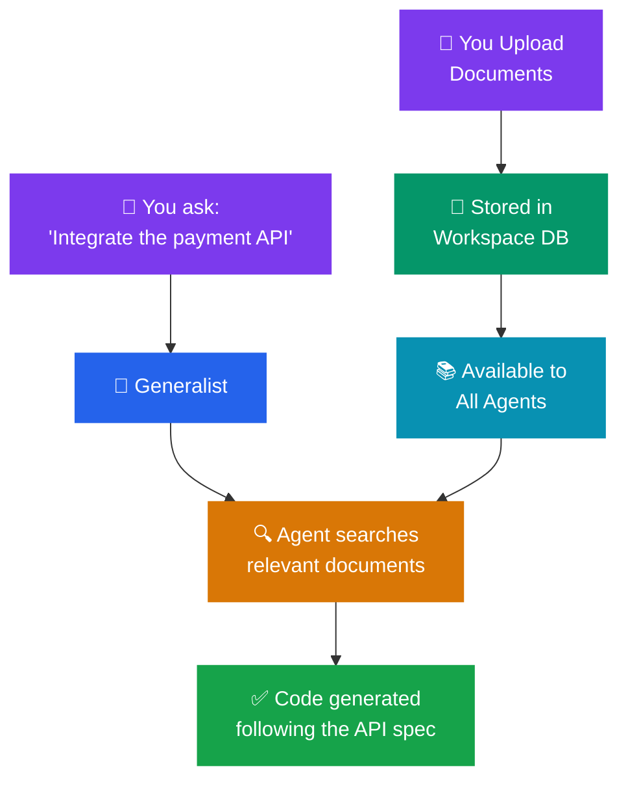

# Documents

The **Documents** tab lets you attach reference files to your workspace so your AI agents can use them during conversations. Think of it as giving your AI team access to your project's documentation shelf.

---

## What are Documents?

Documents are files you upload to your workspace that provide additional context for your AI agents. These might include:

- **Design specifications** — What the product should look like and how it should behave
- **API documentation** — How external services your project connects to work
- **Requirements documents** — Business rules and feature requirements
- **Architecture diagrams** — How the system is structured
- **Style guides** — Design tokens, brand guidelines, or coding standards
- **Meeting notes** — Decisions made about the project

When an agent needs context beyond what's in the code itself, it can reference these documents.

---

## Supported File Types

Agent Studio can read several file formats:

| Format | Extensions | Best For |
|--------|-----------|----------|
| **Text** | .txt | Plain text notes |
| **Markdown** | .md | Formatted documentation |
| **PDF** | .pdf | Formal documents, specs |
| **Word** | .docx | Business documents |
| **PowerPoint** | .pptx | Presentation decks |

---

## Adding Documents

1. Open **Workspace Settings** (gear icon in the header bar)
2. Click the **Documents** tab
3. Click **"Add Document"** or drag and drop files into the area
4. Select one or more files from your computer
5. Documents are added immediately and available to agents

---

## How Agents Use Documents

When you mention a topic that relates to an uploaded document, agents can:

- **Quote specific sections** from the document in their responses
- **Follow specifications** described in design docs
- **Match coding standards** defined in style guides
- **Reference API details** from technical documentation

> **Example:** You upload an API specification document. When you ask the AI to "integrate with the payment service," it can read the API spec and generate code that matches the exact endpoints, parameters, and response formats documented there.

---

## Managing Documents

From the Documents tab, you can:

- **View** all attached documents
- **Preview** document contents
- **Remove** documents that are no longer relevant
- **Update** a document by removing the old version and adding the new one

---

## Best Practices

- **Keep documents current** — Outdated specs lead to outdated code. When a document is updated, replace the old version in your workspace.
- **Use descriptive filenames** — `payment-api-v2-spec.pdf` is better than `document1.pdf`.
- **Start small** — You don't need to upload everything. Start with the most important reference documents and add more as needed.
- **Prefer structured formats** — Markdown and well-formatted PDFs give agents the clearest information to work with.

---

## Frequently Asked Questions

**Q: Is there a file size limit?**
Individual documents should be reasonable in size. Very large files (over 10 MB) may take longer to process. If you have a large document, consider splitting it into focused sections.

**Q: Are documents stored in my project folder?**
Documents are stored in Agent Studio's local database, not in your project folder. They won't appear in your git repository or affect your project's file structure.

**Q: Can agents modify my documents?**
No. Documents are read-only references. Agents can read them but cannot edit or delete them. Only you can manage documents through the Documents tab.

**Q: Do documents count toward my token usage?**
Documents are processed when agents reference them, which does use tokens. However, agents are smart about only reading relevant sections rather than processing entire documents for every message.
