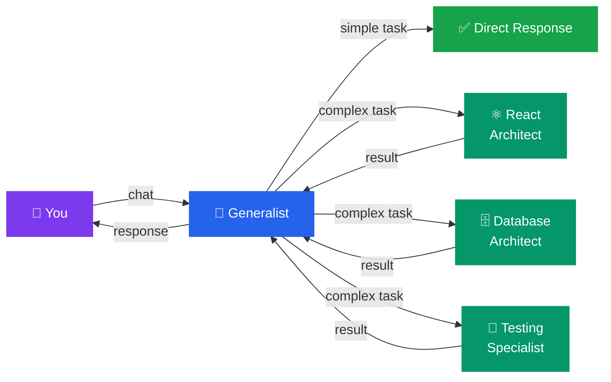
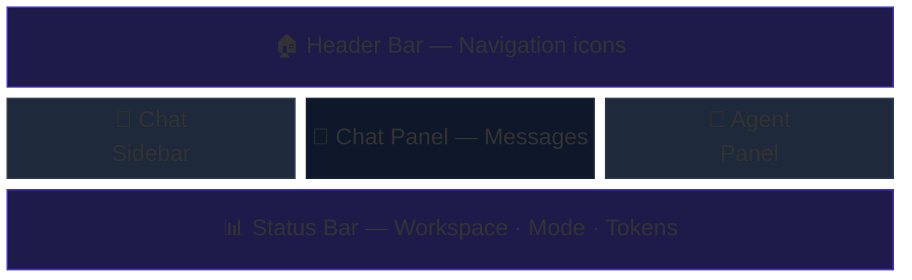

# Getting Started with Code Atelier

Welcome to **Code Atelier** — your AI-powered development team that runs right on your computer. Think of it as having a team of expert programmers available 24/7, each specializing in different areas like databases, user interfaces, testing, and more.

This guide walks you through everything you need to get up and running in about 10 minutes.

---

## What is Code Atelier?

Code Atelier is a desktop application that gives you access to a team of AI specialist agents. Instead of working with a single AI assistant, you work with a **coordinator** (called the Generalist) who understands your project and can delegate tasks to **specialist agents** — each one an expert in a specific area.

Here's how it works at a high level:

> Think of it like a software company: you talk to the project manager (Generalist), who delegates to the right team members (Specialists) based on what needs to be done.

---

## Prerequisites

Before you begin, make sure you have:

- **Claude Max subscription** — Code Atelier uses your Claude subscription to power the AI agents. No separate API keys or payments are needed.
- **Claude CLI installed** — The command-line tool that Code Atelier uses behind the scenes to communicate with Claude. You can install it from [claude.ai](https://claude.ai).
- **A code project** — Any folder on your computer that contains code you want to work on.

---

## Step 1: Create Your First Workspace

A **workspace** is how Code Atelier connects to one of your code projects. Each workspace links to a folder on your computer and remembers all its settings, conversations, and agent configurations.

1. Open Code Atelier — you'll see the **Welcome Screen**
2. Click the **"New Workspace"** button
3. Browse to the folder that contains your code project
4. Give your workspace a name (or keep the suggested one)
5. Click **Create**

Your workspace is now ready. You'll see the chat interface appear, ready for you to start a conversation.

---

## Step 2: Start a Conversation

Conversations are how you interact with your AI team.

1. Click the **"New Chat"** button (or press **Cmd+N** / **Ctrl+N**)
2. Choose a **mode**:
   - **Plan mode** — The AI analyzes your request and creates a plan before doing anything. Great for complex tasks.
   - **Build mode** — The AI jumps straight into implementation. Best for straightforward requests.
3. Type your first message — try something like: *"What does this project do? Give me a quick overview."*
4. Press **Enter** to send

The Generalist agent will analyze your codebase and respond. If your request requires specialized work, you'll see specialist agents activate in the **Agent Panel** on the right side of the screen.

---

## Step 3: Explore the Interface

Here's a quick tour of the main areas:

| Area | Where | What it does |
|------|-------|--------------|
| **Header Bar** | Top of the screen | Navigate between Home, Workspace Settings, App Settings, and Help |
| **Chat Sidebar** | Left panel | Lists your conversations; create new ones here |
| **Chat Panel** | Center | Where you read and send messages |
| **Agent Panel** | Right panel | Shows which specialist agents are active and what they're doing |
| **Status Bar** | Bottom | Shows your current workspace, conversation mode, and token usage |

**Keyboard shortcuts you'll use often:**

| Shortcut | Action |
|----------|--------|
| **Cmd+N** / **Ctrl+N** | New conversation |
| **Cmd+B** / **Ctrl+B** | Toggle sidebar |
| **Cmd+J** / **Ctrl+J** | Toggle agent panel |
| **Cmd+.** / **Ctrl+.** | Switch between Plan and Build mode |
| **Cmd+/** / **Ctrl+/** | Open Help |
| **Esc** | Go back / close current panel |

---

## Step 4: Configure Your Workspace

Now that you have a workspace, you can customize how it works. Click the **gear icon** in the header bar to open **Workspace Settings**.

The settings are organized into tabs. Here's what each one does (see the dedicated help sections for full details):

- **Models** — Choose which AI model your agents use (faster vs. smarter)
- **Repository** — Connect to GitHub so agents can create branches and pull requests
- **Team** — See and configure your AI specialist team
- **Ideas** — Capture project ideas that your AI team can reference
- **Memory** — Automatic knowledge your AI builds about your project over time
- **Documents** — Attach reference documents (specs, designs, etc.) to your workspace
- **Tokens** — Monitor how many AI tokens your conversations are using

---

## What's Next?

Now that you're set up, here are some things to try:

- **Ask the AI to explain your codebase** — *"Walk me through the architecture of this project"*
- **Request a code change** — *"Add input validation to the user registration form"*
- **Get a code review** — *"Review the changes in the last commit and suggest improvements"*
- **Configure your AI models** — Go to Settings > Models to pick the right balance of speed and intelligence

Each section in this Help manual goes deeper into a specific feature. Use the table of contents on the left to jump to any topic.

> **Tip:** You can always get back to this Help view by clicking the **?** icon in the top header bar or pressing **Cmd+/** / **Ctrl+/**.
