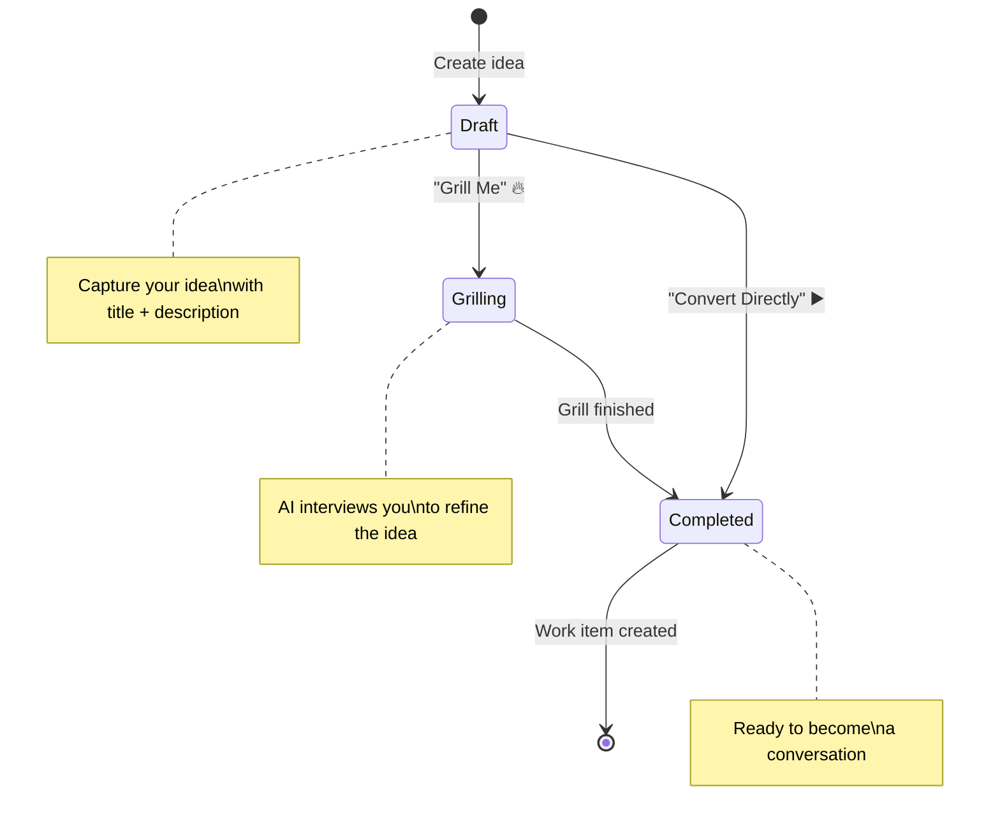

# Ideas

The **Ideas** tab is your project's idea board — a place to capture feature requests, improvement suggestions, and tasks that your AI team can reference and work on.

---

## What are Ideas?

Ideas are structured notes that describe something you want to build, fix, or improve. They're more than just sticky notes — when you add an idea to your workspace, your AI agents can see it and reference it during conversations.

For example, you might add an idea like:

> **Title:** Add dark mode support
> **Description:** Users should be able to toggle between light and dark themes. The preference should persist across sessions.

Later, when you chat with your AI team and say _"Let's work on that dark mode feature,"_ the Generalist already knows what you're referring to.

---

## Adding an Idea

1. Open **Workspace Settings** (gear icon in the header bar)
2. Click the **Ideas** tab
3. Click **"Add Idea"**
4. Fill in:
   - **Title** — A short, descriptive name (e.g., "Add search functionality")
   - **Description** — More details about what you want (the more detail, the better your AI team can plan)
5. Click **Save**

---

## Managing Ideas

From the Ideas tab, you can:

- **View** all your ideas in a list
- **Edit** an idea to add more detail or update requirements
- **Delete** ideas that are no longer relevant
- **Prioritize** ideas by reordering them

---

## How AI Agents Use Ideas

When you start a conversation in **Plan mode**, the Generalist can:

1. **Reference your ideas** to understand project priorities
2. **Create implementation plans** based on idea descriptions
3. **Break down ideas** into smaller, actionable tasks
4. **Track progress** as specialists complete parts of an idea

> **Tip:** The more detail you include in your idea descriptions, the better your AI team can plan and execute. Include things like: who the feature is for, what problem it solves, any technical constraints, and examples of what the end result should look like.

---

## Best Practices

- **Be specific** — "Improve performance" is vague. "Reduce page load time from 3s to under 1s" is actionable.
- **Include context** — Mention which parts of the codebase are involved, or link to design mockups.
- **One idea, one concern** — Keep each idea focused on a single feature or improvement.
- **Update as you go** — When requirements change, update the idea rather than creating a new one.

---

## Frequently Asked Questions

**Q: Can agents create ideas on their own?**
Yes. During planning or grilling sessions, agents may propose tasks and ideas that get added to your idea board. You always have the option to accept or reject these suggestions.

**Q: Is there a limit to how many ideas I can have?**
There's no hard limit. However, for best results, keep your active ideas focused on what you're currently working on. You can always archive completed ideas.

**Q: Do ideas sync with GitHub Issues?**
Not currently. Ideas live within Code Atelier. You can ask your AI team to create GitHub Issues based on your ideas when you're ready to implement them.
