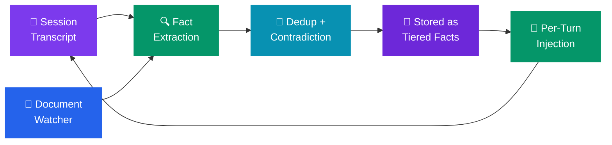

# Memory (Knowledge Engine)

The **Memory** tab shows how Code Atelier remembers important information about your project. As your AI team works, it captures decisions, conventions, gotchas, and preferences as structured **facts** that persist across sessions — so every future conversation starts with full project context.

---

## What is the Knowledge Engine?

The **Knowledge Engine** is a fact-based memory system that automatically captures and manages workspace knowledge. Facts are:

- **Tiered** — Data (T0) → Information (T1, 3 confirms) → Knowledge (T2, 5 confirms) → Wisdom (T3, 8 confirms)
- **Deduplicated** — Embedding-based similarity prevents storing the same fact twice
- **Contradiction-aware** — Conflicting facts are detected, the newer fact supersedes the older one
- **Context-injected** — Relevant facts are prepended to each prompt, with per-session deduplication

> **Think of it like this:** Instead of a flat list of notes, it's a self-curating knowledge base that gets more confident about facts as they're repeatedly confirmed.

---

## How It Works

---

## Fact Categories

| Category       | Example                                                      |
| -------------- | ------------------------------------------------------------ |
| **Decision**   | "We chose PostgreSQL over MongoDB for ACID compliance"       |
| **Convention** | "All API endpoints follow REST naming conventions"           |
| **Gotcha**     | "The test DB must be reset before running integration tests" |
| **Preference** | "User prefers concise code over verbose comments"            |
| **Reference**  | "The auth flow is documented in docs/auth-architecture.md"   |

---

## Capture Sources

Facts are extracted from three sources, each controlled by a toggle in the **Ingestion** tab:

1. **Session transcripts** — After each chat session, decisions and conventions are extracted
2. **Commit changes** — Git diffs are analyzed for architectural decisions
3. **Document watcher** — Changes to docs/, README.md, and CLAUDE.md are monitored

---

## Agent Tools

AI agents can interact with the knowledge base through three MCP tools:

- **memory_search** — Look up relevant facts before making assumptions
- **memory_record** — Save new decisions, conventions, or preferences
- **memory_flag** — Confirm or contradict existing facts

---

## Managing Facts

In the **Memory** tab you can:

- **Browse** — View all facts with their tier, category, and confirmation count
- **Search** — Semantic + keyword hybrid search across all facts
- **Confirm** — Boost a fact's confidence (moves it toward promotion)
- **Archive** — Soft-delete facts that are no longer relevant
- **Contradictions** — Review auto-detected conflicts and choose which fact to keep

---

## CLAUDE.md Integration

Click **Regenerate CLAUDE.md** to synthesize your workspace facts into a CLAUDE.md project file. This gives external tools (Claude CLI, etc.) access to your project knowledge. You'll see a diff review before any changes are written.

---

## Privacy and Security

- All facts are stored **locally on your machine** in the workspace database
- Embeddings are computed locally via ONNX WASM — no external API calls
- You can archive or delete any fact at any time

---

## FAQ

**Q: Will the AI remember personal things I mention in chat?**
The engine captures **project knowledge** — decisions, conventions, gotchas. Personal conversation details are not extracted.

**Q: How does deduplication work?**
Each fact is embedded into a 384-dimensional vector. When a new fact is similar (≥90% cosine similarity) to an existing one, it's treated as a confirmation rather than a duplicate entry.

**Q: What happens when facts contradict?**
The engine detects contradictions (82–90% similarity + Haiku classification). The newer fact supersedes the older one, and the contradiction is recorded for your review.

**Q: Does memory transfer between workspaces?**
No. Each workspace has its own separate fact store. Facts can optionally be scoped to a workspace or marked as global.

**Q: How much storage does memory use?**
Facts are small text records with optional 384-dim float32 embeddings (~1.5KB each). Even hundreds of facts use under 1 MB.
