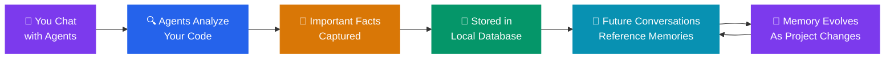

# Memory (Auto Memory / Brain)

The **Memory** tab shows how Agent Studio remembers important information about your project. This is one of Agent Studio's most powerful features — it means your AI team gets smarter about your specific codebase over time, without you having to re-explain things.

---

## What is Auto Memory?

**Auto Memory** (also called the "Brain") is a system that automatically captures and stores important facts about your project. As you chat with your AI team and they analyze your code, they learn things like:

- How your project is structured
- What coding conventions you follow
- Important architectural decisions and their reasons
- Common patterns used throughout the codebase
- Key configuration details

This knowledge is stored locally and made available to all agents in future conversations, so they don't start from scratch every time.

> **Think of it like this:** When you hire a new team member, they spend weeks learning about the project. Auto Memory is like giving every new AI agent instant access to that institutional knowledge.

---

## How It Works

Here's a simplified view of the memory flow:

---

## What Gets Remembered?

Auto Memory focuses on **project-level knowledge** — things that are true about your codebase as a whole, not about specific conversations. Examples:

| Category | Example |
|----------|---------|
| **Architecture** | "This project uses a microservices architecture with 5 services" |
| **Conventions** | "All API endpoints follow REST naming conventions" |
| **Tech Stack** | "The frontend uses React 19 with TypeScript strict mode" |
| **Patterns** | "Error handling uses a centralized ErrorBoundary component" |
| **Configuration** | "The project uses environment variables stored in .env.local" |

Things that are **not** stored in memory:
- Personal information or credentials
- Specific conversation messages
- Temporary debugging details

---

## Viewing Your Memories

1. Open **Workspace Settings** (gear icon)
2. Click the **Memory** tab
3. You'll see a list of memory entries, each with:
   - **Category** — What kind of knowledge it is
   - **Content** — The actual fact or information
   - **Last updated** — When this memory was last confirmed or modified

---

## Managing Memories

While Auto Memory works automatically, you have full control:

- **Review** — Read through memories to see what your AI has learned
- **Edit** — Correct any inaccuracies or add nuance
- **Delete** — Remove memories that are outdated or incorrect
- **Feed** — Manually trigger a memory scan to update the AI's knowledge

> **Tip:** If you notice your AI team making incorrect assumptions about your project, check the Memory tab. There might be an outdated memory entry that needs updating.

---

## Memory Feed

The **Memory Feed** is a process that scans your codebase and updates the AI's knowledge base. It runs:

- **Automatically** when you first create a workspace
- **On demand** when you click "Refresh" in the Memory tab
- **Incrementally** — it only looks at what's changed since the last scan

During a feed, you'll see a progress banner at the top of the app showing what's being analyzed.

---

## Privacy and Security

- All memories are stored **locally on your machine** in the workspace database
- Memory contents are **never sent to external servers** — they're only used by the AI agents running locally
- You can delete all memories at any time by clearing the memory for a workspace

---

## Frequently Asked Questions

**Q: Will the AI remember personal things I mention in chat?**
Auto Memory is designed to capture **project knowledge**, not personal information. Conversation-specific details stay in the conversation and aren't added to the memory system.

**Q: Can I add memories manually?**
Currently, memories are generated automatically from codebase analysis and agent interactions. You can edit existing memories, but manual creation is handled through the feed process.

**Q: Does memory transfer between workspaces?**
No. Each workspace has its own separate memory. This is intentional — different projects have different architectures, conventions, and patterns.

**Q: How much storage does memory use?**
Memory entries are small text records stored in a local SQLite database. Even hundreds of memories use negligible disk space (typically under 1 MB).
