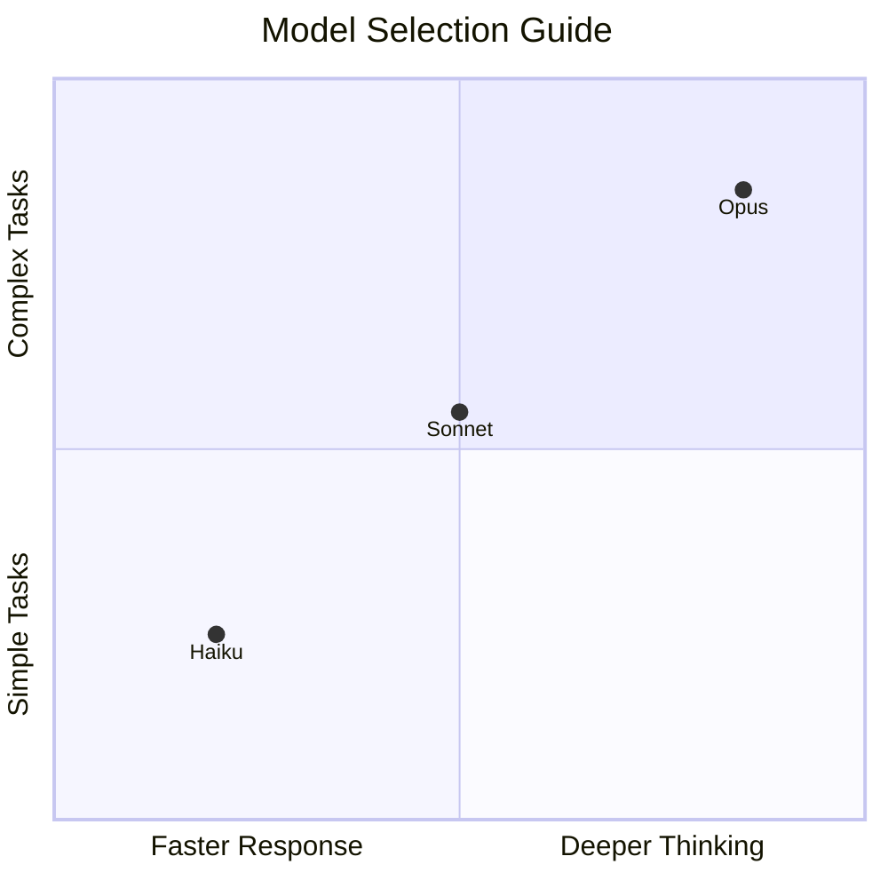

# Models

The **Models** tab lets you choose which AI "brain" powers your agents. Different models have different strengths — some are faster, some are smarter, and some cost fewer tokens. This section explains what each option means and when to use it.

---

## What is a Model?

A **model** is the AI engine that thinks and writes code for you. Think of models like different grades of consultant:

- A **junior consultant** (Haiku) is fast and cheap, but handles simpler tasks
- A **mid-level consultant** (Sonnet) balances speed, quality, and cost — great for everyday work
- A **senior consultant** (Opus) takes more time and tokens, but produces the highest-quality output for complex problems

All three models come from **Anthropic's Claude** family. You already have access to them through your Claude Max subscription.

---

## Available Models

| Model      | Speed     | Quality   | Best For                                                         |
| ---------- | --------- | --------- | ---------------------------------------------------------------- |
| **Haiku**  | Very fast | Good      | Quick questions, simple edits, formatting, boilerplate code      |
| **Sonnet** | Fast      | Very good | Day-to-day coding, code review, explanations, most tasks         |
| **Opus**   | Slower    | Excellent | Complex architecture decisions, difficult bugs, nuanced analysis |

---

## How to Choose a Model

### Use **Haiku** when:

- You need a quick answer or simple code snippet
- The task is straightforward (rename a variable, fix a typo, generate boilerplate)
- You want to save tokens for more complex work later

### Use **Sonnet** when:

- You're doing regular development work (this is the recommended default)
- You want a good balance of speed and intelligence
- The task requires understanding context but isn't extremely complex

### Use **Opus** when:

- You're tackling a difficult architectural decision
- The bug is subtle and requires deep reasoning
- You need the AI to consider many edge cases
- Quality matters more than speed

---

## Changing Your Model

1. Open **Workspace Settings** (click the gear icon in the header bar)
2. Click the **Models** tab
3. Select your preferred model from the dropdown
4. The change takes effect immediately for new messages

> **Tip:** You can change models at any time, even in the middle of a conversation. This is useful when you start with Sonnet for initial exploration, then switch to Opus for a tricky problem.

---

## What are Tokens?

**Tokens** are the unit of measurement for AI usage. Every message you send and every response you receive uses tokens. Think of tokens as roughly equal to words:

- 1 token is approximately 3/4 of a word
- A short sentence is about 10-20 tokens
- A full page of text is about 500-750 tokens

Different models use tokens at different rates:

- **Haiku** uses the fewest tokens per response
- **Sonnet** uses a moderate amount
- **Opus** uses the most tokens per response (because it "thinks" more deeply)

You can monitor your token usage in the **Tokens** tab of Workspace Settings, or glance at the token counter in the bottom-right status bar.

---

## Thinking Budgets

Each model has a **thinking budget** — the maximum amount of internal reasoning it can do before responding. This is set automatically:

- **Opus**: Up to ~32,000 thinking tokens (maximum reasoning)
- **Sonnet**: Up to ~10,000 thinking tokens (balanced)
- **Haiku**: No thinking tokens (immediate response)

You don't need to configure this — it's handled automatically based on your model selection.

---

## Frequently Asked Questions

**Q: Will I be charged extra for using Opus?**
No. Code Atelier uses your Claude Max subscription. All models are included — you won't see a separate charge per model. However, more powerful models use more of your subscription's token allowance.

**Q: Can different agents use different models?**
The model setting applies to the overall workspace. All agents in that workspace will use the selected model. Specialists may have their own optimized thinking budgets, but they use the same base model.

**Q: What happens if I switch models mid-conversation?**
Nothing breaks. New messages will use the new model, but previous messages in the conversation aren't affected. The AI maintains context regardless of which model generated earlier messages.
