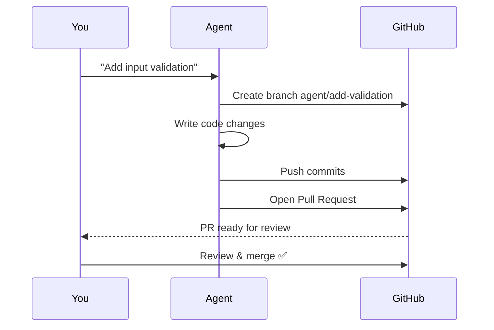

# Repository

The **Repository** tab connects your workspace to **GitHub**, enabling your AI agents to create branches, open pull requests, and collaborate using the same version control workflows your team uses. This section explains what these concepts mean and how to set them up.

---

## What is a Repository?

A **repository** (often called a "repo") is where your code lives online. Think of it as a cloud backup of your project that also tracks every change ever made. **GitHub** is the most popular platform for hosting repositories.

When you connect Agent Studio to your GitHub repository, your AI agents can:

- Create **branches** (separate copies of your code to make changes safely)
- Open **pull requests** (formal proposals to merge changes into the main codebase)
- Read existing code and understand the project structure

---

## Key Concepts

### What is GitHub?

**GitHub** is a website (github.com) where developers store and collaborate on code. It's like Google Docs for code — multiple people (and AI agents) can work on the same project simultaneously without overwriting each other's changes.

### What is a Branch?

A **branch** is like making a photocopy of your entire project before making changes. If the changes go well, you merge them back. If they don't, you throw away the copy — the original is untouched.

- **main** (or **master**) — The primary branch. This is the "official" version of your code.
- **feature branches** — Temporary branches created for specific tasks (e.g., `add-login-page`, `fix-search-bug`).

### What is a Pull Request (PR)?

A **pull request** is a formal way of saying "I made some changes on my branch and I'd like to merge them into the main branch." It shows everyone exactly what changed and lets others review the code before it's merged.

### What is a Personal Access Token (PAT)?

A **PAT** is like a password that gives Agent Studio permission to interact with your GitHub account. It's more secure than using your actual password because:

- You can limit what it's allowed to do (e.g., read code but not delete repositories)
- You can revoke it at any time without changing your password
- It expires automatically after a set period

```mermaid
gitgraph
  commit id: "your code"
  commit id: "latest"
  branch agent/add-validation
  checkout agent/add-validation
  commit id: "add form validation"
  commit id: "add unit tests"
  checkout main
  merge agent/add-validation id: "PR merged ✅"
  commit id: "continues..."
```

---

## Setting Up GitHub Integration

### Step 1: Generate a Personal Access Token

1. Go to [github.com/settings/tokens](https://github.com/settings/tokens)
2. Click **"Generate new token"** (choose "Fine-grained" for better security)
3. Give it a name like "Agent Studio"
4. Set an expiration date (90 days recommended)
5. Under **Repository permissions**, grant:
   - **Contents**: Read and write (so agents can read and create code)
   - **Pull requests**: Read and write (so agents can create PRs)
   - **Metadata**: Read-only (required for basic access)
6. Click **Generate token**
7. **Copy the token immediately** — GitHub will only show it once

### Step 2: Add the Token to Agent Studio

1. Open **Workspace Settings** (gear icon in the header bar)
2. Click the **Repository** tab
3. Paste your GitHub token in the **Personal Access Token** field
4. The token is stored securely on your local machine — it's never sent to any external server

### Step 3: Configure Repository Settings

Once your token is saved, you can configure:

- **Default branch** — Which branch new agent work should be based on (usually `main`)
- **Repository URL** — Automatically detected from your project folder's git configuration

---

## How Agents Use GitHub

When you ask an agent to make code changes in **Build mode**, here's the flow:



> **Important:** Agents never push directly to your main branch. They always create a separate branch and a pull request, giving you full control over what gets merged.

---

## Security Notes

- Your GitHub token is stored **locally on your machine** in the app's database
- It is **never transmitted** to Anthropic or any third-party server
- Agents only access repositories that your token has permission to access
- You can revoke the token at any time from GitHub's settings page

---

## Frequently Asked Questions

**Q: Do I need GitHub to use Agent Studio?**
No. GitHub integration is optional. Without it, agents can still read and modify code in your local project folder — they just can't create branches or pull requests on GitHub.

**Q: Can I use GitLab or Bitbucket instead?**
Currently, Agent Studio supports GitHub. Support for other platforms may be added in future updates.

**Q: What happens if my token expires?**
Agents will still work locally, but GitHub operations (creating branches, opening PRs) will fail. You'll see an error message prompting you to update your token. Just generate a new one and paste it in.

**Q: Can agents delete my code?**
Agents work on separate branches. They can modify files on their branch, but they cannot force-push to or delete your main branch. You always review and approve changes through pull requests.
