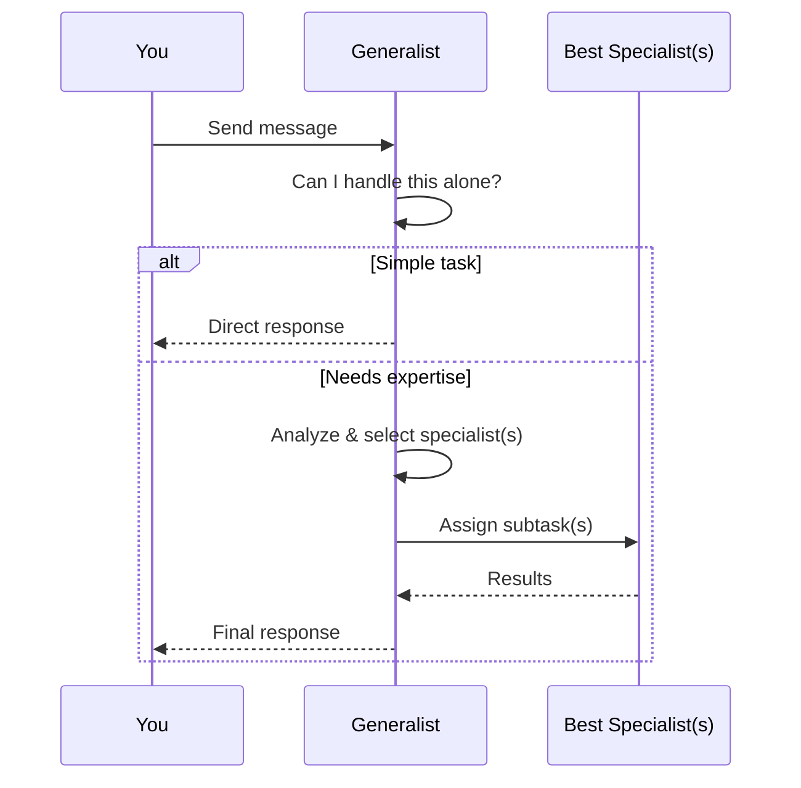
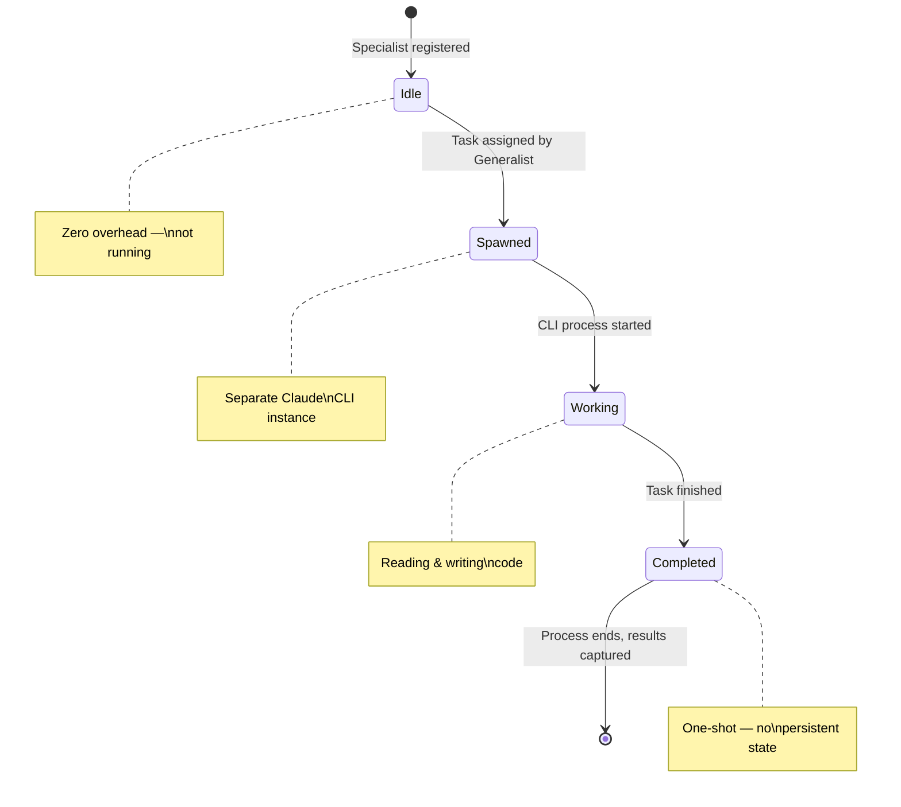

# Specialists

**Specialists** are expert AI agents that focus on specific areas of software development. While the Generalist handles your everyday questions, specialists are called in for tasks that need deeper expertise.

---

## What is a Specialist?

A specialist is an AI agent with a focused skillset. Each specialist has been configured with specific knowledge, instructions, and capabilities for their area of expertise.

Think of specialists like departments in a software company:

| Specialist | Expertise | Example Tasks |
|-----------|-----------|---------------|
| **React Architect** | Frontend UI development | Build components, fix styling, implement forms |
| **Electron Architect** | Desktop app development | Window management, IPC, native features |
| **Database Architect** | Data modeling and SQL | Create tables, write queries, optimize performance |
| **Agentic Architect** | AI agent systems | Agent configuration, orchestration, prompts |
| **Testing Specialist** | Automated testing | Write unit tests, integration tests, E2E tests |
| **Git/GitHub Specialist** | Version control | Branching, merging, pull requests, conflict resolution |
| **UX/UI Specialist** | Design and user experience | Layout, accessibility, design systems |
| **Docs/Diagrams Specialist** | Documentation | Architecture diagrams, API docs, README files |
| **CI/CD & DevOps** | Build and deployment | Pipelines, Docker, deployment configuration |
| **.NET Architect** | C# and .NET development | Backend services, APIs, .NET patterns |

---

## How Specialists Get Assigned

You don't need to manually select specialists. Here's how the process works:

> **Example:** You say *"Redesign the settings page with better accessibility."* The Generalist might assign the **UX/UI Specialist** for the design and the **React Architect** for the implementation.

---

## Viewing Specialist Activity

You can see specialists in action through:

- **Agent Panel** (right side, toggle with Cmd+J / Ctrl+J) — Shows real-time status of all agents
- **Chat messages** — Specialist responses appear with their avatar and name
- **Status bar** — Shows active agent count at the bottom of the screen
- **Team tab** — Lists all available specialists and their current status

---

## Configuring Specialists

From the Workspace Settings, you can customize how specialists work:

### Enabling/Disabling Specialists
If your project doesn't need certain specialists (e.g., you don't use .NET), you can disable them to streamline the Generalist's delegation decisions.

### Viewing Specialist Definitions
Each specialist is defined by a YAML configuration file that specifies:
- **Name and role** — What the specialist is called and what it does
- **Instructions** — Detailed guidance for how the specialist should work
- **Skills** — Which skill files the specialist has access to
- **Permissions** — What the specialist is allowed to do (read files, write files, run commands)

### Agent YAML Files
Specialist configurations are stored as `.yml` files in your workspace's `.claude/agents/` directory. You can view these files through the settings panel to understand exactly how each specialist is configured.

---

## Specialist Lifecycle

Understanding how specialists start and stop:

Unlike the Generalist (which maintains a long-running session), specialists are **one-shot** — they start, do their job, and finish. This means they don't carry conversation history between tasks.

---

## Frequently Asked Questions

**Q: Can I create my own specialists?**
The specialist system is based on YAML configuration files. You can customize existing specialists by modifying their YAML definitions in the `.claude/agents/` directory. Creating entirely new specialists requires following the agent YAML schema.

**Q: Why did the Generalist choose that specialist?**
The Generalist analyzes your request and matches it to the specialist whose expertise best fits the task. If you think the wrong specialist was chosen, provide more context in your request to help the Generalist make a better decision.

**Q: Can multiple specialists work at the same time?**
Yes. This is one of Code Atelier's key strengths. When a task can be parallelized, the Generalist assigns different parts to different specialists who work simultaneously.

**Q: Do specialists have access to my whole codebase?**
Specialists can read files in your project directory based on their configured permissions. They see the relevant parts of your codebase needed for their task, not arbitrary files on your computer.
