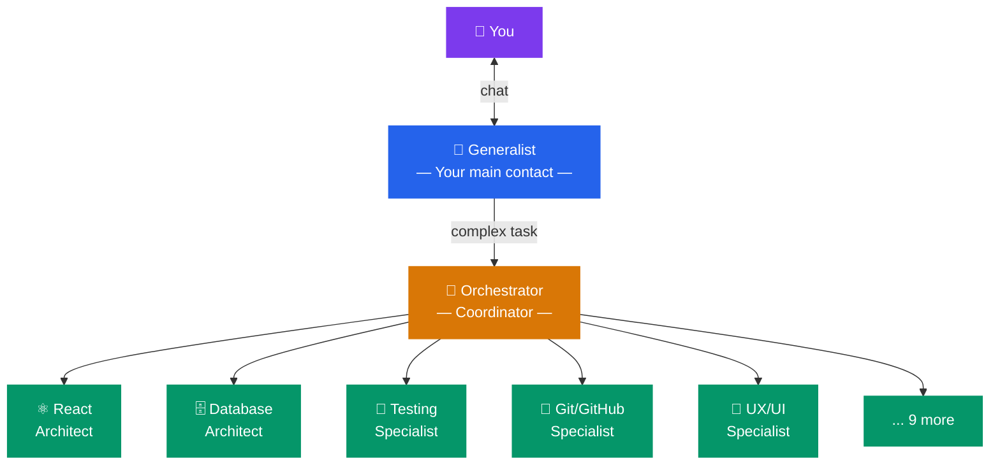
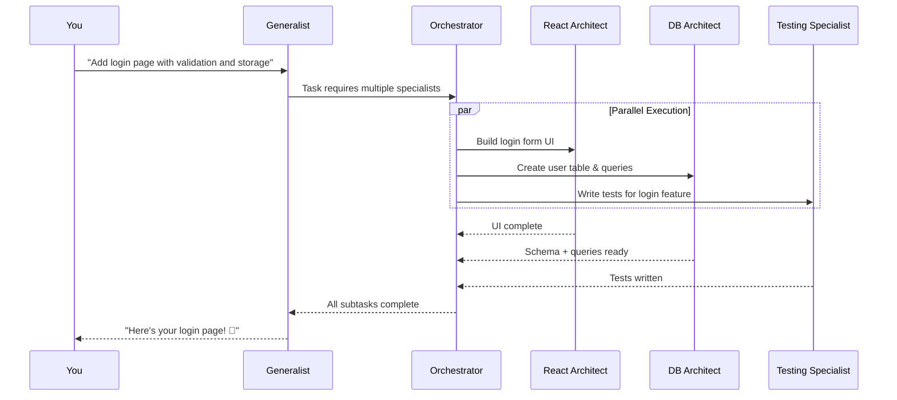

# Team

The **Team** tab shows you the AI specialists available in your workspace. Think of it as your team directory — a roster of expert agents, each with unique skills, ready to be called upon when needed.

---

## How the Team Works

Agent Studio uses a **team-based** approach to AI assistance:

1. **The Generalist** — Your primary point of contact. You chat directly with this agent. It understands your project and can answer questions, explain code, and handle straightforward tasks on its own.

2. **The Orchestrator** — A behind-the-scenes coordinator. When a task is too complex for the Generalist alone, the Orchestrator figures out which specialist(s) should handle it and coordinates their work.

3. **Specialists** — Expert agents focused on specific areas. For example:
   - A **React Architect** for frontend UI work
   - A **Database Architect** for SQL and data modeling
   - A **Testing Specialist** for writing tests
   - A **Git/GitHub Specialist** for version control operations

> You don't need to pick which specialist to use — the Orchestrator does this automatically based on your request. Just describe what you need, and the right expert gets assigned.

---

## Viewing Your Team

The Team tab displays each agent with:

- **Name and role** — What the agent specializes in
- **Avatar** — A visual identifier for the agent (you'll see this in chat messages too)
- **Status** — Whether the agent is idle, thinking, writing code, or reviewing
- **Description** — A brief explanation of what this agent is best at

---

## Agent Statuses

| Status | What it means |
|--------|---------------|
| **Idle** | The agent is available but not currently working |
| **Thinking** | The agent is analyzing your request or planning its approach |
| **Writing** | The agent is actively generating code or documentation |
| **Reviewing** | The agent is reviewing code or verifying its work |
| **Error** | Something went wrong — check the agent panel for details |

You can also see live agent activity in the **Agent Panel** on the right side of the screen (toggle with **Cmd+J** / **Ctrl+J**).

---

## Customizing Your Team

Agent Studio comes with a default set of 14 specialists covering the most common development tasks. You can customize your team in the **Specialists** section of the settings:

- **Enable/disable** specific specialists based on your project's needs
- **Adjust priorities** to tell the Orchestrator which agents to prefer
- **View agent configurations** to understand each specialist's capabilities

See the **Specialists** help section for detailed configuration instructions.

---

## How Agents Collaborate

When you send a complex request, multiple agents may work simultaneously:

You can watch this collaboration happen in real-time through the Agent Panel.

---

## Frequently Asked Questions

**Q: Can I talk directly to a specific specialist?**
Currently, all communication goes through the Generalist, which routes to the appropriate specialist. This ensures the Orchestrator maintains context and coordinates between agents effectively.

**Q: What if a specialist makes a mistake?**
Just tell the Generalist what went wrong. It will either fix the issue itself or re-assign it to the appropriate specialist with your feedback.

**Q: Do specialists remember previous conversations?**
Specialists are launched for specific tasks and don't maintain long-term memory across conversations. However, the Generalist maintains context throughout your conversation, and the **Memory** system (Auto Memory / Brain) captures important project knowledge that all agents can access.
