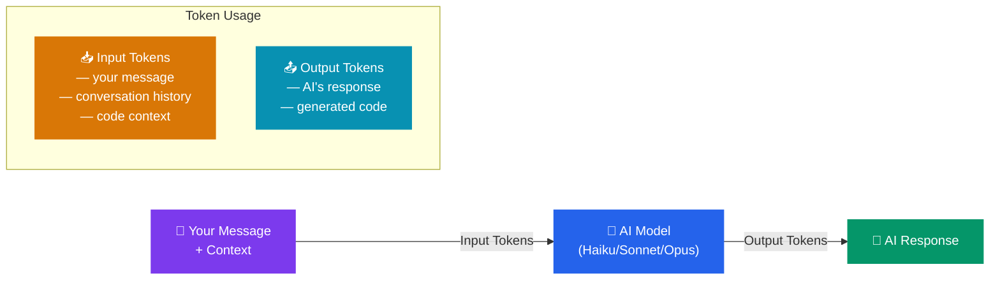

# Tokens

The **Tokens** tab helps you understand and monitor how your AI agents consume tokens — the fundamental unit of AI usage. This section explains what tokens are, why they matter, and how to manage your usage.

---

## What are Tokens?

**Tokens** are how AI models measure the text they read and write. You can think of tokens as small pieces of words:

- The word "hello" is 1 token
- The word "unfortunately" is 3 tokens
- A typical sentence is 15-25 tokens
- A full page of text is about 500-750 tokens
- A large code file might be 2,000-5,000 tokens

Every interaction with Code Atelier uses tokens in two ways:

1. **Input tokens** — The text you send (your message + the context the AI needs to understand your request)
2. **Output tokens** — The text the AI generates in its response

---

## Understanding Token Usage

The Tokens tab shows you:

| Metric                  | What it tells you                                                 |
| ----------------------- | ----------------------------------------------------------------- |
| **Session tokens**      | Total tokens used in your current session (since opening the app) |
| **Conversation tokens** | Tokens used in the active conversation                            |
| **Per-message usage**   | Approximate tokens used by each individual message                |

You can also see a quick token count in the **bottom-right status bar** of the app, which updates in real-time as you chat.

---

## What Affects Token Usage?

Several factors influence how many tokens a conversation uses:

### Context Size

The more code and context an agent needs to understand, the more input tokens are used. A question about a single file uses fewer tokens than a question about the entire project architecture.

### Model Choice

More powerful models (like Opus) tend to generate longer, more detailed responses, using more output tokens. Faster models (like Haiku) produce shorter responses.

### Conversation Length

As a conversation gets longer, each new message includes more history for context. This means later messages in a long conversation use more input tokens than early messages.

### Specialist Agents

When the Generalist delegates work to multiple specialists, each specialist uses its own tokens. A complex task assigned to 3 specialists uses roughly 3x the tokens of a simple single-agent task.

---

## Managing Token Usage

Here are some practical tips to use tokens efficiently:

### Start New Conversations for New Topics

Long conversations accumulate context. If you're switching to a completely different task, start a fresh conversation rather than continuing in the same one.

### Use the Right Model for the Task

Don't use Opus for simple questions that Haiku could handle. See the **Models** section for guidance on choosing the right model.

### Be Specific in Your Requests

Vague requests often lead to back-and-forth clarification, using more tokens. A specific, well-described request gets you the right answer faster.

### Use Plan Mode First

For complex tasks, start in **Plan mode**. The planning phase uses fewer tokens than building, and a good plan leads to more efficient building.

---

## Token Limits

Your Claude Max subscription includes a generous token allowance. Code Atelier itself doesn't impose additional limits — your usage is governed by your Claude subscription terms.

If you approach your subscription's usage limits, you may notice:

- Slower response times
- Rate limiting messages
- Temporary pauses between messages

These are normal and managed by the Claude platform, not by Code Atelier.

---

## Frequently Asked Questions

**Q: Do tokens cost me extra money?**
No. Tokens are included in your Claude Max subscription. Code Atelier doesn't charge separately for token usage.

**Q: Why does the same question use different amounts of tokens each time?**
Token usage depends on context. The same question in a fresh conversation uses fewer tokens than in a long conversation, because there's less history to process. The AI's response length can also vary.

**Q: Can I set a token budget or limit?**
Currently, there's no built-in token budget feature. You can monitor usage through the Tokens tab and the status bar to stay aware of your consumption.

**Q: What happens when I close the app — does it reset?**
Session token counts reset when you restart the app. Per-conversation token counts are preserved in the database and visible when you reopen a conversation.
